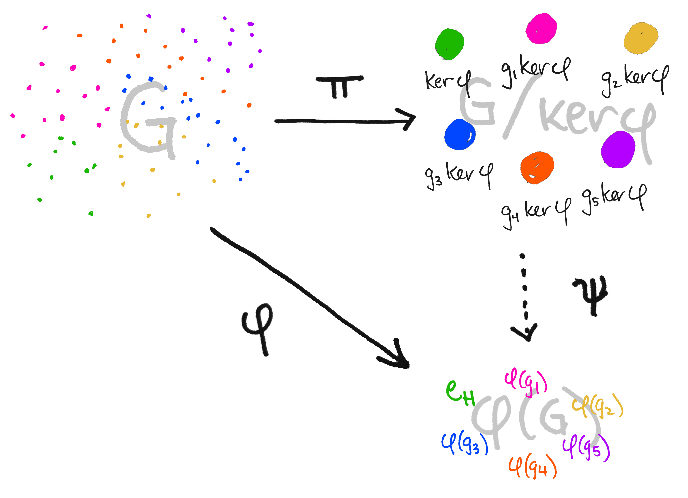

# WTF zk 教程第 15 讲：同态和同构

之前我们一直在关注群的内部关系：群、子群、陪集、商群。这一讲，我们将研究两个群之间的关系，并引入群同态和群同构的概念。

## 1. 群同态

群同态的字面意思就是两个群形态相似。对于两个群 $(G, 🐔)$ 和 $(H, 🐑)$，如果函数 $f : G \to H$ 对于 $a,b \in G$ 满足：

$$
f(a 🐔 b) = f(a) 🐑 f(b)
$$

，我们就称存在一个 $G$ 到 $H$ 的群同态 $f$。

> 为了简单，我们会直接叫它“同态”，而不是“群同态”。

上面的等式左边的意思是：先在群 $G$ 中做 $a$ 和 $b$ 的运算，再将结果用 $f$ 映射到群 $H$。等式右边的意思是：先将群 $G$ 的元素 $a$ 和 $b$ 映射到群 $H$ 后，再对 $H$ 中的像做运算。在群同态中，两种方式殊途同归。因此，同态让两个群之间建立了一种连接，同时保持了群的基本运算结构不变。

举个例子，设 $G = \set{R, +}$ 为实数加法群， $H = \set{R_{+}, \times}$ 为正实数乘法群。那么幂函数 $f(x) = e^x$ 为 $G$ 到 $H$ 的同态，因为对于 $a, b \in R$，有 $f(a+b) = e^{a+b} = e^ae^b=f(a)f(b)$，满足同态的定义。

再举个例子，设 $G = \set{\mathbb{Z}, +}$ 为整数加法群， $H = \set{\mathbb{Z}^*_n, +}$ 为整数模 $n$ 加法群，定义函数 $f(x) \equiv x \pmod{n}$ 为 $G$ 到 $H$ 的同态，因为 对于 $a, b \in \mathbb{Z}$，有 $f(a+b) = a+b \pmod{n} = a  \pmod{n} + b  \pmod{n} =f(a) + f(b)$，满足同态的定义。

### 1.1 性质

群同态有一些非常好的性质，如果 $f : (G, 🐔) \to (H, 🐑)$ 是群同态，那么：

**1. 单位元的保持：** $f(e_G) = e_H$，其中 $e_G$ 和 $e_H$ 分别是群 $G$ 和 $H$ 的单位元。

点我展开证明👀

根据单位元性质，对于任意 $a \in G$，有 $f(a 🐔 e_G) = f(a) 🐑 e_H$。由群同态的性质，有 $f(a 🐔 e_G) = f(a) 🐑 f(e_G) = f(a) 🐑 e_H$。等式两边同时消去 $f(a)$，有 $f(e_G) = e_H$。证毕。

**2. 逆元的保持：** $f(a ^{-1}) = f(a)^{-1}$。

点我展开证明👀

$f(e_G) = f(a a ^{-1}) = f(a)f(a ^{-1}) = e_H$。证毕。

**3. 子群的保持：** 若 $X$ 是 $G$ 的子群，那么 $f(X)$ 是 $H$ 的子群，其中 $f(X) = \set{f(x) \mid x \in X}$。

点我展开证明👀

根据之前介绍的[子群检验方法](https://github.com/WTFAcademy/WTF-zk/tree/main/12_Subgroup#3-%E5%AD%90%E7%BE%A4%E7%9A%84%E6%A3%80%E9%AA%8C)，对于任意 $a, b \in X$，有 $f(a), f(b) \in f(X)$，因此 $f(a) 🐑 f(b)^{-1} = f(a) 🐑 f(b^{-1})  = f(a 🐔 b^{-1})$。因为 $a 🐔 b^{-1} \in X$，因此 $f(a 🐔 b^{-1}) \in f(X)$，因此若 $X$ 是 $G$ 的子群，那么 $f(X)$ 是 $H$ 的子群。证毕。

**4. 子群的保持的逆定理：** 若 $f(X)$ 是 $H$ 的子群，那么 $X$ 是 $G$ 的子群。

点我展开证明👀

根据之前介绍的[子群检验方法](https://github.com/WTFAcademy/WTF-zk/tree/main/12_Subgroup#3-%E5%AD%90%E7%BE%A4%E7%9A%84%E6%A3%80%E9%AA%8C)，对于任意 $f(a), f(b) \in f(X)$，并且 $f(X)$ 是 $H$ 的子群，有 $f(a 🐔 b^{-1}) = f(a) 🐑 f(b)^{-1} \in f(X)$。因此 $a 🐔 b^{-1} \in X$， $X$ 为 $G$ 的子群。证毕。

总结一下，如果两个群存在同态，那么它们的单位元，逆元，和子群的结构都通过同态保持。从群论的角度，这两个群是相似的。

### 1.2 例子

我们举个指数函数（以 $e$ 为底）的例子，帮助大家了解同态的性质：
- 单位元保持：在 $G = \set{R, +}$ 中，0 为单位元，那么 $f(0) = e^0 = 1$ 就是 $H = \set{R_{+}, \times}$ 的单位元。
- 逆元保持：在 $G$ 中， $-1$ 和 $1$ 互为逆元，那么 $f(-1) = 1/e$ 和 $f(1) = e$ 在 $H$ 中互为逆元。
- 子群保持及逆向子群保持：整数加法群 $(\mathbb{Z}, +)$ 是 $G$ 的子群，那么 $f(Z) = \set{,..., e^{-2}, e^{-1}, 1, e, e^{2}, ...}$ 是 $H$ 的子群。反之亦然

## 2 像与核

群同态确定了两个重要的子群：像和核，接下来我们会学习它们。不过让我们先复习一下函数的像和原像：
- 映射的像 $f(A)$ 是映射作用到定义域 $A$ 上得到的值的集合，表示为 $\set{ f(a) \mid a \in A }$。
- 映射的原像 $f^{-1}(y)$ 是映射的逆操作，表示在给定值域中某个元素的所有可能的前像，即 $\set{ x \in A \mid f(x) = y }$。

映射的像描述了输出范围，原像描述了在给定输出下映射的所有可能输入。

### 2.1 同态像

对于群同态 $: G \to H$，其同态像是指映射 $f$ 对于群 $G$ 的所有元素的像所构成的集合。同态像通常用符号 $\text{Im}(f)$ 表示：

$$
\text{Im}(f) = f(G) =  \{ f(a) \mid a \in G \}
$$

具体而言，同态像是由所有形如 $f(a)$ 的元素所构成的集合，其中 $a$ 是群 $G$ 中的元素。

### 2.2 同态核

同态核是群同态中的另一个重要概念，它指的是群 $H$ 的单位元在群 $G$ 中的原像，换句话说，同态核是群 $G$ 的子集，其中元素被映射到 $H$ 后构成单位元。同态核通常用符号 $\text{Ker}(f)$ 表示，有：

$$
\text{Ker}(f) = f^{-1}(e_H) = \set{ a \in G \mid f(a) = e_H }
$$

由于 $\set{e_H}$ 是群 $H$ 的平凡子群，根据同态的性质 4，可知同态核是群 $G$ 的一个子群，它反映了群同态中映射到单位元的部分。

### 2.3 性质

**1. 同态像 $\text{Im}(f)$ 是群 $H$ 的子群。**

点我展开证明👀

群 $G$ 是其本身的平凡子群，根据同态的子群的保持性质， $\text{Im}(f) = f(G)$ 是 $H$ 的子群。证毕。

**2. 同态核 $\text{Ker}(f)$ 是群 $G$ 的子群。**

点我展开证明👀

$\set{e_H}$ 是群 $H$ 的平凡子群，根据同态的子群的保持的逆定理，有 $\text{Ker}(f) = f^{-1}(e_H)$ 是 $G$ 的子群。证毕。

**3. 同态核是正规子群：** 同态核 $\text{Ker}(f)$ 是群 $G$ 的正规子群。

点我展开证明👀

正规子群的左右陪集相等。我们观察 $\text{Ker}(f)$ 的陪集：设任意 $a \in G$，左陪集为 $a\text{Ker}(f) = \set{ah \mid h \in \text{Ker}(f)}$。根据同态定义 $f(a h a^{-1}) = f(a) f(h) f(a^{-1}) = f(a) e_H f(a)^{-1} = f(a)f(a)^{-1} = e_H$，因此有 $h' \in \text{Ker}(f)$，使得 $a h a^{-1} = h'$，也就是 $ah = h'a$。因此 $aH = Ha$，左右陪集相同，同态核 $\text{Ker}(f)$ 是群 $G$ 的正规子群。证毕。

总结一下，同态的核和像有很好的性质，分别是 $G$ 和 $H$ 的子群。特别的，同态核是 $G$ 的正规子群，根据我们上一讲学习的内容，我们可以通过同态核构造商群，将群 $G$ 的元素分配到等价类中，进一步刻画 $G$ 和 $H$ 的关系。这也引出将介绍的第一同构定理。

## 3. 群同态的分类

根据同态映射 $f$ 属于单射，满射或双射，我们可以将同态分为单同态，满同态，和同构。首先，让我们复习一下单射，满射，和双射是什么。

在数学中，单射、满射和双射是映射（函数）之间的性质描述。

1. **单射（Injective）**：
   一个映射 $f: A \rightarrow B$ 被称为单射，如果对于集合 $A$ 中的不同元素 $a_1$ 和 $a_2$，都有 $f(a_1) \neq f(a_2)$。换句话说，不同的元素映射到不同的值。

2. **满射（Surjective）**：
   一个映射 $f: A \rightarrow B$ 被称为满射，如果对于集合 $B$ 中的每一个元素 $b$，都存在集合 $A$ 中的至少一个元素 $a$，使得 $f(a) = b$。换句话说，映射的值域等于目标集合。

3. **双射（Bijective）**：
   一个映射 $f: A \rightarrow B$ 被称为双射，如果它既是单射又是满射。换句话说，每个元素都有唯一的映射，且每个元素都被映射到。

下面，我们学习一下如何判断同态的类型。

**1. 单同态（即映射 $f$ 为单射）的充要条件：同态核仅包含群 $G$ 的单位元 $e_G$，** 即同态核 $\text{Ker}(f)=\set{e_G}$。

点我展开证明👀

**充分性**

单同态中， $f$ 为单射，即对于 $a, b \in G$， $f(a) \neq f(b)$。我们利用反证法，假设存在不相等的 $a,b \in \text{Ker}(f)$，那么 $f(a) = f(b) = e_G$，与 $f$ 为单射矛盾。因此，若 $f$ 为单同态，则同态核 $\text{Ker}(f)=\set{e_G}$。证毕。

**必要性**

同样用反证法，假设存在 $a, b \in G$， $a \neq b$，使得 $f(a) = f(b)$。它们在 $H$ 中的逆元素也相等，有 $f(a)^{-1} = f(b) ^{-1}$。根据群同态，有 $f(b^{-1}a) = f(b)^{-1} f(a) = f(b)^{-1} f(b) = e_H$。根据同态核的定义，有 $b^{-1}a \in \text{Ker}(f)$。又因为 $a \neq b$，所以 $b^{-1}a \neq e$。也就是说同态核至少包含 $e$ 和 $b^{-1}a$ 两个元素，这与同态核仅包含群 $G$ 的单位元 $e_G$矛盾。因此，不存在 $a \neq b$ 使得 $f(a) = f(b)$。证毕。

**2. 满同态（即映射 $f$ 为满射）的充要条件：同态像 $\text{Im}(f)$ 等于群 $H$ 本身，** 即 $\text{Im}(f) = H$。

点我展开证明👀

根据同态像和满同态的定义很容易得到这个结论。

**3. 群同构（即映射 $f$ 为双射）的充要条件：同态核仅包含群 $G$ 的单位元 $e_G$，且同态像 $\text{Im}(f)$ 等于群 $H$ 本身，记为 $G \cong H$**

点我展开证明👀

根据定义，当同态 $f$ 既是单同态又是满同态时，就被称为同构。跟据前面两条性质容易得到这个结论。

总结一下，单同态的充要条件体现了同态核和单位元的重要性：从单同态推出同态核只包含单位元很容易，因为如果包含非 $e_G$ 其他元素映射到 $e_H$，那就不是单射了。但是从同态核只包含单位元推出单同态有点绕，我们可以从它的逆反命题出发：如果同态不是单同态，如果一个映射不是单射，那么同态核不只包含单位元。证明也很直观，如果 $a \neq b$ 有 $f(a) = f(b)$，根据同态， $b^{-1}a \neq e_G$ 也会进入到同态核，将它“污染”。这也体现了同态核和单位元在同态中的重要性。满同态的充要条件很直观，没什么好说的。

## 4. 第一同构定理

如果两个群同构，那么从群论的角度，它们本质上是相同的，因为它们具有相同的群论性质，如阶数，子群结构等。

第一同构定理将群同态与商群联系了起来，它的定义如下：

如果 $f: G \to H$ 是群同态，则同态核构造的商群与同态像是同构的，即 $G/\text{Ker}(f) \cong \text{Im}(f)$，其中同构映射为 $\hat{f}(x\text{Ker}(f)) = f(x)$。

点我展开证明👀

我们推导了同态核 $\text{Ker}(f)$ 是 $G$ 的正规子群，因此我们能在商群 $G/\text{Ker}(f)$ 定义一个与 $G$ 相融的运算规则。为了证明简洁，我们用 $K$ 代替 $\text{Ker}(f)$。

首先，我们需要证明 $\hat{f}: G \to K$ 是同态。对于任意 $a, b \in G$，有 $\hat{f}(aK) \hat{f}(bK) = f(a)(b) = f(ab) = \hat{f}(abK)$，因此 $\hat{f}$ 是同态。

接着，我们证明 $\hat{f}$ 是单射。对于任意 $a, b \in G$ 且 $\hat{f}(aK) = \hat{f}(bK)$，有 $f(a) = f(b)$，因此有 $f(ab^{-1}) = f(a) f(b)^{-1} = e_H$，根据同态核定义，有 $ab^{-1} \in K$。根据陪集相等的性质， $aK = bK$。因此，若 $\hat{f}(aK) = \hat{f}(bK)$，则有 $aK = bK$，$\hat{f}$ 是单射。

最后，我们证明 $\hat{f}$ 是满射。对于任意 $a \in G$，$\hat{f}(aK) = f(a)$。根据同态像的定义， $f(a)$ 的值域为 $\text{Im}(f)$，因此 $\hat{f}$ 是满射。

证毕。

我们从直观的角度理解下第一同构定理，它是说同态核构造的商群 $G/\text{Ker}(f)$ 和同态像 $\text{Im}(f)$ 同构，也就是说他们的同态既是单同态又是满同态。满同态很好理解：因为陪集划分了整个群，商集 $G/\text{Ker}(f)$ 由陪集构成，自然也划分了整个 $G$，那么它的值域也是 $\text{Im}(f)$，也就是满射。那么单同态呢？商群 $G/\text{Ker}(f)$ 的单位元是 $\text{Ker}(f)$，同态核也是 $\text{Ker}(f)$，所以同态核仅包含单位元，根据单同态的充要条件，这个同态是单同态。它巧妙的地方是，即使群 $G$ 的同态核包含非 $e_G$ 的元素，在商群 $G/\text{Ker}(f)$ 中它们都归在了单位元 $\text{Ker}(f)$ 中（商群的元素是陪集，也就是集合），因此就变成了单同态，真是小机灵鬼！

如上图所示，由 $G$ 到 $\varphi(G)$ 的同构映射 $\varphi$ 可以被分解为一个满同态映射 $\pi:G \to G/\text{Ker}(\varphi)$ 和一个单同态映射 $\psi:G/\text{Ker}(\varphi) \to \varphi(G)$。即 $\varphi = \pi \circ \psi$

如果你还不能很直观的理解第一同构定理，可以阅读[这篇文章](https://www.math3ma.com/blog/the-first-isomorphism-theorem-intuitively)。

## 5. 总结

这一讲，我们介绍了群同态和同构。同态可以理解为两个群结构相似，同构就是两个群结构相同。而第一同构定理将群，子群，陪集，商群，同态，和同构联系到了一起，非常优雅，学起来很酸爽，大家好好感受。
