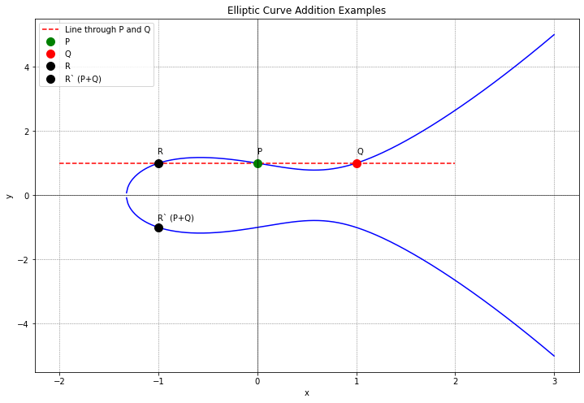

# WTF zk 教程第 29 讲：椭圆曲线基础

基于椭圆曲线（elliptic curve）的密码学算法更加安全有效，在区块链和零知识证明中被大量使用。这一讲，将介绍椭圆曲线的基本定义及其上的加法运算。

## 1. 椭圆曲线

椭圆曲线不是我们日常所理解的椭圆形状，而是满足特定方程的点的集合。这个方程通常被写为：

$$
y^2 = x^3 + ax + b
$$

这种形式也叫标准 Weierstrass 等式，其中 $a, b$ 为系数，决定了椭圆曲线的形状。它们可以来自任何域，但为了简单起见，我们先把它限定在实数域，之后再拓展到有限域。在实数域和有限域的椭圆曲线分别记为 $E(\mathbb{R})$ 和 $E(\mathbb{F}_p)$。

椭圆曲线需要满足判别式 $\Delta =  -16(4a^3 + 27b^2) \neq 0$，以确保曲线没有奇点（即曲线上没有尖点或自交点）。这个条件保证了曲线的平滑性，是进行加法运算的前提。

椭圆曲线中虽然有“椭圆“两字，但它其实和椭圆没什么关系。我们看两个椭圆曲线的例子：

椭圆曲线1: $y^2 = x^3 - x$

椭圆曲线2: $y^2 = x^3 - x + 1$

从上图可以看到，在实数域上的椭圆曲线关于x轴对称，比如点 $(2, \sqrt{6})$ 和 $(2, -\sqrt{6})$ 都是椭圆曲线1上的点。

## 2. 无穷远点 $O$

为了让椭圆曲线上的点组成群，我们必须引入一个特殊的点：无穷远点 $O$（point at infinity）。它不像椭圆曲线上的其他点那样有具体的坐标位置；你可以从几何的角度理解它，射影几何中，两条平行线在无穷远点相交。

无穷远点 $O$ 是椭圆曲线上的点构成的加法群的单位元（零元），我们会在下一节更详细的介绍它。

## 3. 椭圆曲线上的加法运算

椭圆曲线点群是椭圆曲线上的点按照特定的"加法"规则组成的群。这种加法不同于我们在数学中通常理解的加法，而是一种几何操作将两个曲线上的点“相加”，得到曲线上的第三个点。

根据两点的位置不同，相加的规则也不同，可以分为4种情况：

下面我们从几何的角度，介绍这4种情况。给定两个曲线上的点 $P = (x_1, y_1)$ 和 $Q = (x_2, y_2)$，根据它们在曲线上的位置不同，加法满足如下规则：

**情况1. 点加（point add）：** 如果 $x_1 \neq x_2$，也就是两个点横坐标不同，那么它们的加法规则：画一条直线穿过 $P$ 和 $Q$（两点确定一条直线），该直线将会与椭圆曲线再次相交于另一点 $R$。然后，取 $R$ 关于 $x$ 轴的对称点 $R'$ 作为 $P$ 和 $Q$ 相加的结果。

**情况2. 倍点（point double）：** 如果 $x_1 = x_2$ 且 $y_1 = y_2$，但是纵坐标不为0，此时点 P 和 Q 重合。因此，这种情况其实就是点 $P$ 与自身相加， $P+P$，也可写为 $2P$，加法规则：画一条点 $P$ 处的切线，这条切线将与曲线再次相交于另一点 $R$。同样，取 $R$ 关于 $x$ 轴的对称点 $R'$ 作为结果。

**情况3. 逆元相加：** 如果 $x_1 = x_2$ 且 $y_1 = -y_2 \neq 0$，我们可以写为 $P = -Q$，它们在椭圆曲线点群中互为逆元。这种情况下，画一条直线穿过 $P$ 和 $Q$（两点确定一条直线），该直线垂直于 x 轴，不再与椭圆曲线相交。但是没关系，我们定义的无穷远点 $O$ 就派上了用场：不相交，就定义为相交于无穷远点，也就是 $P + (-P) = O$。

**情况4. ：纵坐标均为0** 如果 $x_1 = x_2$ 且 $y_1 = y_2 = 0$，也就是两点重合且纵坐标为0。这种情况下， $P$ 点处的切线垂直于x轴，与曲线不再相交于另一点。同样的，不相交就可以理解为相交于无穷远点，这种情况下的结果也是无穷远点 $O$。

这些运算规则保证了椭圆曲线上的点形成了一个抽象代数中的群。这意味着，椭圆曲线上的加法运算满足闭合性、结合律、存在单位元素（无穷远点）和每个元素都存在逆元素。我们会在下一讲深入介绍椭圆曲线点群的性质。

## 4. 加法运算的代数形式

从几何角度介绍了加法运算后，这一节，我们将介绍如何通过点 $P$ 和 $Q$ 的坐标计算点 $R'$，其中 $R' = P + Q$。

情况3和4的加法结果很简单，都是无穷远点 $O$，这里我们只考虑情况1和2即可。设点 $P = (x_1, y_1)$， $Q = (x_2, y_2)$， $R' = (x_3, y_3)$， $R = (x_3, -y_3)$。

### 情况1. 点加（point add）

在这种情况下，我们先计算过 $P$ 和 $Q$ 的直线 $l: y = \lambda x + \mu$，其中斜率 $\lambda = \frac{y_2 - y_1}{x_2 - x_1}$，截距 $\mu = y_1 - \lambda x_1$。

接下来，我们要求直线 $l$ 与椭圆曲线的交点。将 $y = \lambda x + \mu$ 代入椭圆曲线方程：

$$
(\lambda x + \mu)^2 = x^3 + ax + b
$$

整理后得到交点方程：

$$
x^3 - \lambda^2x^2+ (a-2\lambda\mu)x + (b-\lambda^2) = 0
$$

另外，椭圆曲线也可以写为根式的形式 $y^2 = (x-x_1)(x-x_2)(x-x_3)$，展开得到 $y^2 = x^3 - (x_1 + x_2 + x_3) x^2 + (x_1x_2 + x_1x_3 + x_2x_3)x - x_1 x_2 x_3$。 

交点方程和根式方程是等价的。因此有：

$$
\lambda^2 = x_1 + x_2 + x_3
$$

即 $x_3 = \lambda^2 - x_1 - x_2$，将它代入直线方程，得到 $y_3 = \lambda x_3 + \mu = \lambda(x_3-x_1) + y_1$。

因此，点 $R' = P+Q = (x_3, - y_3)$ 的坐标为 $(\lambda^2 - x_1 - x_2, \lambda(x_1 - x_3) - y_1)$，其中 $\lambda = \frac{y_2 - y_1}{x_2 - x_1}$。

### 情况2. 倍加（point double）

在这种情况下，点 $P = (x_1,y_1)$，点 $R = (x_3, y_3)$，点 $R' = P+P = 2P = (x_3, -y_3)$。我们先计算点 $P = (x_1,y_1)$ 处的切线 $l: y = \lambda x + \mu$，其中斜率可以用隐函数求导得到， $\lambda = \frac{3x_1^2 + a}{2y_1}$，截距 $\mu = y_1 - \lambda x_1$。

同样的，交点方程和根式方程是等价的。因此有：

$$
\lambda^2 = 2x_1 + x_3
$$

因此 $x_3 = \lambda^2 - 2x_1$，代入切线函数，得到 $y_3 = \lambda (x_3 - x_1) + y_1$。

因此，点 $R' = 2P = (x_3, - y_3)$ 的坐标为 $(\lambda^2 - 2x_1, \lambda(x_1 - x_3) - y_1)$，其中 $\lambda = \frac{3x_1^2 + a}{2y_1}$。

这样，我们就得到了椭圆曲线上点的加法运算的代数形式，总结一下：

情况1: 点 $R' = P+Q = (x_3, - y_3)$ 的坐标为 $(\lambda^2 - x_1 - x_2, \lambda(x_1 - x_3) - y_1)$，其中 $\lambda = \frac{y_2 - y_1}{x_2 - x_1}$。

情况2: 点 $R' = 2P = (x_3, - y_3)$ 的坐标为 $(\lambda^2 - 2x_1, \lambda(x_1 - x_3) - y_1)$，其中 $\lambda = \frac{3x_1^2 + a}{2y_1}$。

情况3: 点 $R' = P + Q = O$，也就是无穷远点。

情况4: 点 $R' = P + Q = O$，也就是无穷远点。

## 5. 加法运算示例

考虑椭圆曲线 $y^2 = x^3 - x + 1$ 上的两点 $P(0, 1)$ 和 $Q(1, 1)$。根据加法规则，直线 $y = 1$ （$P$ 和 $Q$ 的连线，此时 $\lambda = 0$）与曲线的第三个交点 $R = (- x_1 - x_2,  y_1)= (-1, 1)$，因此与它x轴对称的点 $R' = P + Q = (-1 , -1)$。

## 6. 群律

椭圆曲线点群

在椭圆曲线上，所有的点加上一个无穷远点 $O$ 形成了一个群，称为椭圆曲线点群，记为 $E$。它满足以下性质：

- **封闭性：** 任意两个群内的点通过椭圆曲线上定义的加法运算相加，其结果仍然是群内的一个点。
- **存在单位元：** 无穷远点 $O$ 是椭圆曲线群的单位元，对任意群内的点 $P$，有 $P + O = P$。
- **存在逆元：** 对于任意点 $P(x, y)$ 在椭圆曲线上，存在一个点 $P'(x, -y)$ 使得 $P + P' = O$，即 $P'$ 是 $P$ 的逆元，记为 $P' = -P$。
- **结合律：** 对于群内的任意三个点 $P, Q, R$，满足 $(P + Q) + R = P + (Q + R)$。
- **交换律：** 对于群内的任意两个点 $P, Q$，满足 $P + Q = Q + P$。

这些性质保证了椭圆曲线上的点可以构成一个Abel群，使得椭圆曲线成为密码学中的一个强大工具。

实数域上的椭圆曲线点群由曲线 $y^2 = x^3 + ax + b$ 上的点和无穷远点 $O$ 构成，其中 $a, b \in \mathbb{R}$ 且判别式 $\Delta =  4a^3 + 27b^2 \neq 0$。这个群可以写为 $E(\mathbb{R}) = \set{(x, y) | y^2 = x^3 + ax + b} \cup O$。

椭圆曲线上的加法运算定义在两个点上。我们可以用 $P + Q + R = 0$ 表示椭圆曲线上三个点 $P, Q, R$ 共线，那么 $P + Q = -R$ 就是点 $P$ 和 $Q$ 进行加法运算的结果。

下面我们证明 $(E(\mathbb{R}), +)$ 构成Abel群。

- **封闭性：** 根据椭圆曲线上加法运算的定义，计算结果是椭圆曲线上的点 $R' = -R = P+Q$ 或是无穷远点 $O$，均属于椭圆曲线的点集 $E(\mathbb{R})$，因此满足封闭性。

- **存在单位元：** 为了满足这个性质，我们特别定义了无穷远点 $O$，它就是我们的加法单位元（零元）。对于 $E(\mathbb{R})$ 中的任意点 $P$，有 $P + O = O + P = P$ 成立。

- **存在逆元：** 椭圆曲线相对于x轴对称，因此对于椭圆曲线上的点 $P(x, y)$，点 $P' = (x, -y)$ 也在椭圆曲线上。从几何的角度理解，对于 x 轴对称的两个点 $P$ 和 $'P$，它们确定的直线垂直于x轴，与椭圆曲线交于无穷远点 $O$，因此 $P, P', O$ 共线，可以写为 $P + P' + O = O$，也就是 $P + P' = O$，因此 $P$ 和 $P'$ 互为逆元，可以记为 $P' = -P$。

- **交换律：** 对于 $E(\mathbb{R})$ 中任意两点 $P$ 和 $Q$，两点确定一条直线，点的顺序不影响结果，因此有 $P + Q = Q + P$。

- **结合律：** 对于群内的任意三个点 $P, Q, R$，满足 $(P + Q) + R = P + (Q + R)$。这一条性质证明起来比较麻烦，因为需要分类讨论的情况很多。一种方式是代数方法，思路就是利用公式去证明等号两边的表达式相等；另一种方式是几何方法，见[链接](https://warwick.ac.uk/fac/sci/maths/people/staff/helena_verrill/associativity/)。

## 7. 总结

这一讲，我们介绍了椭圆曲线定义，椭圆曲线点群上的加法和群律。椭圆曲线的美妙之处不仅在于其数学结构的优雅，还在于它为密码学和零知识证明提供了强大的工具。随着我们继续探索零知识证明，椭圆曲线的重要性将更加凸显。
