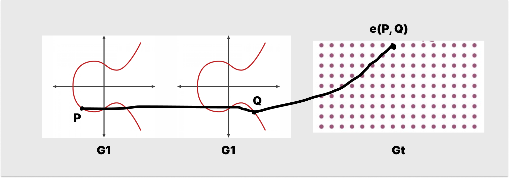

# WTF zk 教程第 34 讲：双线性配对基础

椭圆曲线上的双线性配对在密码学（基于身份的加密系统）和零知识证明（zkSnark）中有着重要作用，这一讲，我们将介绍双线性配对的基础，下一讲再介绍具体算法。

## 1. 双线性配对

双线性配对是一种数学运算，它在两个群（通常是椭圆曲线上的点构成的群）之间建立关系，并映射到一个第三个群（通常是乘法群）上。

**双线性配对定义：** 设群 $G_1$、 $G_2$ 和 $G_T$，以及配对运算 $\text{e}(P, Q) : G_1 \times G_2 \rightarrow G_T$。双线性配对满足以下性质：

1. **双线性**：对于所有的 $a, b \in \mathbb{Z}$，以及 $P \in G_1$ 和 $Q \in G_2$，有 $\text{e}(P^a, Q^b) = \text{e}(P, Q)^{ab}$。 

> 更严格的，双线性可以写为满足 $\text{e}(P + Q, S) = \text{e}(P, S) \cdot \text{e}(Q, S)$ 和 $\text{e}(P, Q + S) = \text{e}(P, Q) \cdot \text{e}(P, S)$。 
  
2. **非退化性**：如果 $P$ 和 $Q$ 是群 $G_1$ 和 $G_2$ 中的非零元素，则 $\text{e}(P, Q) \neq 1$。

3. **可计算性**：存在多项式时间的有效算法计算任意 $P \in G_1$ 和 $Q \in G_2$ 的配对 $\text{e}(P, Q)$。

其中**双线性**最重要，后两个性质只是保证配对是非平凡的，可以被有效计算的。

如果双线性配对中 $G_1 = G_2$，我们就叫它对称的双线性配对，否则是非对称的。

举个例子，设 $G_1 = G_2 = G_T = (\mathbb{Z}, +)$，我们可以定义映射 $e: \mathbb{Z} \times \mathbb{Z} \to \mathbb{Z}$，形式为 $e(x, y) = x \cdot y$。它满足双线性： $\text{e}(ax, by) = axby=abxy = ab\text{e}(x, y)$，同时满足非退化性和可计算性，因此 $e$ 为双线性映射。

## 2. 椭圆曲线的双线性配对

椭圆曲线与双线性配对结合，可以构造出新的加密算法，比如基于身份的加密（IBE）、短签名和零知识证明等。这一节，我们会介绍椭圆曲线的双线性配对。

为了简便，我们专注于对称的双线性配对，即 $G_1 = G_2$，设 $G_1$ 为椭圆曲线的点群， $G_T$ 是一个有限群（假设为加法群），我们可以构造双线性映射 $e(P, G): G_1 \times G_1 \rightarrow G_T$，满足：

1. **双线性**：对于所有的 $a, b \in \mathbb{Z}$，以及 $P, Q \in G_1$，有 $\text{e}(aP, bQ) = ab \text{e}(P, Q)$。 
  
> 更严格的，双线性可以写为满足 $e(P, Q + R) = e(P, Q) \cdot e(P, R)$ 和 $e(P + R, Q) = e(P, Q) \cdot e(R, Q)$

2. **非退化性**：如果 $P$ 和 $Q$ 均不是群 $G_1$ 的无穷远点 $O$，则 $\text{e}(P, Q) \neq O$。

3. **可计算性**：存在多项式时间的有效算法计算任意 $P, Q \in G_1$ 的配对 $\text{e}(P, Q)$。

下面一张图可以帮你理解椭圆曲线的双线性配对，它就是选取椭圆曲线 $G_1$ 的两个点 $P, Q$ 并映射到另一个群 $G_T$ 中，同时满足双线性。

### 2.1 决策性 Diffie-Hellman 问题

决策性 Diffie-Hellman 问题（DDH）指的是在一个群 $G$ 中，给定元素 $g, g^a, g^b, g^c$ ，DDH 问题要求判断 $g^c$ 是否等于 $g^{ab}$。

在普通群结构中，DDH 问题的难解性取决于群的特性。然而，在椭圆曲线上，双线性配对提供了一种解决 DDH 问题的有效方法。

给定椭圆曲线点群 $G_1$，点 $P$ 为 $G_1$ 的生成元，给定 $P, aP, bP, cP$ 。我们可以通过计算 $e(aP, bP)$ 和 $e(P, cP)$，如果他们相等，就可以确定 $g^c = g^{ab}$；否则，不等于。

这是因为跟据双线性，有 $e(aP, bP) = e(P, abP) = ab e(P, P)$，因此我们可以利用它来解决 DDH 问题.

## 3. 结论

这一讲，我们介绍了双线性配对的基本概念和性质，以及它如何解决 DDH 问题。它和椭圆曲线结合能够构造出新的密码学和零知识证明算法，比如基于身份的加密（IBE）、短签名和zkSnark。下一讲，我们将介绍可以实现双线性配对的算法。

