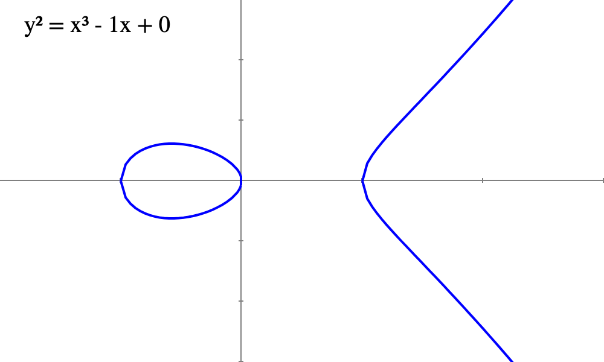

# WTF zk 教程第 35 讲：挠群和除子

在学习 Weil 配对之前，我们需要介绍它用到的数学工具：挠群和除子，前者提供了性质良好的点群，后者使得 Weil 配对能够在数学上精确地描述点之间的配对关系。

## 1. 挠群

挠点（torsion points）指在椭圆曲线上具有有限阶的点。即存在正整数 $m \geq 1$，使得对于椭圆曲线 $E$ 上的点 $P$，有 $mP = O$，其中 $O$ 是曲线的单位元（无穷远点）。点 $P$ 的阶即为 $m$，此时 $P$ 被称为挠点。

我们可以将所有阶为 $m$ 的倍数的点集合起来，就构成了 $m$-挠群（torsion group），定义为：

$$
E[m] = \set{P \in E: mP = O}
$$

挠群 $E[m]$ 是椭圆曲线 $E$ 的一个加法子群，其中单位元是无穷远点 $O$。如果 $P, Q \in E[m]$，则 $P+Q$ 和 $-P$ 也属于 $E[m]$，说明挠群具有封闭性和存在逆元，因此构成一个群结构。

当椭圆曲线定义在域 $K$ 上时，$m$-挠群记为 $E(K)[m]$。例如，定义在 $\mathbb{F}_p$ 上的 $E$ 的 $m$-挠群写作 $E(\mathbb{F}_p)[m]$。

我们以椭圆曲线 $E(\mathbb{F}_{19})$，方程为 $y^2 = x^3 - x + 1$。椭圆曲线上共有 22 个元素，11-挠群中共有 11 个点，它们是：

- (0, 18)
- Infinity (无穷远点)
- (18, 18)
- (0, 1)
- (5, 11)
- (3, 14)
- (5, 8)
- (18, 1)
- (3, 5)
- (1, 1)
- (1, 18)

下面是椭圆曲线 $E(\mathbb{F}_{19})$ （红色+蓝色）和 $11$-挠群（红色）上的点的可视化：

挠群有个很重要的性质：

对于椭圆曲线 $E(\mathbb{F}_p)$，若 $m$ 与 $p$ 互质，那么存在正整数 $k$，使得

$$
E(\mathbb{F}_{p^{k}})[m] \cong \mathbb{Z}/m\mathbb{Z} \times \mathbb{Z}/m\mathbb{Z}
$$

成立。也就是说，存在扩域 $\mathbb{F}_{p^{k}}$ 上椭圆曲线的挠群 $E(\mathbb{F}_{p^{k}})[m]$ 同构于两个阶为 $m$ 的循环群的直积。这表明在某些扩域中，挠群可以视为一个2维向量空间，为 Weil 配对提供了一个有限的、结构良好的点群。

## 2. 有理函数和除子

### 2.1 有理函数

有理函数(Rational Function)是形式为 $A/B$ 的函数，其中 $A$ 和 $B$ 是多项式函数，且 $B$ 不恒等于零。有理函数可以定义为：

$$
f(x) = \frac{A(x)}{B(x)}
$$

其中， $A(x)$ 和 $B(x)$ 是多项式： $A(x) = \sum_{j=0}^{n}{a_jx^j}$ 和 $B(x) = \sum_{j=0}^{m}{b_jx^j}$。

如果我们分别对 $A(x)$ 和 $B(x)$ 进行质因式分解并考虑复数，有理函数可以写为另一种形式：

$$
f(x) = \frac{a(x - \alpha_1)^{e_1}...(x - \alpha_r)^{e_r}}{b(x - \beta_1)^{d_1}...(x - \beta_s)^{d_s}}
$$

下面是有理函数的性质:
1. 加法性: 有理函数可以通过加法和乘法运算组合形成新的有理函数。
2. 零点（zeros）和极点（poles）: 有理函数的零点是使函数值为 0 的点，也就是所有使得分子 $P(x_0) = 0$ 的 $x_0$，也就是 $\set{\alpha_1, ..., \alpha_r}$；极点是函数值趋向无穷大的点，也就是所有使得分母 $Q(x_1) = 0$ 的点 $x_1$，也就是 $\set{\beta_1, ..., \beta_s}$。而 $\set{e_1, ..., e_r, d_1, ..., d_s}$ 是零点和极点的重数。
3. 除子: 有理函数的零点和极点可以用来定义函数的除子。

举个例子，设多项式 $f(x) = \frac{x^3 - 2x}{2(x^2 - 5)}$，它的零点为 $\set{0, \sqrt{2}, - \sqrt{2}}$，极点为 $\set{\sqrt{5}, - \sqrt{5}}$。

### 2.2 除子

除子（Divisor）是椭圆曲线上点的形式和，可以看作是一种“加权”点的概念，用于追踪有理函数上的零点和极点。如果在 $\alpha_1$ 处有 $e_1$ 个零点，就记为 $e_1 [\alpha_1]$；如果在 $\beta_1$ 处有 $d_1$ 个极点，就记为 $- d_1 [\beta_1]$，然后再把它们形式的加起来（不是普通的加法运算）：

$$ 
\text{div}(f) = e_1 [\alpha_1] + ... + e_r [\alpha_r] - d_1 [\beta_1] - ... - d_s [\beta_s] 
$$

举个例子，多项式 $f(x) = \frac{x^3 - 2x}{2(x^2 - 5)}$，它的零点为 $\set{0, \sqrt{2}, - \sqrt{2}}$，极点为 $\set{\sqrt{5}, - \sqrt{5}}$，这些零点和极点的重数都为 1。因此它的除子：

$$ 
\text{div}(f) = [0] + [\sqrt{2}] + [- \sqrt{2}] - [\sqrt{5}] - [- \sqrt{5}] 
$$

### 2.3 椭圆曲线上的有理函数和除子

椭圆曲线是满足以下方程的点的集合，加上一个无穷远点 $O$：

$$
y^2 = x^3 + ax + b
$$

其中 $a, b$ 是系数。我们可以把所有椭圆曲线上的点 $P(x,y)$ 的坐标用方程 $E(x,y) = y^2 - x^3 - ax - b = 0$ 表示。这样，我们就可以定义椭圆曲线上的二元有理函数：

$$
f(x,y) = \frac{A(x,y)}{B(x,y)}
$$

其中 $A(x,y), B(x,y)$ 是定义在椭圆曲线上的多项式，满足 $E(x,y) = 0$，且 $B(x,y)$ 不恒等于零。分子 $A(x,y)= 0$ 是 $f(x,y)$ 的零点，分母 $B(x,y)= 0$ 是 $f(x,y)$ 的极点，它们都定义在椭圆曲线上。

接下来我们可以定义椭圆曲线上有理函数的除子：

$$ 
D= \text{div}(f) = \sum_{P \in E}{n_P[P]} 
$$

其中 $n_P \in \mathbb{Z}$ 是在点 $P$ 的零点或极点的重数。由于椭圆曲线上仅有有限个零点和极点，其余的点对应的重数 $n_P$ 均为零，因此 $D$ 中的求和是有限的。

椭圆曲线上的除子有两个很重要的概念：除子的度（degree）和除子的和（sum）：

1. **除子的度**：定义为 $n_P$ 的和：

   $$
   \text{deg}(D) = \sum_{P \in E} n_P
   $$

2. **除子的和**：定义为除子去掉中括号后的和：

   $$
   \text{sum}(D) = \sum_{P \in E} n_P P
   $$

椭圆曲线 $E$ 上的除子有几个重要性质（证明超出本教程范畴，可以在专门的椭圆曲线教材中找到）：

**性质1. 除子的唯一性定理** 如果定义在椭圆曲线 $E$ 上的两个非零的有理函数 $f$ 和 $g$ 的除子相同，即满足 $\text{div}(f) = \text{div}(g)$，那么这两个函数必定是相互成比例的，即存在一个常数 $c$ 使得 $f = cg$。

> 这个性质说明了有理函数的除子能够唯一确定该有理函数（乘以一个非零常数因子），对于双线性配对非常重要。

**性质2. 主除子定理** 一个除子 $D = \sum_{P \in E}{n_P[P]}$ 是椭圆曲线上的有理函数的除子，当且仅当它的度数为零 $\text{deg}(D) = 0$，且除子的和为椭圆曲线上的无穷远点 $\text{sum}(D) = O$。特别的，如果一个椭圆曲线上的有理函数没有零点或极点，那么它是一个常量。

> 首先，这个定理提供了一种判断给定除子 $D$ 是否对应于某个有理函数的方法；其次，对于双线性配对非常重要。

### 2.4 除子的例子

我们以椭圆曲线 $E: y^2 = x^3 - x$ 为例，定义 $E$ 上的有理函数 $f(x, y) = y$。我们可以观察 $f$ 在不同点上的行为来构造它的除子。由于 $x^3 - x = x(x+1)(x-1)= 0$ 的 3 个根为 $0, -1, 1$，因此 $f$ 有3个零点，分别在 $P_1(0,0), P_2(-1,0), P_3(1,0)$，他们的重数均为 $1$。并且 $f$ 在无穷远点 $O$ 有一个极点（因为在椭圆曲线上， $y$ 在无穷远处趋向于无穷大），根据主除子定理，无穷远点的极点的重数为 $3$。因此，咱们的除子可以写为：

$$
\text{div}(f) = [P_1] + [P_2] + [P_3] - 3 [O]
$$

其中除子的度 $\text{deg}(D) = 1 + 1 + 1 - 3 = 0$。由于 $P_1, P_2, P_3$ 三点共线，有 $P_1 + P_2 + P_3 = O$，因此，除子的和 $\text{sum}(D) = P_1 + P_2 + P_3 - 3 O = O - 3O = O$。

## 3. 例子

下面我们举个结合挠群和除子的例子。我们选一个定义在 $F_5$ 上的椭圆曲线 $E: y^2 = x^3 - x \pmod{5}$。

它有3个根，分别为 $0, -1, 1$，对应椭圆曲线上的3个点 $P_1(0,0), P_2(-1,0), P_3(1,0)$。由于他们满足 $2P_1 = 2P_2 = 2P_3 = O$，因此它们加上无穷远点 $O$ 构成了椭圆曲线的 $2$-挠群 $E[2] = \set{P_1, P_2, P_3, O}$。可以看到 $E[2]$ 包含4个点，同构于 $\mathbb{Z}/2\mathbb{Z} \times \mathbb{Z}/2\mathbb{Z}$。

我们可以定义在 $E[2]$ 上的有理函数 $f(x, y) = \frac{x + 1}{x-1}$。这个函数在 $P_2$ 有一个零点，在 $P_3$ 有一个极点。因此，它的除子可以写为：

$$
D = \text{div}(f) = 2[P_2] - 2[P_3]
$$

> 注意， $m$-挠群的零点或极点的重数为 $m$。

这个除子的度为 $\text{deg}(D) = 2 - 2 = 0$，和为 $\text{sum}(D) = 2P_2 - 2P_3  = O - O = O$。

## 4. 总结

这一讲，我们介绍了 Weil 配对使用的两个数学工具：挠群和除子。 $m$-挠群包含椭圆曲线上阶为 $m$ 的点，为 Weil 配对提供了一个有限的、结构良好的点群；除子基于有理函数，是椭圆曲线上点的形式和，支持 Weil 配对在数学上精确地描述点之间的配对关系。下一讲，我们将介绍 Weil 配对。

