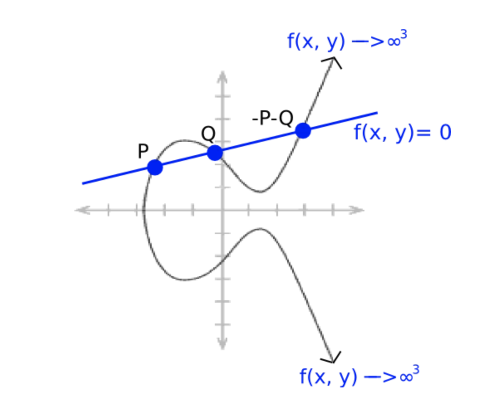

# WTF zk 教程第 37 讲：Miller 算法

这一讲，我们介绍 Miller 算法，它可以高效计算椭圆曲线上的配对。

## 1. Miller 算法

首先我们回顾下 Weil 配对，它将椭圆曲线 $m$-挠群上的两个点 $P, Q$ 映射到 $m$ 次单位根上：

$$
e_m: E[m] \times E[m] \to \mu_m
$$

它的具体形式：

$$
e_m(P, Q) = \frac{f_P(Q+X)}{f_P(X)} / \frac{f_Q(P-X)}{f_Q(-X)}
$$

其中，函数 $f_P$ 和 $f_Q$ 为定义在椭圆曲线上的有理函数，满足：

$$
\text{div}(f_P) = m[P] - m[O]
$$

$$
\text{div}(f_Q) = m[Q] - m[O]
$$

### 1.1 算法步骤

Miller 算法就求解函数 $f_P$ 的高效算法，你可以把它理解为计算配对的 Double-And-Add 算法，对于乘数 $m$，它的计算复杂度是 $O(\log{m})$。具体步骤：

1. 初始 $T = P$ 和 $f = 1$
2. 从 $i = t - 1$ 循环至 0
   - $f = f^2 \cdot h_{T,T}$
   - $T = 2T$
   - 如果 $\varepsilon_i = 1$
      - $f = f \cdot h_{T,P}$
      - $T = T + P$
3. 结束循环
4. 返回 $f$ 的值

最后返回的函数 $f$ 的除子满足以下形式：

$$
\text{div}(f_P) = m[P] - [mP] - (m-1)[O]
$$

当 $P$ 是 $m$-挠点时，有 $mP = O$，因此除子变为 $\text{div}(f_P) = m[P] - (m)[O]$，符合 Weil 配对中的形式。

### 1.2 证明

首先，我们定义一个和椭圆曲线交与 $P, Q, -P-Q$ 三点的直线 $y = \lambda x + \mu$。



定义在椭圆曲线上的有理函数 $y-\lambda x - \mu$ 在 $P, Q, -P-Q$ 有三个零点，重数均为1；在无穷远点 $O$ 有一个极点，重数为3。它的除子满足：

$$
\text{div}(y-\lambda x - \mu) = [P] + [Q] + [- P - Q] - 3[O]
$$

另外，有理函数 $x-x_{P+Q}$ 在 $P+Q$ 和 $-P-Q$ 有两个零点（它们的横坐标相等），重数均为1；在无穷远点 $O$ 有一个极点，重数为2。它的除子满足：

$$
\text{div}(x-x_{P+Q}) = [P+Q] + [- P - Q] - 2[O]
$$

我们可以构造上面两个有理函数的商 $h_{P, Q} = \frac{y-\lambda x - \mu}{x-x_{P+Q}}$，它同样是个有理函数，并且它的除子满足（上面两个除子相减）：

$$
\text{div}(h_{P, Q}) = [P] + [Q] - [- P - Q] - [O]
$$

特别的，当直线斜率 $\lambda = \infty$ 时，有 $P + Q = O$，我们设 $g_{P,Q} = x - x_P$，它的除子为：

$$
\text{div}(h_{P, Q}) = [P] + [-P] - 2[O]
$$

接下来，我们将 $m$ 展开为二进制形式

$m = \varepsilon_0 + \varepsilon_1 \cdot 2 + \varepsilon_2 \cdot 2^2 + \ldots + \varepsilon_t \cdot 2^t$

其中 $\varepsilon_i \in \{0, 1\}$ 且 $\varepsilon_t \neq 0$。

通过简单的（并不）归纳法，我们就能证明 Miller 算法输出的 $f$ 满足

$$
\text{div}(f_P) = m[P] - [mP] - (m-1)[O]
$$

## 2. 例子

下面我们举个稍微复杂的 Weil 配对的例子，过程使用 Sage 计算，内置了 Miller 算法。Sage（也称为SageMath）是一个开源的数学软件系统，旨在提供一个强大、全面的环境，用于解决各种数学问题和进行数学研究。它的语法与python类似，你可以使用 [SageMathCell](https://sagecell.sagemath.org/) 在浏览器中运行 Sage 程序。

设定义在 $F_{631}$ 上的椭圆曲 $E: y^2 = x^3 + 30x + 34 \pmod{631}$。椭圆曲线上共有 650 个点，可以被分解为 $2 \cdot 5^2 \cdot 13$。它的 $5$-挠群 $E[5]$ 上共有 25 个点，我们在其中取点 $P(36, 60)$ 和 $Q(121, 387)$，它们都是 $E[5]$ 的生成元。然后我们用 Sage 计算它们的 Weil 配对：

$$
e_m(P, Q) = 242
$$

它满足 $242 \in \mu_5$，因为 $242^5 = 1 \pmod{631}$。

代码如下：

```python
p = 631
a = 30
b = 34
E = EllipticCurve(GF(p), [a, b])
print(E)
print("椭圆曲线中的元素个数: ", E.cardinality())

# 获取5-挠群的点
INF = E[0]
L_E_5 = INF.division_points(5)  # [11]P == INF
E_5 = Set(L_E_5)  # $5$-torsion
print("5-torsion points: ", E_5)
print("5-挠群中的元素个数: ", E_5.cardinality())

P = E([36,60])
Q = E([121,387])

weil_P_Q = P.weil_pairing(Q, 5)
print("5-挠群中点", P, "和", Q, "的Weil配对为", weil_P_Q)

# 输出
# Elliptic Curve defined by y^2 = x^3 + 30*x + 34 over Finite Field of size 631
# 椭圆曲线中的元素个数:  650
# 5-torsion points:  {(121 : 244 : 1), (121 : 387 : 1), (420 : 48 : 1), (0 : 1 : 0), (531 : 613 : 1), (36 : 60 : 1), (586 : 584 : 1), (428 : 25 : 1), (586 : 47 : 1), (339 : 132 : 1), (289 : 362 : 1), (575 : 7 : 1), (511 : 23 : 1), (511 : 608 : 1), (617 : 626 : 1), (575 : 624 : 1), (595 : 221 : 1), (617 : 5 : 1), (595 : 410 : 1), (36 : 571 : 1), (531 : 18 : 1), (339 : 499 : 1), (289 : 269 : 1), (428 : 606 : 1), (420 : 583 : 1)}
# 5-挠群中的元素个数:  25
# 5-挠群中点 (36 : 60 : 1) 和 (121 : 387 : 1) 的Weil配对为 242
```

接下来，我们计算 $R = 3P = (617, 5)$ 和 $S = 4Q = (121, 144)$ 之间的配对：

$$
e_m(R, S) = 512
$$

因为 Weil 配对满足双线性，那么应该有 $e_m(R, S) = e_m(3P, 4Q) = e_m(P,Q)^{12}$。验证一下 $242^{12} = 512 \pmod{631}$，的确成立。

因此，使用 Weil 配对，我们可以用 $e_m(P, Q)^{12} = e_m(3P,4P)$ 来验证 $3 * 4 = 12$。

代码如下：

```python
R = 3 * P
S = 4 * Q

weil_R_S = R.weil_pairing(S, 5)
print("5-挠群中点", R, "和", S, "的Weil配对为", weil_R_S)

print("因为 R= 3P, S = 4Q，因此 weil_P_Q ^ 12  = ",  weil_P_Q^12 , "和 weil_R_S 相等")

# 5-挠群中点 (617 : 5 : 1) 和 (121 : 244 : 1) 的Weil配对为 512
# 因为 R= 3P, S = 4Q，因此 weil_P_Q ^ 12  =  512 和 weil_R_S 相等
```

## 3. 总结

这一讲，我们介绍了可以高效计算配对的 Miller 算法，并使用 Sage 写了一个 Weil 配对的例子。