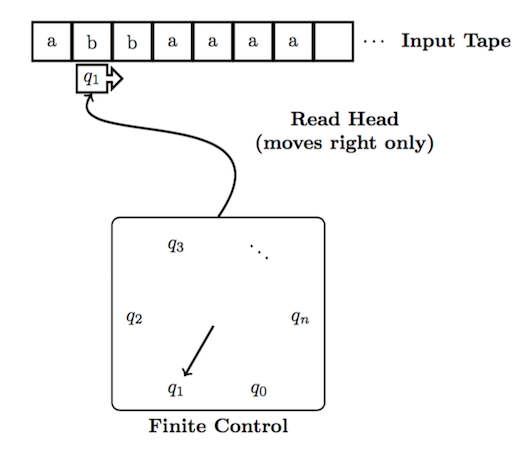
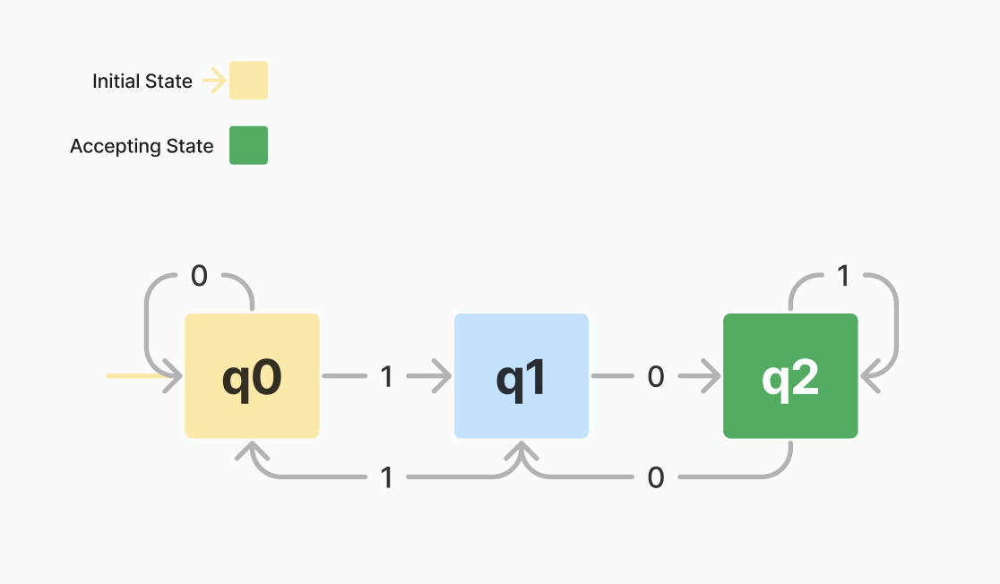

# WTF zk 教程第 41 讲：计算理论入门

零知识证明（ZKP）是计算理论（Theory of Computation）的重要应用之一，用于验证一个命题的真实性而不泄露任何附加信息。在深入研究零知识证明之前，了解计算理论的基础是至关重要的。这一讲，我们将介绍计算理论的基本概念，包括有限自动机（Finite Automata）和正则语言。

## 1. 计算理论概览

计算理论是研究计算过程及其能力的理论分支，主要分为两部分：可计算性理论（Computability Theory）和复杂性理论（Complexity Theory）。

### 1.1 可计算性理论

- **定义**：研究哪些问题可以通过计算解决以及如何解决。
- **活跃时间**：1930-1960。
- **图灵机**是可计算性理论的基础模型，用于定义算法和计算。

### 1.2 复杂性理论

- **定义**：研究解决问题所需的资源（时间、空间等）及其优化。
- **活跃时间**：1960至今。
- 主要研究对象是**复杂性类**：如P类、NP类，用于分类问题的计算复杂性。

## 2. 基本术语

这一节，我们介绍一些计算理论中的常用概念，包括：符号、字母表、字符串、语言。

### 2.1 符号（Symbol）

符号是构成字符串的基本单元，比如 "a"，"b"，"c"，"1"，"0" 均是符号。符号具有以下特性：

- **原子性**：符号是不可再分的，意味着在处理的上下文中，它们不能被拆分成更小的部分。
- **抽象性**：符号本身不携带意义，而是在特定的语境中被赋予意义。例如，在不同的编程语言中，相同的字符可能用于表示不同的操作或数据类型。
- **多样性**：符号可以是任何事物，只要它是字母表中的一部分。常见的符号包括字母、数字、特殊字符等。

### 2.2 字母表（Alphabet）

字母表是一组符号的集合，通常表示为 $\Sigma$。这些符号是构造字符串的基本单元。在计算理论中，字母表可以非常简单，例如：
- 二进制字母表: $\Sigma = \{0, 1\}$
- ASCII字符集
- 任意有限集合，如 $\Sigma = \{a, b, c\}$

字母表的幂（Power of Alphabet）指字母表生成的所有可能字符串的集合。对于字母表 $\Sigma$ ， $\Sigma^n$ 表示字母表中符号生成的所有长度为 $n$ 的字符串的集合。

举个例子，设字母表 $\Sigma = \{a, b\}$:

- $\Sigma^0$ 是仅包含空字符串的集合：$\{\epsilon\}$
- $\Sigma^1$ 是包含长度为1的所有字符串的集合：$\{a, b\}$
- $\Sigma^2$ 是包含长度为2的所有字符串的集合：$\{aa, ab, ba, bb\}$
- $\Sigma^3$ 是包含长度为3的所有字符串的集合：$\{aaa, aab, aba, abb, baa, bab, bba, bbb\}$
- $\Sigma^* = \bigcup_{n=0}^{\infty} \Sigma^n$ 表示通过 $\Sigma$ 能够生成的所有字符串集合，包括空字符串和任意长度的字符串。

### 2.3 字符串（String）

字符串是字母表中符号的一个有序序列。字符串可以有任意长度，包括空字符串（表示为 $\epsilon$）。例如，考虑字母表 $\Sigma = \{0, 1\}$，能组成的字符串包括：
- "0"
- "1101"
- "01010101"
- 空字符串 $\epsilon$

字符串的长度是构成字符串的符号数量。例如，字符串 "1101" 的长度为 4。

字符串的幂（Power of Strings）表示将字符串重复若干次所得到的新字符串：

- 对于字符串 $s = "abc"$ 和幂 $n = 3$，其幂 $s^n$ 表示 $s$ 重复 $n$ 次，即 $s^3 = "abcabcabc"$。

### 2.4 语言（Language）

在计算理论中，语言是某个特定字母表上所有可能字符串 $\Sigma^*$ 的子集。语言可以通过直接枚举其元素定义，通过正则表达式定义，或者通过自动机等计算模型定义。例如：

- 语言 $L_1 = \{0, 11, 001\}$ 是字母表 $\{0, 1\}$ 上的一个语言，只包含三个字符串。
- 语言 $L_2 = \{0^n 1^n \mid n \geq 0\} $ 包含所有形式为连续的 $n$ 个 0 后跟连续的 $n$ 个 1 的字符串，例如 $\epsilon$, "01", "0011", "000111", 等等。

语言的定义可以非常灵活，允许我们描述复杂的模式和约束。例如，正则语言是可以通过正则表达式描述的语言集合，例如语言 $L_3 = \{(ab)^n \mid n \geq 0\}$ 可以用正则表达式 $(ab)^*$ 描述，表示任意数量的 "ab" 对。

## 3. 有限自动机

有限状态自动机是计算理论中最基础的计算模型，用于识别正则语言。



它是一种简单的机器，逐个符号地读取输入字符串，按照规则改变其内部状态，然后在完全读取输入后决定是否接受或拒绝输入。

### 3.1 确定有限自动机

如果可以为自动机制定一个确定的代码，并且只有唯一的一种方法来制定该代码，那么该机器称为确定有限自动机（DFA）。

DFA在概念上由三部分组成：

1. **磁带**：用于存储输入字符串。磁带被划分为有限数量的单元格，每个单元格包含一个符号。
2. **磁带头**：用于读取磁带上的符号。
3. **控制器**：由以下三部分组成：
   - 机器可以处于的有限状态（一个或多个状态被指定为接受状态或终止状态）。
   - 初始状态。
   - 状态转移函数，用于改变当前状态。

自动机通过重复以下操作来处理磁带上的字符串，直到磁带头遍历整个字符串：

1. 磁带头读取当前磁带单元格的符号 $s$ 发送到控制器，然后磁带头移动到下一个单元格。
2. 控制器接收符号 $s$ 和当前状态，并根据状态转移函数以获取下一个状态，将当前状态更新为该状态。

一旦整个字符串被处理完毕，检查自动机进入的状态：如果处于接受状态，则接受输入字符串；否则，拒绝该字符串。

### 3.2 DFA的形式化定义

一个有限自动机可以表示为五元组 $A = (Q, \Sigma, \delta, q_0, F)$，其中：
- $Q$ 是有限状态集合。这是一个包含所有可能状态的集合，有限自动机在任何时间点都处于这些状态之一。
- $\Sigma$ 是输入字母表。这是一个包含所有可能输入符号的有限集合，输入字母表中的符号是自动机接受并处理的输入。
- $\delta$ 是状态转移函数： $\delta: Q \times \Sigma \rightarrow Q$。这个函数定义了自动机在给定状态和输入符号下如何转移到下一个状态。具体来说，对于每一对（当前状态，输入符号），状态转移函数确定性的指定了下一个状态。
- $q_0$ 是初始状态。这是自动机开始时所处的状态， $q_0 \in Q$。
- $F$ 是接受状态集合：这是一个包含所有接受状态的集合。一个字符串被自动机接受当且仅当在处理完字符串所有输入符号后，自动机处于接受状态中的某一个。$F \subseteq Q$。

若 $S$ 是机器 $A$ 接受的全部字符串集合，则称 $S$ 是机器 $A$ 的语言，记为 $L(A) = S$，即 $A$ 识别 $S$。

### 3.3 例子

假设我们有一个有限自动机 $A = (Q, \Sigma, \delta, q_0, F)$，具体定义如下：
- $Q = \{q_0, q_1, q_2\}$，即状态集合包含三个状态： $q_0, q_1, q_2$。
- $\Sigma = \{0, 1\}$，输入字母表包含两个符号：$0$ 和 $1$。
- $\delta$ 定义如下：
  - $\delta(q_0, 0) = q_0$
  - $\delta(q_0, 1) = q_1$
  - $\delta(q_1, 0) = q_2$
  - $\delta(q_1, 1) = q_0$
  - $\delta(q_2, 0) = q_1$
  - $\delta(q_2, 1) = q_2$
- $q_0$ 是初始状态。
- $F = \{q_2\}$，接受状态集合包含状态 $q_2$。

它的示意图如下：



对于输入字符串 $101$，有限自动机的状态转移过程如下：
1. 初始状态为 $q_0$。
2. 读取第一个输入符号 $1$，状态从 $q_0$ 转移到 $q_1$（根据 $\delta(q_0, 1) = q_1$）。
3. 读取第二个输入符号 $0$，状态从 $q_1$ 转移到 $q_2$（根据 $\delta(q_1, 0) = q_2$）。
4. 读取第三个输入符号 $1$，状态从 $q_2$ 转移到 $q_2$（根据 $\delta(q_2, 1) = q_2$）。
5. 输入处理完毕，当前状态是 $q_2$，它属于接受状态集合 $F$。

因此，输入字符串 $101$ 被有限自动机 $A$ 接受。

而字符串 $011$ 将被有限自动机 $A$ 拒绝，想一想为什么？

### 3.4 代码示例 

下面，我们用python实现例子中的DFA，可以看到输入 $101$ 被DFA接受，而 $011$ 不被接受。

```python
class DFA:
    def __init__(self, states, alphabet, transition_function, start_state, accept_states):
        self.states = states
        self.alphabet = alphabet
        self.transition_function = transition_function
        self.start_state = start_state
        self.accept_states = accept_states

    def accepts(self, input_string):
        current_state = self.start_state
        for symbol in input_string:
            if symbol in self.alphabet:
                current_state = self.transition_function[current_state][symbol]
            else:
                return False
        return current_state in self.accept_states

# 定义一个DFA，识别以'01'结尾的字符串
states = {'q0', 'q1', 'q2'}
alphabet = {'0', '1'}
transition_function = {
    'q0': {'0': 'q0', '1': 'q1'},
    'q1': {'0': 'q2', '1': 'q0'},
    'q2': {'0': 'q1', '1': 'q2'}
}
start_state = 'q0'
accept_states = {'q2'}

dfa = DFA(states, alphabet, transition_function, start_state, accept_states)

# 示例使用
input_string = "101"  # 应该被接受
print(f"Input: {input_string}, Accepted: {dfa.accepts(input_string)}")

input_string = "011"  # 不应该被接受
print(f"Input: {input_string}, Accepted: {dfa.accepts(input_string)}")
```

## 4. 正则表达式

正则语言（Regular Language）是形式语言的一种，可以被有限自动机或正则表达式描述。它们在文本处理、编译器设计和搜索引擎中有广泛的应用。

正则表达式就是通过简单的构建规则从基本单元（基本正则语言和正则操作）构造出正则语言的方法。

### 4.1 基本正则语言

对于任何字母表 $\Sigma$ 和其上的每个符号 $a \in \Sigma$，单符号集 {a} 是一个正则语言。此外，空集合 $\emptyset$ 和仅包含空字符串的集合 $\{\epsilon\}$ 也是正则语言。

### 4.2 正则操作

正则操作主要包括并运算、连接运算、闭包运算三种。我们会假设 $L_1, L_2$ 均为正则语言，那么：

- **并运算（Union）**： $L_1 \cup L_2 = \{ w \mid w \in L_1 \text{ or } w \in L_2 \}$

- **连接运算（Concatenation）**： $L_1 \circ L_2 = L_1 L_2 = \{ w_1 w_2 \mid w_1 \in L_1, w_2 \in L_2 \}$

- **闭包运算（Star）**： $L_1^* = \{ w_1 w_2 \cdots w_n \mid n \geq 0, w_i \in L_1 \}$


举几个例子，假设 $L_1 = \{\text{wtf}\}$, $L_2 = \{\text{solidity}, \text{zk}\}$，那么：

1. $L_1 \cup L_2 = \{\text{wtf}, \text{solidity}, \text{zk}\}$

2. $L_1 \circ L_2 = \{\text{wtfsolidity}, \text{wtfzk}\}$

3. $L_1^* = \{\epsilon, \text{wtf}, \text{wtfwtf}, \text{wtfwtfwtf}, ...\}$


### 4.3 正则表达式例子

假设字母表 $\Sigma = \{0, 1\}$：

1. $1^*$：表示零个或多个字符 $1$ 的字符串集合定义的语言。它定义的正则语言包含空字符串 $\epsilon$, $1$, $11$, $111$ 等等。
2. $0^*10^*$：表示仅包含1个 $1$ 的字符串集合定义的语言。
3. $\Sigma^*1\Sigma^*$：表示至少包含1个 $1$ 的字符串集合定义的语言。

### 4.4 与有限自动机的等价性

正则表达式和有限自动机之间的等价性是计算理论中的一个基本结果，表明这两种不同的形式语言描述方式能够表示相同的语言类别——正则语言。这种等价性意味着对于每个正则表达式，都存在一个能够识别相同语言的有限自动机，反之亦然。

## 5. 总结

这一讲，我们介绍了计算理论的基本概念，包括有限自动机和正则语言，为深入研究零知识证明和计算复杂性理论打下坚实的基础。

