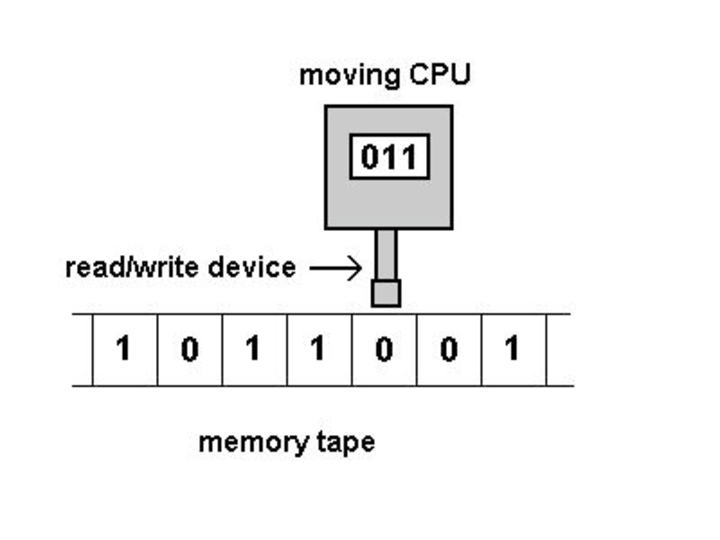
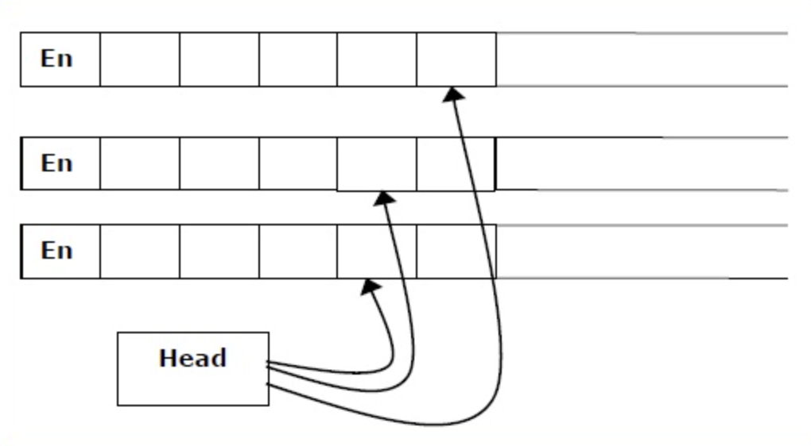
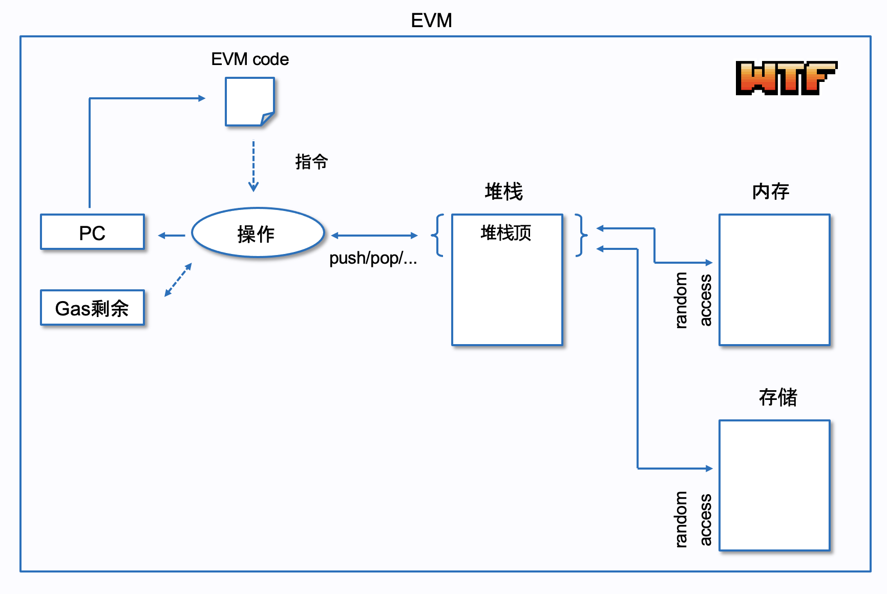

# WTF zk 教程第 42 讲：图灵机

在上一讲中，我们介绍了计算理论的基本概念，包括有限自动机和正则语言。这一讲，我们将探讨计算理论中最重要的概念：图灵机。

## 1. 图灵机

图灵机是由英国数学家艾伦·图灵在1936年提出的抽象计算模型。图灵机与有穷自动机相似，但它有无限大的存储容量且任意访问内部数据，能够模拟任何计算机算法。

### 1.1 图灵机的基本结构

一个图灵机包含以下几个关键组件：

1. **无限长的纸带**：被划分为一个个单元格，每个单元格可以包含一个符号。
2. **读写头**：可以在纸带上左右移动，读取和修改纸带上的符号。
3. **有限状态控制器**：控制图灵机的行为，包含有限数量的状态。
4. **转移函数**：根据当前状态和读取的符号，决定下一步的动作。

图灵机和有限自动机的主要区别包括：

1. **读写能力**：有限状态机只能进行读取，而图灵机既能读取也能写入。
2. **移动方向**：有限状态机只能向右移动，而图灵机既能向右也能向左。
3. **纸带长度**：有限状态机的纸带长度是有限的，而图灵机的纸带长度是无限的
4. **停机方式**：有限状态机只能在处理完所有状态后停机（判断接受/拒绝）；而图灵机在进入接受/拒绝状态后立即停机，也可能永不停机（无限循环）。

这些差异使图灵机的计算能力远超有限自动机。

### 1.2 图灵机的工作原理

图灵机的工作过程如下：

1. 初始时，输入字符串写在纸带上，读写头位于最左边的非空字符处。
2. 图灵机从初始状态开始，重复以下步骤：
   a. 读取当前单元格的符号
   b. 根据当前状态和读取的符号，查询转移函数
   c. 执行转移函数指定的动作：写入新符号、移动读写头、改变状态
3. 如果达到接受状态，则接受输入；如果达到拒绝状态，则拒绝输入。

### 1.3 图灵机示例

让我们通过一个简单的例子来理解图灵机的工作原理。假设我们要设计一个图灵机来接受形如 $0^n1^n$ 的语言（其中 $n \geq 1$），即包含连续的相同数量的0和1的字符串。

这个图灵机的工作过程如下：
1. 从左到右扫描，将第一个0改为X，然后向右移动直到找到最右边的1。
2. 将最右边的1改为X，然后向左移动直到找到最左边的未标记的0。
3. 重复步骤1和2，如果最后所有的符号都被标记为X，则接受；否则拒绝。

### 1.4 图灵机的形式化定义

一个图灵机可以形式化地定义为一个七元组 $M = (Q, \Sigma, \Gamma, \delta, q_0, q_{accept}, q_{reject})$，其中：

- $Q$ 是有限的状态集合
- $\Sigma$ 是输入字母表（不包含空白符号 $\square$）
- $\Gamma$ 是纸带字母表，满足 $\Sigma \subset \Gamma$ 且 $\square \in \Gamma$
- $\delta: Q \times \Gamma \rightarrow Q \times \Gamma \times \{L, R\}$ 是转移函数
- $q_0 \in Q$ 是初始状态
- $q_{accept} \in Q$ 是接受状态
- $q_{reject} \in Q$ 是拒绝状态，且 $q_{accept} \neq q_{reject}$

### 1.5 图灵可识别和图灵可判定  

这两个概念对于后续学习计算复杂性理论至关重要。

- **图灵可识别（Turing-recognizable）**：如果一个语言能被某个图灵机识别，则称它是图灵可识别的。这意味着对于该语言中的任何字符串，图灵机都会最终接受它；对于不在该语言中的字符串，图灵机可能拒绝或永不停机。  
亦即，在输入字符串上运行一个作为识别器的图灵机，可能出现三种结果：停机接受、停机拒绝和循环（指机器不停机）。  
对于一个输入，图灵机有两种方式不接受：停机拒绝和循环。

- **图灵可判定（Turing-decidable）**：如果存在一个图灵机 $M$，对于一个语言中的任何输入，$M$ 都会在有限步骤内停机并正确地接受或拒绝，则称该语言是图灵可判定的。这比图灵可识别更强，因为它要求图灵机对所有输入都能在有限时间内给出明确的接受或拒绝决定。  
在输入字符串上运行一个作为判定器的图灵机，只可能出现两种结果：停机接受和停机拒绝。

所有图灵可判定的语言都是图灵可识别的，这意味着能够判定的问题必然也是可识别的。更进一步，一个语言是图灵可判定的，当且仅当它和它的补语言都是图灵可识别的。

## 2. 图灵机的变体

### 2.1 多带图灵机

多带图灵机有多个纸带和读写头，每个读写头可以独立移动。这种变体可以简化某些算法的设计，但在计算能力上与标准图灵机等价。

### 2.2 非确定性图灵机

非确定性图灵机在每一步可以有多个可能的动作，有多个计算路径。如果存在一个可以到达接受状态的计算路径，则接受输入。这类图灵机在理论上与确定性图灵机具有相同的计算能力。

### 2.3 以太坊虚拟机

以太坊虚拟机（Ethereum Virtual Machine, EVM）被称为图灵完备的，这是因为它具备图灵机的所有计算能力。

EVM是以太坊智能合约的执行环境，其主要组成部分包括：
- **栈、内存和存储**：用于存储数据。栈是临时数据存储，内存是短期数据存储，存储是长期数据存储。
- **字节码**：智能合约的编译代码，由EVM解释执行。
- **程序计数器（PC）**：指示当前执行到的指令。
- **指令集（Opcode）**：包括算术操作、逻辑操作、数据存储操作、流程控制操作等。

下面是EVM和图灵机的对比：

1. 无限纸带：虽然EVM的内存和存储都是有限的，但通过区块链网络的扩展性和分布式存储，EVM可以动态增加存储空间，理论上可以视为无限。
2. 读写头：EVM的程序计数器和指令可以完成图灵机读写头的功能。
3. 有限状态集合：EVM执行字节码指令时，通过控制流指令（如JUMP、JUMPI）和状态变量模拟有限状态集合。
4. 状态转移函数：指令集包括一系列操作码，每个操作码对应一个特定的操作，如算术计算、数据操作、条件跳转等，类似于图灵机的状态转移函数。

EVM具备动态可扩展的存储机制，能够执行复杂计算和条件跳转的指令集，支持无限循环和递归调用，总的来说，EVM的计算规则可以实现图灵机模型里的全部功能，时因此我们说EVM是图灵完备的。

## 3. 算法和图灵机的关系

### 3.1 算法的定义

算法是解决问题的一系列明确而精确的步骤，具有以下特征：

1. 输入：接受零个或多个输入。
2. 输出：产生一个或多个输出。
3. 确定性：每个步骤都明确无歧义。
4. 有限性：在有限步骤内终止。
5. 有效性：每个步骤都可以被精确执行。

## 3.2 算法和图灵机的对应关系  

算法和图灵机之间存在着深刻的对应关系：

1. **计算等价性**：如果一个问题可以通过某种算法解决，那么理论上也存在一台图灵机能够解决这个问题，反之亦然。这就是著名的丘奇-图灵论题（Church-Turing thesis）。

2. **步骤对应**：算法的每一个步骤都可以映射到图灵机的一个或多个状态转换。

3. **输入输出**：算法的输入对应图灵机纸带的初始状态，输出对应计算结束时纸带的内容。

4. **控制流**：算法中的条件和循环结构对应图灵机中的状态转换和读写头的回头操作。

5. **抽象级别**：算法通常是高级的抽象描述，而图灵机提供了一个更低级的计算模型。

算法是作为判定器的图灵机。

## 4. 总结

这一讲，我们介绍了图灵机，并解释了为什么EVM是图灵完备的。图灵机是计算理论的基石，帮助我们理解计算的本质和限制。