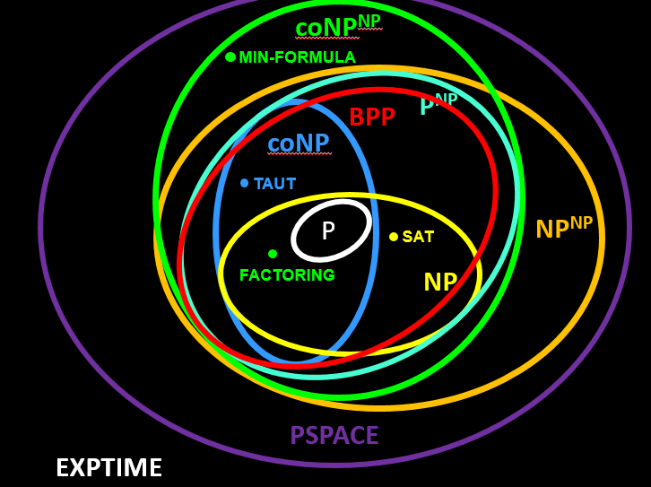
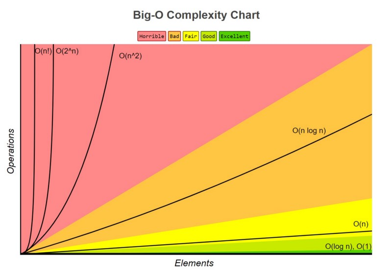

# WTF zk 教程第 43 讲：时间复杂度

在上一讲中，我们介绍了图灵机的概念及其在计算理论中的重要性。这一讲，我们将探讨计算理论中另一个核心概念：复杂性理论，并介绍时间复杂度。

## 1. 什么是复杂性理论

复杂性理论是计算机科学的一个重要分支，主要研究解决计算问题所需的资源（如时间和空间）。它回答了以下关键问题：

1. 解决一个特定问题需要多少时间？
2. 需要多少内存空间？
3. 不同问题之间的难度如何比较？

复杂性理论不仅关注解决问题是否可能（这是可计算性理论的范畴），更关注解决问题的效率。它帮助我们理解问题的内在难度，指导我们设计更高效的算法。



## 2. 时间复杂度

时间复杂度（Time Complexity）描述了算法执行时间与输入大小的关系。假设 $M$ 是一个对于所有输入都停机的图灵机，它的时间复杂度 $t(n)$ 为 $M$ 在所有长度为 $n$ 的输入上运行的最大步数。

### 2.1 大O表示法

因为算法的精确时间通常是一个复杂的表达式，所以我们一般只估计它的趋势和级别。这种方法叫做**渐进分析**，只考虑算法运行时间表达式的最高次项。

大O表示法给出了算法运行时间的上界。如果一个算法的时间复杂度是 $O(t(n))$，意味着当输入大小为 $n$ 时，算法的运行时间不会超过 $ct(n)$，其中 $c$ 是一个常数。



### 2.2 常见的时间复杂度

假设输入长度为 $n$。

1. **$O(1)$** - 常数时间：无论输入大小如何，算法总是执行固定次数的操作，非常高效。比如访问数组的特定元素：

   ```python
   def constant_time(arr):
       return arr[0] if arr else None
   ```

2. **$O(\log{n})$** - 对数时间：算法的运行时间与输入大小的对数成正比，非常高效。比如二分查找：

   ```python
   def binbary_search(arr, target):
       left, right = 0, len(arr) - 1
       while left <= right:
           mid = (left + right) // 2
           if arr[mid] == target:
               return mid
           elif arr[mid] < target:
               left = mid + 1
           else:
               right = mid - 1
       return -1
   ```

3. **$O(n)$** - 线性时间：算法的运行时间与输入大小成正比，比较高效。比如遍历数组：

   ```python
   def linear_search(arr, target):
       for i, value in enumerate(arr):
           if value == target:
               return i
       return -1
   ```

4. **$O(n \log{n})$** - 线性对数时间：算法的运行时间与 $n\log{n}$ 成正比。很多高效的排序算法都具有这种复杂度，效率可以接受，比如归并排序（Merge Sort）：

```python
   def merge_sort(arr):
       if len(arr) <= 1:
           return arr
       mid = len(arr) // 2
       left = merge_sort(arr[:mid])
       right = merge_sort(arr[mid:])
       return merge(left, right)

   def merge(left, right):
       result = []
       i, j = 0, 0
       while i < len(left) and j < len(right):
           if left[i] <= right[j]:
               result.append(left[i])
               i += 1
           else:
               result.append(right[j])
               j += 1
       result.extend(left[i:])
       result.extend(right[j:])
       return result
   ```

5. **$O(n^2)$** - 平方时间：算法的运行时间与 $n^2$ 成正比，通常涉及嵌套循环，效率低下。比如冒泡排序：

   ```python
   def bubble_sort(arr):
       n = len(arr)
       for i in range(n):
           for j in range(0, n - i - 1):
               if arr[j] > arr[j + 1]:
                   arr[j], arr[j + 1] = arr[j + 1], arr[j]
       return arr
   ```

6. **$O(2^n)$** - 指数时间：算法的运行时间随输入大小呈指数增长，效率低下。比如递归计算斐波那契数列：

   ```python
   def fibonacci(n):
       if n <= 1:
           return n
       return fibonacci(n-1) + fibonacci(n-2)
   ```

## 3. 最坏情况、平均情况和最好情况分析

在分析算法时，我们通常考虑三种情况：

1. **最坏情况**：算法执行时间最长的情况。这通常是我们最关心的，因为它给出了算法性能的上界。

2. **平均情况**：算法在所有可能输入下的平均表现。这通常更接近算法在实践中的表现。

3. **最好情况**：算法执行时间最短的情况。尽管这不太常用，但有时也能提供有用的信息。

考虑线性搜索算法：

- 最坏情况：目标元素在数组的最后或不存在，需要遍历整个数组，时间复杂度为 $O(n)$。
- 平均情况：假设目标元素随机分布，平均需要遍历半个数组，时间复杂度仍为 $O(n)$。
- 最好情况：目标元素在数组的第一个位置，时间复杂度为 $O(1)$。

## 4. 与ZK的联系：为什么复杂性分析对ZK重要

复杂性分析在ZK证明系统的设计和实现中起着关键作用：

1. **效率评估**：复杂性分析帮助我们评估ZK协议的计算和通信成本。例如，我们希望证明生成的时间复杂度尽可能低，而验证的时间复杂度理想情况下应该是常数级的。

2. **安全性分析**：复杂性理论帮助我们理解破解ZK系统的难度。许多ZK协议的安全性基于某些计算问题的难解性，这些问题通常具有高时间复杂度。

3. **可行性判断**：复杂性分析允许我们确定哪些计算问题适合转化为ZK证明。通常，我们寻找NP类中的问题，因为它们既难以解决又易于验证。

4. **协议设计**：理解复杂性有助于设计更高效的ZK协议。例如，我们可能会使用复杂度较低的算法来构造证明，或者优化协议以减少通信轮数。

5. **性能优化**：通过分析ZK系统各个组件的复杂度，我们可以识别瓶颈并进行有针对性的优化。

比如zk-SNARKs（零知识简洁非交互式知识论证）的一个关键特性是验证的时间复杂度为 $O(1)$，即常数时间。这意味着无论原始计算多么复杂，验证ZK证明的时间都是恒定的。这种特性使得zk-SNARKs特别适用于区块链这种高效验证的场景。

## 5. 总结

这一讲，我们介绍了复杂性理论基础：时间复杂度。复杂性理论为我们提供了分析和比较算法效率的工具，而理解时间复杂度对设计和评估ZK证明系统至关重要。