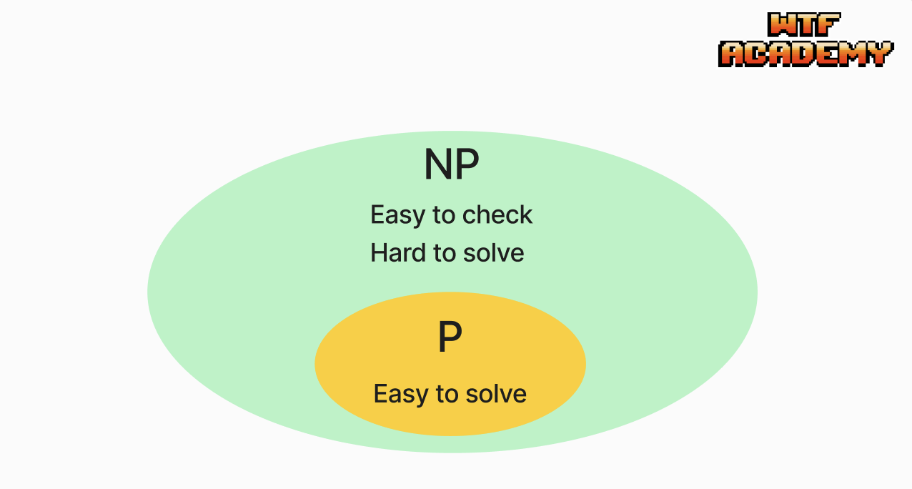
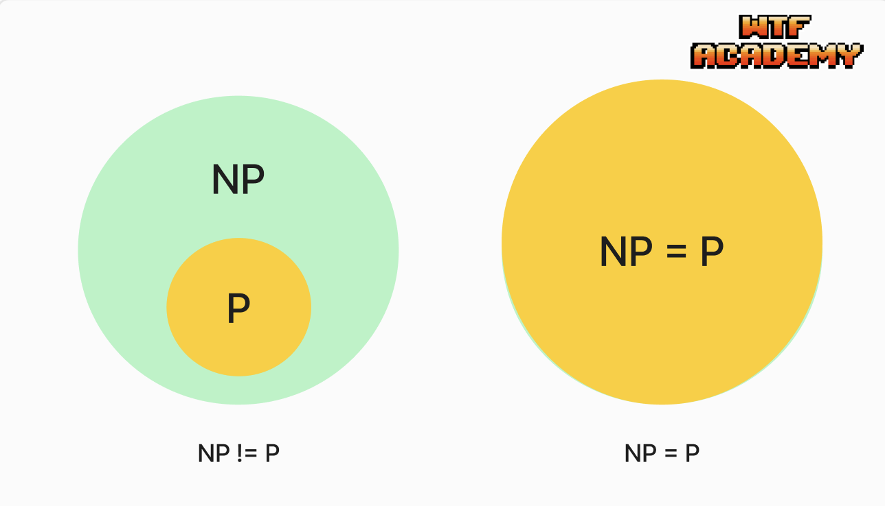

# WTF zk 教程第 44 讲：P 与 NP

在上一讲中，我们介绍了复杂性理论的基础概念。这一讲，我们将探讨两个最重要的复杂度类：P类和NP类。它们有助于我们理解计算问题的难度。

## 1. P类

复杂度类是具有相关复杂性的问题的集合。P类（**P**olynomial Time）是确定型单带图灵机可以在多项式时间内可判定的语言类。我们认为多项式时间的问题是高效的，因此P类代表可以所有被“快速”解决的问题。

### 1.1 P类的形式化定义

设 $t: N \to R^+$ 是一个函数，我们定义时间复杂类 $\text{TIME}(t(n))$ 为由 $O(t(n))$ 时间的确定型图灵机可以判定的所有语言的集合。例如 $\text{TIME}(n^2)$ 是由 $O(n^2)$ 时间的图灵机可以判定的所有语言的集合。

P类的形式化定义为：

$$
P = \cup_k{\text{TIME}(k^n)}
$$

一个语言 $L$ 属于P类，当且仅当存在一个确定性图灵机 $M$ 和一个多项式 $p$，使得：
- 对于任何输入 $x$， 图灵机 $M$ 在最多 $p(\lvert x \rvert)$ 步内停机，其中 $\lvert x \rvert$ 是输入长度。
- $M$ 接受 $x$ 当且仅当 $x \in L$。

### 1.2 P类的特征

在复杂性理论中，P类非常重要，它主要有两个特征：

1. 通用：虽然我们把P类定义在确定型单带图灵机上，但实际上，所有的确定型图灵机（比如确定型多带图灵机）都是多项式等价的。也就是说单带图灵机可以模拟它们中的任何一个模型，且运行时间只增长多项式倍。对于它们，P类是不变的。
2. 高效可解：尽管 $O(n^{100})$ 的算法看起来不那么高效，但算法的时间复杂度只随着输入的变化线性增长。因此随着时间推移我们总是能够找到足够高效的算法（比如 $O(n^2)$）解决同样的问题。因此，P类大致对应计算机实际可解的问题。

### 1.3 P类的例子

咱们之前在[第一章数论](https://github.com/WTFAcademy/WTF-zk/blob/main/03_Euclidean/readme.md)中介绍过**欧几里得算法**，它是求解两个整数的最大公约数的方法。该算法的复杂度是 $O(\log(n))$，因此该问题属于P类。

```python
def euclidean_algorithm(a, b):
    if a < b:
        a, b = b, a
    while b:
        a, b = b, a % b
    return a

# Example
num1 = 30
num2 = 24
gcd_result = euclidean_algorithm(num1, num2)
print(f'The greatest common divisor of {num1} and {num2} is {gcd_result}')
# Output: The greatest common divisor of 30 and 24 is 6
```

还有非常多可以在多项式时间高效求解的问题，它们都属于P类。

## 2. NP类

NP类（**N**ondeterministic **P**olynomial Time）指的是在多项式时间内可以被非确定型图灵机判定，但却不一定可以在多项式时间内被解决的语言类。非确定型图灵机虽然在计算能力上与确定型图灵机等价，但可以使用“猜测并验证”的能力，同时探索多个可能的计算路径，计算效率更高。因此，它不仅包含P类中可以被高效解决的问题，还包含难度更高、只能通过暴力搜索解决的问题。



### 2.1 从验证的角度定义NP

这一节，我们另一个角度定义NP类，即通过验证的概念：

定义：语言 $L$ 的验证器 $V$ 是一个确定性图灵机，满足 $x \in L$ 当且仅当存在一个证明（字符串）$`c`$ 使得 $V(x, c) = 1$。如果验证器在多项式时间内运行，我们称之为多项式时间验证器。

NP类可以定义为所有具有多项式时间验证器的语言的集合。换言之，语言 $L \in NP$，当且仅当存在一个多项式时间验证器可以验证它。

这个定义意味着对于NP类中的任何问题，如果给出一个答案，我们可以在多项式时间内验证这个答案的正确性。

### 2.2 NP类的特征

与P类不同，NP类问题主要的特征有：

1. 难解性：NP类包含了许多在计算上被认为是难解的问题。研究NP类有助于我们理解计算难题的本质。

2. 易于验证：尽管NP类问题难解，但是它的解可以在多项式时间内被验证。这意味着如果给定一个“证明”，我们可以迅速检查这个证明是否是该问题有效的解。

### 2.3 NP类的例子

第二章数论中介绍的离散对数问题（DLP）是NP类的一个典型例子。在群 $Z^*_p$ 中（$`p`$ 为质数），给定生成元 $g$ 和元素 $a$，找到离散对数 $x$ 使得 $a \equiv g^x \pmod{p}$ 成立。

这个问题目前没有已知的多项式时间解法，但给定一个解 $x$，我们可以很容易地在多项式时间内验证 $a \equiv g^x \pmod{p}$ 是否成立。

```python
def compute_dlp(g, a, p):
    # exhaustive search for x: g^x = h (mod p)
    current = 1
    for x in range(p):
        if current == a:
            return x
        current = (current * g) % p
    return None  

# example parameter
g = 13  # generator
a = 17  
p = 31  # prime

# 计算DLP
x = compute_dlp(g, a, p)
print(f"The discrete log of {a} base {g} modulo {p} is x = {x}, since {g}^{x} % {p} = {a}")

# The discrete log of 17 base 13 modulo 31 is x = 14, since 13^14 % 31 = 17

def verify_dlp(g, x, a, p):
    return pow(g, x, p) == a

# verify DLP
is_valid = verify_dlp(g, x, a, p)
print(f"The DLP solution is {'valid' if is_valid else 'invalid'}.")

# The DLP solution is valid.
```

### 3.4 P = NP 吗？

"P是否等于NP"是计算机科学中最著名的未解难题之一，是克雷数学研究所提出的[七个千禧年大奖难题](https://zh.wikipedia.org/wiki/%E5%8D%83%E7%A6%A7%E5%B9%B4%E5%A4%A7%E7%8D%8E%E9%9B%A3%E9%A1%8C)之一，解决它的人可以获得百万美元的大奖：

- 如果P = NP，那么所有可以快速验证的问题也可以快速解决。这将意味着许多被认为困难的问题（包括大多数现代密码系统所依赖的问题）都有高效的解法。
- 大多数研究者倾向于认为P ≠ NP，因为经过数十年的研究，还没有人找到任何一个NP完全问题的多项式时间解法。然而，P ≠ NP 的证明仍然悬而未决。





## 4. 总结

这一讲，我们介绍了复杂性理论中的两个核心概念：P类和NP类。P类问题可以通过确定性算法在多项式时间内高效解决；而NP类问题虽然可能没有已知的高效解法，但其解可以在多项式时间内被验证。理解这两个类的本质对于深入研究计算复杂性和设计高效算法至关重要。许多零知识证明协议都基于NP类问题，利用了这类问题难解但易验证的特性。
