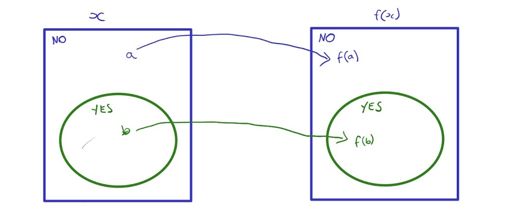
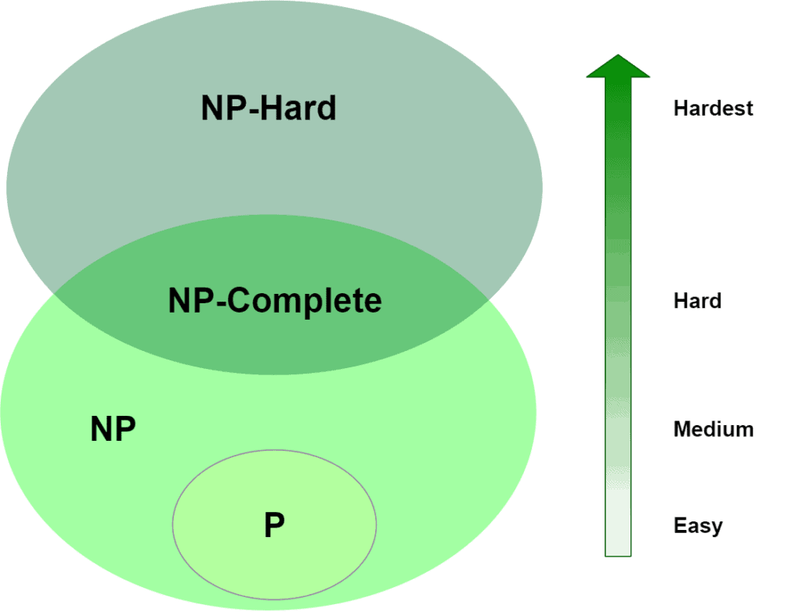
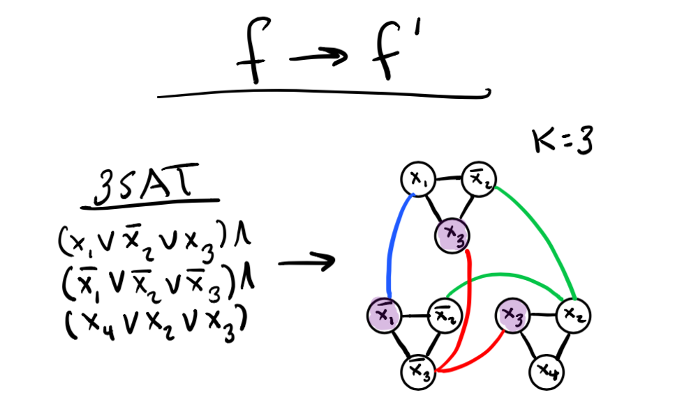

# WTF zk 教程第 45 讲：NP完全性

在上一讲中，我们介绍了 P 类和 NP 类。这一讲，我们将深入探讨 NP 完全性的概念，这是复杂性理论中的一个核心主题，也是理解许多密码学和零知识证明系统的基础。

## 1. 归约

在讨论 NP 完全性之前，我们需要先理解归约（Reduction）的概念。归约是将某个计算问题变换为另一个问题的过程，规约在复杂性理论中起着重要的作用，它允许我们比较问题的相对难度。  

如果问题 A 可以转化为问题 B，那么我们就可以用 B 的答案去解决 A，也就是说 B 至少和 A 一样难。换句话说，如果我们能解决问题 B，就能解决问题 A。  

根据可计算性理论，如果问题 A 可规约到问题 B，且问题 B 是可判定的，则问题 A 也是可判定的。等价地，如果问题 A 不可判定，且可规约到问题 B，则问题 B 也是不可判定的。

### 1.1 映射归约

映射归约（Mapping Reduction）是最基本的归约类型。

定义：给定两个语言 $L_1$ 和 $L_2$，如果存在一个**可计算函数** $f$，对于所有输入 $x$，有 $x \in L_1$ 当且仅当 $f(x) \in L_2$，则我们说 $L_1$ 可归约到 $L_2$，记作 $L_1 \leq_m L_2$。  

映射规约指的是，存在一个**可计算函数**（规约），它将问题 A 的实例转换成问题 B 的实例。如果有了这样的一个可计算函数，就能用问题 B 的解决方法来解决问题 A。  

映射归约展示了如何利用一个映射将一个问题转化为另一个问题。  

### 1.2 多项式时间归约

多项式时间归约（Polynomial-time Reduction）是映射归约的一个更强版本，它要求归约过程必须在**多项式时间**内完成。

定义：如果存在一个多项式时间算法 $f$，对于任意输入 $x$，有 $x \in L_1$ 当且仅当 $f(x) \in L_2$，则我们说 $L_1$ 可多项式时间归约到 $L_2$，记作 $L_1 \leq_p L_2$。  

如同一般的映射规约一样，A 到 B 的多项式时间规约提供了一种方法，把 A 的成员资格判定转化为 B 的成员资格判定，只是这种转化是在多项式时间内有效完成的。为了判定是否 $x \in A$, 用规约 $f$ 把 $x$ 映射为 $f(x)$, 然后判定是否 $f(w) \in B$。

如果 $A \leq_p B$ 且 $B \in \text{P}$, 则 $A \in \text{P}$。也就是说，B 可以用一个确定型图灵机在多项式时间内判定，则 A 也可以用一个确定型图灵机在多项式时间内判定。

### 1.3 归约示例

我们以离散对数问题（DLP）和计算 Diffie-Hellman 问题（CDH）为例，其中：

1. DLP：给定循环群 $G$、生成元 $g$ 和元素 $y \in G$，找到整数 $x$ 使得 $g^x = y$。

2. CDH：给定循环群 $G$、生成元 $g$ 以及 $g^a$ 和 $g^b$（其中 $a$ 和 $b$ 未知），计算 $g^{ab}$。

这两个密码学常用难题均为NP类，没有多项式时间的有效解法。那它们之间是否存在归约关系呢？

答案是有的，如果能解决 DLP，就能轻松的解决CDH问题：给定 $g^a$ 和 $g^b$，先用 DLP 求解 $a$，然后计算 $(g^b)^a = g^{ab}$。因此，我们可以说 DLP 至少与 CDH 一样难。由于归约算法是多项式时间的，这个关系可以表示为：

$$\text{DLP} \geq_p \text{CDH}$$

## 2. NP 完全性

NP 类包含非常多的算法，那么人们如何证明 P = NP 呢？1970 年左右，研究者 Cook 和 Levin 发现 NP 中某些问题的复杂性可以和整个类的复杂性产生关联：如果这些问题中的任何一个多项式时间算法，那么所有 NP 问题都是多项式时间可解的，即 P = NP。这类问题被称为 NP 完全问题（NP-complete），是 NP 类中最难的问题。

### 2.1 NP 完全性的形式化定义

如果语言 $B$ 满足下面的两个条件，就是 NP 完全的：

- $B \in \text{NP}$，并且
- 对于每个 $A \in \text{NP}$，有 $A \leq_p B$. 即 NP 中的每个 $A$ 都多项式时间可规约到 $B$。

若 $B$ 是 NP 完全的，且 $B \in \text{P}$，根据上述定义，则对于任意的 $A \in \text{NP}$，有 $A \leq_p B$，那么 $A \in \text{P}$。

也就是说，若 $B$ 是 NP 完全的，且 $B \in \text{P}$，则 P = NP。  

即所有 NP 问题都可以在**多项式时间**归约到 NP 完全问题。因此，如果找到任何一个 NP 完全问题的多项式时间算法，那么所有 NP 问题都可以在多项式时间内解决 (P = NP)。  

如果 $B$ 是 NP 完全的，且 $B \leq_p C$，$C$ 属于 NP，则 $C$ 是 NP 完全的。这是证明某个问题是 NP 的常用结论。

## 3. SAT 问题

SAT（布尔可满足性问题）是第一个被证明为 NP 完全的问题，在复杂性理论和实际应用中都有重要地位。

我们先复习一下**布尔变量**，**布尔运算**和**布尔公式**。

**布尔变量**指取值为 `TRUE` 或 `FALSE` 的变量，通常我们用 1 表示 `TRUE`，用 0 表示 `FALSE`。

**布尔运算**包含AND，OR，NOT（与、或、非运算），分别用符号 $\wedge$, $\vee$, $\neg$ 表示。为了方便，我们用 $\bar{x}$ 代替 $\neg{x}$。规则如下：

- $0 \wedge 0 = 0$
- $0 \wedge 1 = 0$
- $1 \wedge 0 = 0$
- $1 \wedge 1 = 1$
- $0 \vee 0 = 0$
- $0 \vee 1 = 1$
- $1 \vee 0 = 1$
- $1 \vee 1 = 1$
- $\bar{0} = 1$
- $\bar{1} = 0$

**布尔公式**是包含布尔变量和运算的表达式，例如 

$$\phi = (x_1 \vee \bar{x_2}) \wedge (\bar{x_1} \vee x_3) \wedge (x_2 \vee \bar{x_3})$$

如果存在变量 $x_1, x_2, ..., x_n$ 的取值使得布尔公式的值为1，则称该布尔公式是可满足的（satisfiable）。

### 3.1 定义

SAT 问题：给定一个布尔公式 $\phi$，判断是否存在一组变量赋值使得 $\phi$ 为真。

对于 

$$\phi = (x_1 \vee \bar{x_2}) \wedge (\bar{x_1} \vee x_3) \wedge (x_2 \vee \bar{x_3})$$

赋值 $x_1=1$，$x_2=1$，$x_3=1$ 使得公式 $\phi$，因此该布尔公式是可满足的。

## 3.2 Cook-Levin 定理

Cook-Levin 定理是复杂性理论中的一个里程碑，它证明了 SAT 问题不仅属于 NP，而且是 NP 完全的，即每个 NP 语言 $L$ 都可以多项式时间归约到 SAT 问题。

- 它建立了第一个 NP 完全性问题，即 SAT。
- 它建立了一个模板，可以用来证明其他问题的 NP 完全性。( 对于某问题 $A$，证明 $\text{SAT} \leq_p A$，$A$ 属于 NP，则 $A$ 是 NP 完全的 )

Cook-Levin 定理的证明思路是将任意 NP 问题的验证过程编码为一个布尔公式，证明过程超出本教程范围，请大家自行查阅。

## 4. 总结

这一讲，我们介绍了归约和 NP 完全性。归约可以让我们比较不同问题的相对难度。NP 完全性是 NP 中最难的一类问题，所有 NP 问题都可以归约到它们。SAT 问题是第一个被证明为 NP 完全的问题。