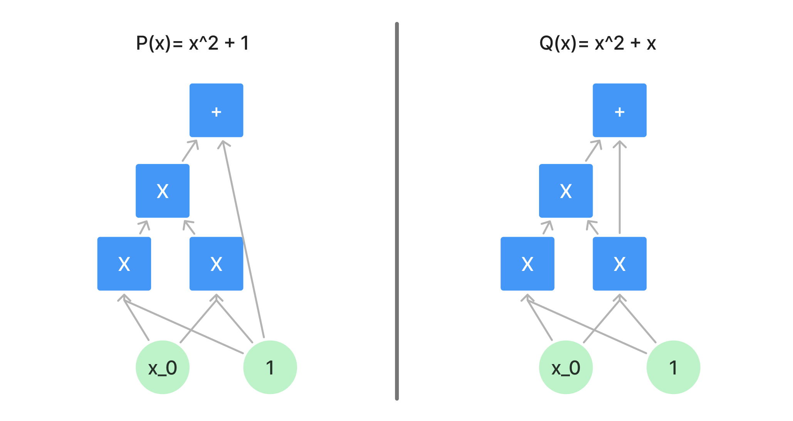
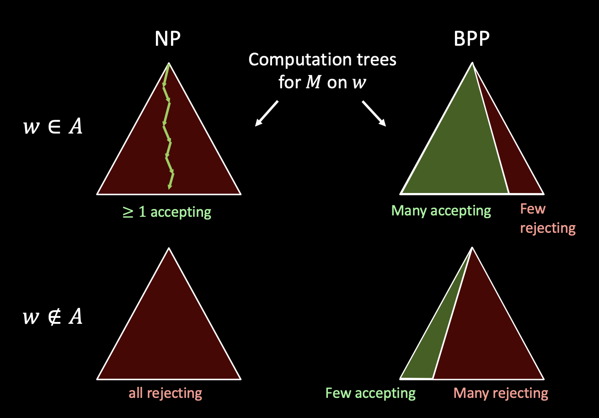

# WTF zk 教程第 47 讲：随机计算

在本讲中，我们将探讨随机计算，包括概率图灵机和BPP类的概念。所有零知识证明都是概率证明，理解随机计算非常重要。

## 1. 概率图灵机

概率图灵机（Probabilistic Turing Machine，简称 PTM）是对确定性图灵机的扩展，它引入了随机性。

### 1.1 定义

概率图灵机是一个七元组 $(Q, \Sigma, \Gamma, \delta, q_0, q_{accept}, q_{reject})$，其中：

- $Q, \Sigma, \Gamma, q_0, q_{accept}, q_{reject}$ 的定义与确定性图灵机相同
- $\delta: P(Q \times \Gamma \times Q \times \Gamma \times \{L,R\})$ 是转移分布函数，给出所有可能转移的概率分布，其中 $P(S)$ 表示集合 $S$ 上的概率分布。

可以看出，概率图灵机和确定性图灵机的关键区别在于转移分布函数 $\delta$：PTM 可以根据概率随机的在每步做出不同选择，能够更高效的处理某些问题。

确定性图灵机也是特殊的概率图灵机，只不过它所有的转移概率均为 0 或 1。

### 1.2 示例：多项式恒等测试

[多项式](../46_Polynomial/readme.md)恒等测试（Polynomial Identity Testing，PIT）是判断两个多元多项式是否相同的问题，即给定两个多项式 $P(x)$ 和 $Q(x)$，判断对于所有 $x$，是否有 $P(x) = Q(x)$。

你可能会说，我们可以逐项展开两个多项式，然后比较它们的系数。但对于高次多项式或多变量多项式，这个问题可能会很复杂。并且对于定义在域上的多项式，即使系数不相同，多项式也可能相等。比如定义在 $F_2$ 上的多项式 $x^3 + x^2 + x$ 和 $x$ 

是相等的。目前，我们还没有多项式恒等测试的确定性算法，但我们可以使用随机算法来解决这个问题：随机选取有限域上的点，然后比较两个多项式在这个元素处的取值是否相等。具体步骤如下：

1. 输入两个多项式 $P(x)$ 和 $Q(x)$
2. 随机选择一个 $x$ 值
3. 计算 $P(x)$ 和 $Q(x)$ 的值
4. 比较 $P(x)$ 和 $Q(x)$ 的值，如果相等，则接受；否则拒绝。

举个例子，设 $P(x)$ 和 $Q(x)$ 是两个定义在 $F_3$ 上的多项式，其中：

$P(x) = x^2 + 1$

$Q(x) = x^2 + x$

我们经常会把多项式转换为数字电路：

对于不同的 $x$，多项式的取值如下：

| x | P(x) | Q(x) | P(x)- Q(x) |
|---|---|---|---|
|0|1|0|1|
|1|2|2|0|
|2|2|0|2|

因此，我们运行随机算法时，有 $1/3$ 的概率接受两者相等，有 $2/3$ 的概率拒绝。

## 1.2 误差概率

在随机算法中，误差概率（Error Probability）是算法给出错误结果的概率。

对于一个决策问题 $L$ 和一个概率图灵机 $M$，我们定义：

- $M$ 在输入 $x$ 上的误差概率为 $\epsilon(x) = Pr[M(x) \neq L(x)]$
- $M$ 的误差概率为 $\epsilon = \max_{x} \epsilon(x)$

对于多项式恒等测试的示例， $P(x)$ 和 $Q(x)$ 不等时，算法有 $1/3$ 的概率接受两者相等，因此误差概率为 $1/3$。

## 2. BPP类

BPP（Bounded-error Probabilistic Polynomial time，有界误差概率多项式时间）是一个重要的复杂性类，它包含了那些可以在多项式时间内用概率图灵机解决的问题，且误差概率被限制在 $1/3$ 内。

### 2.1 定义

一个语言 $L$ 属于BPP，如果存在一个多项式时间概率图灵机 $M$ ，使得：

- 对于所有 $x \in L$， $Pr[M \text{ 接受 } x] \geq 2/3$
- 对于所有 $x \notin L$， $Pr[M \text{ 接受 } x] \leq 1/3$

> 注意：这里的误差概率上界 $1/3$ 可以被其他常数代替，只要它小于 $1/2$ 即可。

由于确定型图灵机是特殊的概率图灵机，因此所有P类的问题也都属于BPP类，即 $\text{P} \in \text{BPP}$。但两者是否相等，即 $\text{P} = \text{BPP}$，目前还没有定论，多数学者认为 $\text{P} \neq \text{BPP}$。

对于多项式恒等测试的示例，随机算法的误差概率为 $1/3$，因此它属于BPP类。

## 2.2 放大引理

放大引理（Amplification Lemma）是BPP类的一个重要性质，它表明我们可以通过重复运行算法并取多数结果来显著减少错误概率。

定义：如果一个语言 $L$ 属于BPP，那么对于任意 $k > 0$，存在一个多项式时间概率算法，使得：

- 对于所有 $x \in L$， $Pr[M \text{ accepts } x] \geq 1 - 2^{-k}$
- 对于所有 $x \notin L$， $Pr[M \text{ accepts } x] \leq 2^{-k}$

构造的方法也很简单，只需要重复运行算法多次，然后取多数结果即可。对于多项式恒等测试的示例，运行算法两次，错误概率变为 $1/9$，运行算法三次，错误概率变为 $1/27$，以此类推。只要我们运行的次数够多，那么错误概率无限接近于 $0$。

## 3. 与零知识证明的关系

随机计算在零知识证明中扮演着至关重要的角色。零知识证明允许一方（证明者）向另一方（验证者）证明某个陈述是真实的，而无需透露除了该陈述真实性之外的任何额外信息。随机性是实现这一目标的关键：

1. **概率完备性**：随机计算为零知识证明提供了概率完备性：如果证明者遵循协议并且声明是真实的，那么验证者接受证明的概率非常高（接近 1）。
2. **隐藏信息**：随机性允许证明者在每次证明过程中使用不同的“随机化”版本的证明，从而防止验证者从多次交互中推断出秘密信息，保障了零知识性。
3. **防止预计算**：随机挑战确保验证者无法预先计算响应，增加了证明的可信度。

## 4. 总结

这一讲，我们探讨了随机计算的核心概念，包括概率图灵机、误差概率、BPP类和放大引理。随机计算为零知识证明提供了必要的工具，使得我们能够设计出既安全又高效的协议。