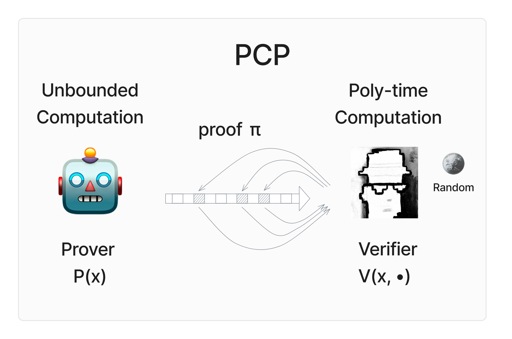
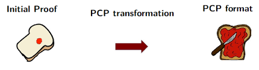
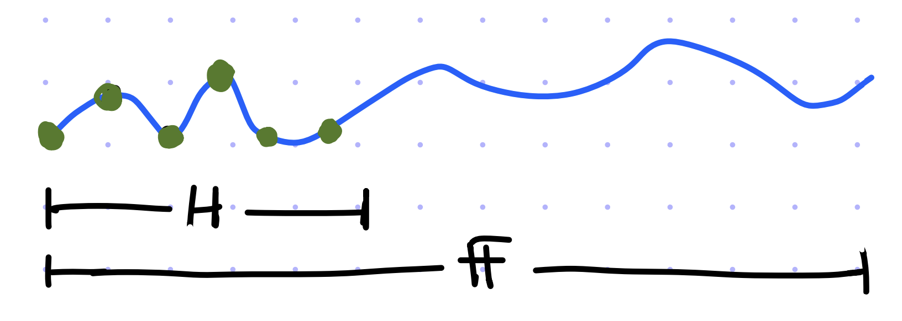

# WTF zk 教程第 49 讲：概率可检验证明（PCP）

这一讲，我们将探讨概率可检验证明（Probabilistically Checkable Proof，PCP）这一重要概念。PCP 定理为我们提供了一种验证证明的方式，允许验证者在仅检验少部分证明的情况下，以高概率确定其正确性。PCP 是 zk-SNARKs 中一个关键的理论基础。

## 1. PCP 概述

PCP 是一种**局部可验证**的证明系统，验证者只需要检查证明的少部分内容就能高概率地验证其正确性。与传统的 NP 证明系统不同，PCP 验证者具有两个特性：

1. **随机性**：验证者使用随机选择的方式抽取证明中的部分内容进行检查。
2. **预言机访问**：验证者可以查询一个“证明预言机”（oracle），在一个计算步骤内返回证明中某个位置的值。

随机性在之前的 BPP 和 IP 中已经出现过，而预言机（oracle）则首次出现在这里。在计算理论中，预言机是一个强大的“黑盒子”，它可以瞬间解决某个特定的问题。通过预言机，PCP 验证者可以有效地查询证明的任意位置，从而大幅降低验证成本。

### 1.1 PCP 定义

我们通常用两个参数刻画 PCP 模型：

- **$r(n)$**：随机复杂度，表示验证者使用的随机位的数量，其中 $n$ 为问题实例的长度。
- **$q(n)$**：查询复杂度，表示验证者最多查询的证明位数。

一个语言 $L$ 属于 $\text{PCP}[r(n), q(n)]$ 类，如果存在一个概率多项式时间验证者 $V$，满足：

1. **完备性**（Completeness）：对于 $x \in L$，存在一个证明 $\pi$ 使得 $V$ 接受的概率为 $1$，即 $P(V_{\pi}(x) = 1) = 1$。
2. **可靠性**（Soundness）：对于 $x \notin L$，对于任何证明，$'V'$ 接受的概率最多为 $1/2$，即 $P(V_{\pi}(x) = 1) \leq 1/2$。
3. **高效性**（Efficiency）：验证者 $V$ 的复杂度为多项式时间，即 $r(n)$ 和 $q(n)$ 最多为多项式。

### 1.2 特殊情况

当查询复杂度为零，即 $q = 0$，此时证明不存在：

- $\text{PCP}(0, 0) = P$：当随机复杂度也为 0 时，PCP 类退化为 P 类。因为此时验证者为确定型多项式时间图灵机，只能验证多项式时间内可判定的证明（自己计算并验证）。
- $\text{PCP}(\text{poly}(n), 0) = \text{BPP}$：当查询复杂度为多项式时，PCP 类退化为 BPP 类。因为此时验证者为概率多项式时间图灵机，只能验证概率多项式时间内可判定的问题（自己计算并验证）。

当随机复杂度为零，即 $r = 0$，此时验证者变为确定型验证者：

- $\text{PCP}(0, \text{poly}(n)) = \text{NP}$，即查询复杂度为多项式时，PCP 类退化为 NP 类。因为验证者可以读取多项式空间的证明并验证。

## 2. PCP 定理

PCP 定理是计算复杂性理论中的一个里程碑。它不仅深化了我们对 NP 问题的理解，还为许多计算问题的近似算法提供了理论基础。PCP 定理表明，每个NP问题都存在一个高效的PCP验证者，可以使用对数个随机位和常数个查询位来验证，即：

$\text{NP} = \text{PCP}[O(\log{n}), O(1)]$

### 2.1 定理的含义

这个定理意味着对于任何 NP 问题，都存在一个 PCP 证明系统，使得：

1. **随机性**：验证者使用 $O(\log{n})$ 个随机位。这意味着验证者的随机性是多项式可计算的。
2. **局部性**：验证者只需要查看证明的常数个位。这是 PCP 最令人惊讶的特性，无论问题规模如何增长，验证者始终只需要检查固定数量的位。
3. **完备性**：如果输入属于该语言，诚实的证明者可以构造一个证明，使验证者以接近 100% 的概率接受。
4. **可靠性**：如果输入不属于该语言，对于任何（可能不诚实的）证明者提供的证明，验证者以高概率（比如至少 1/2 的概率）拒绝。

### 2.2 直观理解

想象这样一个场景：
- 证明者是一台超级计算机，拥有强大的计算能力，但可能不诚实。
- 验证者是一台普通的个人电脑，计算能力有限，但绝对诚实。

PCP 定理告诉我们，即使面对这样悬殊的计算能力差距，验证者仍然可以通过随机选择一些位置，仅检查证明中的极小部分内容，就能以很高的概率正确判断整个证明的正确性。这种能力看起来几乎是"魔法"般的存在。

PCP 非常强大，但构造 PCP 证明并不容易。我们会在下一讲介绍如何构造最简单的线性 PCP （Linear PCP）证明，下面我们介绍构造它的必要工具。

## 3. Schwartz–Zippel 引理

Schwartz–Zippel 引理是关于多项式在有限域中取零概率的定理，通常被用于[多项式恒等测试](https://github.com/WTFAcademy/WTF-zk/tree/main/47_ProbComputation/readme.md)。它的形式化定义如下：

令 $P(x_1, x_2, ..., x_n)$ 是一个定义在有限域 $\mathbb{F}$ 上的非零多项式，其中 $P$ 的总度数（degree）为 $d$。如果我们从有限域 $\mathbb{F}$ 中随机独立地选取 $r_1, r_2, ..., r_n$，那么多项式 $P(r_1, r_2, ..., r_n)$ 等于零的概率满足：

$$
\Pr(P(r_1, r_2, ..., r_n) = 0) \leq \frac{d}{|\mathbb{F}|}
$$

其中：
- $d$ 是多项式 $P$ 的总度数。
- $|\mathbb{F}|$ 是域 $\mathbb{F}$ 的大小（即域中元素的个数）。
- $\Pr(P(r_1, r_2, ..., r_n) = 0)$ 表示多项式在随机点 $(r_1, r_2, ..., r_n)$ 取值为零的概率。

Schwartz–Zippel引理告诉我们：多项式在随机点取零的概率和它的总度数 $d$ 成正比，和域的大小 $|\mathbb{F}|$ 成反比。也就是说，如果我们有一个低阶多项式 $P$，且有限域 $\mathbb{F}$ 较大，那么取零的概率很小。它提供了一种通过少量查询来检测多项式是否正确的高效方法，帮助我们构造 PCP 证明。

在构造 PCP 证明时，我们通常会将一个普通的证明编码为多项式问题。验证器会通过在随机点查询这些多项式的值，来检查某些代数关系是否成立。如果这些关系在所有（或大部分）查询点上都成立，验证器就接受证明；否则拒绝。我们希望构造的多项式的度数尽量小，而域尽量大，从而减少可靠性错误的概率。下面要介绍的低度扩展技术帮助我们构造这样的多项式，同时保持了原始证明的结构。

## 4. 低度扩展

低度扩展（Low-degree Extension）是一种技术，用于将一个定义在有限域上的函数 $f$ 转换为一个低次多项式 $Q(x)$，在保持原函数的性质的同时控制多项式的度数，常被用于构造 PCP 和零知识证明。

给定一个域 $\mathbb{F}$ 和其子集 $H \subseteq \mathbb{F}$，以及一个定义在 $H$ 上的函数 $f: H \to \mathbb{F}$，我们希望将 $f$ 扩展为一个低度多项式 $P(x)$，该多项式定义在整个域 $\mathbb{F}$ 上，并满足：

$$
P(x) \equiv f(x), \forall x \in H
$$

则称 $P(x)$ 是 $f(x)$ 在 $H$ 上的低度扩展。扩展后的多项式 $P(x)$ 在 $H$ 上与 $f(x)$ 的值完全一致，并且度数较低（通常小于某个给定的度数）。

### 4.1 计算方法

如果要求的度数越大，那么扩展的方式越多，构造的低度扩展多项式 $P(x)$ 也越多。而度最小的低度扩展多项式是唯一的，度数小于 $|H|$，可以由拉格朗日插值法得到。如果你不了解拉格朗日插值法。

> 可以阅读[WTF zk 第24讲](https://github.com/WTFAcademy/WTF-zk/tree/main/24_Polynomial/readme.md)

拉格朗日插值法得到的多项式为：

$$
P(x) = \sum_{\alpha \in H} f(\alpha) L_{H, \alpha}(x)
$$

其中 $L_{H, \alpha}(x)$ 是拉格朗日基函数，定义为：

$$
L_{H, \alpha}(x) = \prod_{\beta \in H \setminus \{\alpha\}} \frac{x - \beta}{\alpha - \beta}
$$

它的性质是在 $x = \alpha$ 上取值为 $1$，在其他地方 $\beta \in H \setminus \{\alpha\}$ 取值为 $0$。

因此，多项式 $P(x)$ 在 $H$ 上等于 $f(\alpha)$，且是最小度数的扩展多项式。

举个例子，给定一个定义在 $\mathbb{F_2}$ 上的函数 $f(x)$，其中 $f(0) = 1$，$'f(1) = 0'$，我们希望将其扩展到域 $\mathbb{F_5}$ 上。根据拉格朗日插值法，我们可以得到：

$$
P(x) = f(0)L_{H, 0}(x) + f(1)L_{H, 1}(x)
$$

$$
= 1 \cdot \frac{(x-1)}{(0-1)} + 0 \cdot \frac{(x-0)}{(1-0)}
$$

$$
= x - 1
$$

得到的定义在 $\mathbb{F_5}$ 上的低度多项式 $P(x) = x - 1$ 在 $\mathbb{F_2}$ 上与 $f(x)$ 完全一致，且度数为 $1$。

### 4.2 多元函数的低度扩展

对于多变量情况，给定一个多元函数 $f(x_1, x_2, \dots, x_n): H^n \to \mathbb{F}$，其低度扩展也是通过多变量的拉格朗日插值法得到：

$$
P(x_1, x_2, \dots, x_n) = \sum_{\alpha_1, \alpha_2, \dots, \alpha_n \in H} f(\alpha_1, \alpha_2, \dots, \alpha_n) \prod_{i=1}^{n} L_{H, \alpha_i}(x_i)
$$

其中 $L_{H, \alpha_i}(x)$ 是拉格朗日基函数，与单变量情况相同，在 $x_i = \alpha_i$ 时取值为 $1$，在其他地方取值为 $0$。因此，得到的多项式 $P(x_1, x_2, \dots, x_n)$ 在 $H^n$ 上等于 $f(x_1, x_2, \dots, x_n)$，且度数最低。

## 5. 总结

这一讲，我们介绍了概率可检验证明（PCP）的定义和 PCP 定理，它的核心思想是通过随机采样和局部检查来验证证明的全局性质，为零知识证明提供了新的工具。并且，我们介绍了 Schwartz–Zippel 引理和低度扩展技术，它们是构建线性 PCP 证明的关键工具。
