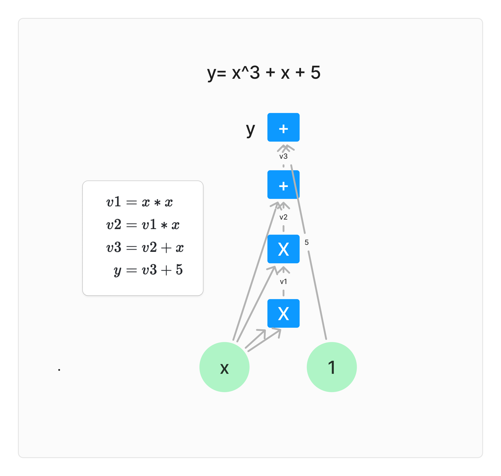

# WTF zk 教程第 50 讲：线性 PCP 第一部分 R1CS

在上一讲中，我们介绍了概率可检验证明（PCP）的基本概念。这一讲，我们将介绍构造线性 PCP 的第一部分：R1CS。

## 1. 线性 PCP

线性 PCP（Linear PCP, LPCP）是一种特殊的 PCP 系统，它的证明是**线性函数**，而验证者可以对证明进行线性查询（查询某个位置的线性组合）来验证某个命题。

线性 PCP 的核心特征：

1. **线性函数证明**：证明者提供的证明是一个线性函数，也就是证明内容可以看作一个向量，每个元素是某个线性函数的结果。
2. **线性查询**：验证者通过对证明的线性函数进行查询来获取特定信息，从而验证证明的正确性。

### 1.1 线性 PCP 的定义

给定一个域 $\mathbb{F}$ 和向量 $\pi \in \mathbb{F}^{\ell}$，证明者提供的函数为 $f_{\pi}(x) = \langle \pi, x \rangle$，即 $\pi$ 与 $x$ 的内积，而验证者通过线性查询 $f_{\pi}$ 来验证证明的正确性。

一个线性 PCP 系统 $(P, V)$ 对于某个语言 $L$ 满足以下性质：

1. **完备性（Completeness）**：对于 $x \in L$，存在一个证明 $\pi$ 使得验证者 $V$ 在随机选择某个 $\rho$ 后，能够正确验证证明，满足：

$$
\Pr_{\rho} \left[ V^{f_{\pi}}(x; \rho) = 1 \right] \geq 1 - \epsilon_c
$$

   其中 $\epsilon_c$ 是完备性误差。

2. **可靠性（Soundness）**：对于 $x \notin L$，无论证明者提供怎样的证明 $\tilde{\pi}$，验证者 $V$ 验证后拒绝错误证明的概率较高，满足：

$$
\Pr_{\rho} \left[ V^{f_{\tilde{\pi}}}(x; \rho) = 1 \right] \leq \epsilon_s
$$

   其中 $\epsilon_s$ 是可靠性误差。

### 1.2 构造线性 PCP

线性 PCP 是最简单的非平凡 PCP 系统，但构造它并不容易。将一个 NP 问题转换为线性 PCP 主要包含以下步骤（图中红框部分）：

1. **电路表示**：将 NP 问题表示为一个代数电路。
2. **R1CS 表示**：将代数电路表示为 R1CS（Rank-1 Constraint System）。
3. **QAP 表示**：将 R1CS 转换为 QAP（Quadratic Arithmetic Program）。
4. **线性 PCP 构造**：利用 QAP 构造线性 PCP。

从下图可以看出，构建线性 PCP 后，我们只需要额外两步就可以构造出零知识证明系统 zkSNARK 了。这一讲，我们将介绍前 2 步，电路表示和 R1CS。

## 2. 电路表示

这一步，我们需要将要证明的 NP 问题转化为一个算数电路。因为 circuit SAT （电路满足性问题）是 NP 完全问题，且每个 circuit SAT 都可以转化为一个算数电路，因此所有 NP 问题都可以转化为算数电路。

> 我们在 [WTF zk 第 46 讲](https://github.com/WTFAcademy/WTF-zk/blob/main/46_CircuitComplexity/readme.md) 中介绍过算数电路，不熟悉的可以复习下。

我们一般用“扁平化” (flattening)的方法进行这一步转换。它的核心思想是将复杂的计算分解成一系列简单的算术操作，每个操作只涉及基本的加法和乘法（或者它们的逆运算）。每个操作只涉及两种形式：$y = x$ 或 $z = x \square y$，其中 $\square$ 表示加法或乘法门，$x, y, z$ 是变量，度数限制为 1（或者是常数）。

举个例子，比如我们要证明一个方程 $y = x^3 + x + 5$ 的根为 $x = 3$，我们可以通过引入中间变量的方法将其扁平化：

$$
\begin{align}
v1 &= x * x \\
v2 &= v1 * x \\
v3 &= v2 + x \\
y &= v3 + 5
\end{align}
$$

可以看到，原来方程只有 2 个变量 $x, y$，扁平化之后引入了 3 个中间变量 $v1, v2, v3$，外加一个常数变量 $1$。我们将扁平后的变量向量（数组）记为 $w$：

$$
w = [1, x, v1, v2, v3, y]
$$

对于根 $x = 3$，变量向量的取值为：

$$
w(x=3) = [1, 3, 9, 27, 30, 35]
$$

下面是扁平化后的算数电路示意图，共有 6 个变量和 4 个算数门：

## 3. R1CS 表示

R1CS（Rank-1 Constraint System，秩-1约束系统）是一种表示计算的标准化方法，广泛用于零知识证明系统中。它将电路的每个门转换为一个约束，进而将电路的计算问题转化为一个矩阵方程，方便后续构造线性 PCP。

### 3.1 Rank-1 约束系统

约束系统定义了一组变量和这些变量之间必须满足的关系，比如最简单的线性约束系统：

$$
a_1x_1 + a_2x_2 +  a_0 = 0
$$

$$
b_1x_1 + b_2x_2 +  b_0 = 0
$$

其中 $x_i$ 是变量, $a_i, b_i$ 是系数。它的矩阵形式可以写为 $Aw = 0$，其中 $A$ 是系数矩阵，$w = [1, x_1, x_2]$ 是变量向量。中国剩余定理解决的同余方程组也属于约束系统。

再比如二次约束系统，每个约束等式的变量最高次为 2：

$$
a_{11} x_1^2 + a_{12} x_1x_2 + a_{22} x_2^2 + a_{20} x_2 + a_{00} = 0
$$

$$
b_{11} x_1^2 + b_{02} x_2 + b_{00} = 0
$$

其中每个约束都可以化简为 $w^T A w = 0$ 的形式，其中 $A$ 是系数矩阵，也被称为约束矩阵，$w$ 是变量向量（包含一个常数 1）。这个示例中， $w = [1, x_1, x_2]$，第一个约束矩阵可以表示为：

$$
A = \begin{bmatrix}
a_{00} & 0 & a_{20} \\
0 & a_{11} & 0 \\
0 & a_{12} & a_{22} \\
\end{bmatrix}
$$

R1CS 是一种特殊的二次约束系统，它的约束矩阵 $A$ 的秩为 1，即可表示为两个向量的外积 $A = a \otimes b = a b^T$。等价的，每个约束的形式可以简化为： 

$$
\langle a, w \rangle \langle b, w \rangle = \langle c, w \rangle
$$

其中 $a, b, c$ 是系数向量，$w$ 是变量向量， $\langle a, w \rangle = a^T w = \sum_{i} a_i w_i$ 表示向量内积。你可以自行推导下它为什么成立。

因此， R1CS 中的多个约束可以表示为矩阵形式：

$$
Aw \circ Bw = Cw
$$

其中 $A, B, C$ 是系数矩阵（和之前的约束矩阵不同），每一行代表一个约束中的 $a, b, c$，而 $w$ 是变量向量， $\circ$ 表示向量逐元素乘法（Hadamard积）。

R1CS 可以表示任意的电路计算问题，而电路满足性问题（Circuit SAT）是 NP 完全的，因此 R1CS 问题也是 NP 完全的。这意味着通过 R1CS，我们可以将任何 NP 问题转换为约束系统，方便后续的证明构造。

### 3.2 R1CS 示例

下面我们将示例中扁平化的电路转换为 R1CS 表示。在上一节，我们得到了 4 个约束：

1. $v_1 = x \cdot x$
2. $v_2 = v_1 \cdot x$
3. $v_3 = v_2 + x$
4. $y = v_3 + 5$

变量向量 $w$ 为：

$$
w = [1, x, v_1, v_2, v_3, y]
$$

**约束 1**：

$$
(x) \cdot (x) - v_1 = 0
$$

对应的向量表示为：

- $a_1 = [0, 1, 0, 0, 0, 0]$
- $b_1 = [0, 1, 0, 0, 0, 0]$
- $c_1 = [0, 0, 1, 0, 0, 0]$

**约束 2**：

$$
(v_1) \cdot (x) - v_2 = 0
$$

对应的向量表示为：

- $a_2 = [0, 0, 1, 0, 0, 0]$
- $b_2 = [0, 1, 0, 0, 0, 0]$
- $c_2 = [0, 0, 0, 1, 0, 0]$

**约束 3**：

$$
(v_2 + x) \cdot 1 - v_3 = 0
$$

对应的向量表示为：

- $a_3 = [0, 1, 0, 1, 0, 0]$
- $b_3 = [1, 0, 0, 0, 0, 0]$
- $c_3 = [0, 0, 0, 0, 1, 0]$

**约束 4**：

$$
(v_3 + 5) \cdot 1 - y = 0
$$

注意加法和乘法的处理有区别，对应的向量表示为：

- $a_4 = [5, 0, 0, 0, 1, 0]$
- $b_4 = [1, 0, 0, 0, 0, 0]$
- $c_4 = [0, 0, 0, 0, 0, 1]$

然后，我们将上述向量组合成矩阵 $A, B, C$，矩阵的行数与约束（算术门）数一致，为 4；列数与变量数一致，为 6：

$$
A = \begin{bmatrix}
0 & 1 & 0 & 0 & 0 & 0 \\
0 & 0 & 1 & 0 & 0 & 0 \\
0 & 1 & 0 & 1 & 0 & 0 \\
5 & 0 & 0 & 0 & 1 & 0 \\
\end{bmatrix}
$$

$$
B = \begin{bmatrix}
0 & 1 & 0 & 0 & 0 & 0 \\
0 & 1 & 0 & 0 & 0 & 0 \\
1 & 0 & 0 & 0 & 0 & 0 \\
1 & 0 & 0 & 0 & 0 & 0 \\
\end{bmatrix}
$$

$$
C = \begin{bmatrix}
0 & 0 & 1 & 0 & 0 & 0 \\
0 & 0 & 0 & 1 & 0 & 0 \\
0 & 0 & 0 & 0 & 1 & 0 \\
0 & 0 & 0 & 0 & 0 & 1 \\
\end{bmatrix}
$$

下面，我们验证约束是否成立，即对于每个约束，我们验证 $\langle a_i, w \rangle \langle b_i, w \rangle = \langle c_i, w \rangle$。

对于约束 3，有：

- $a_3 w = x + v_2$
- $b_3 w = 1$
- $c_3 w = v_3$

也就是，

$$
(x + v_2) \cdot 1 = v_3
$$

这与原始约束 $v_3 = v_2 + x$ 一致，证明我们成功的将扁平化电路转换为 R1CS 表示。

## 4. 总结

这一讲，我们介绍了线性 PCP 的基本概念，以及构建它的第一步：将计算问题转换为 R1CS。下一讲，我们将介绍如何进一步转换为 QAP，并利用它构造线性 PCP。

