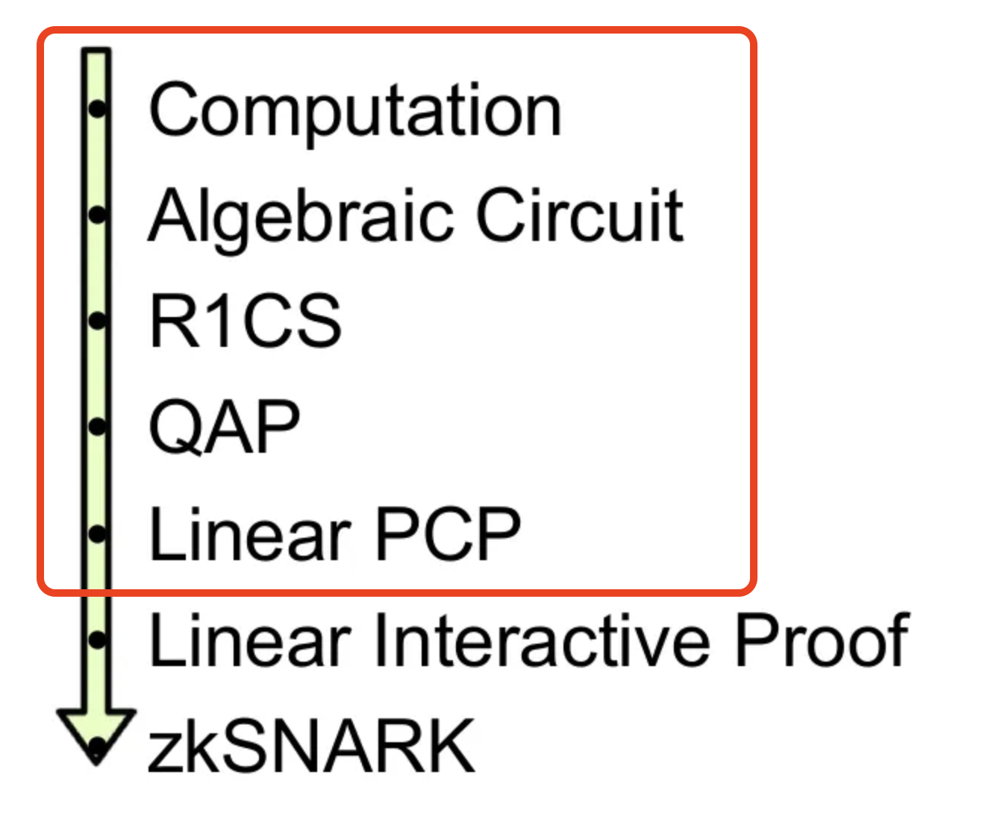

# WTF zk 教程第 51 讲：线性 PCP 第二部分 QAP

在上一讲中，我们介绍了构建线性 PCP 的第一步：将计算问题转换为 R1CS。这一讲，我们将介绍如何进一步转换为 QAP，并利用它构造线性 PCP。



## 1. QAP 表示

QAP（Quadratic Arithmetic Program，二次算数程序）通过低度拓展将 R1CS 转换为多项式形式，让我们可以高效的验证证明，从而构造线性 PCP。如果你不熟悉低度拓展，可以参考 [WTF zk 第 49 讲：PCP](https://github.com/WTFAcademy/WTF-zk/blob/main/49_PCP/readme.md) 。

### 1.1 QAP 定义

QAP 的本质就是将 R1CS 中的系数矩阵 $A, B, C$ 的每一列转换为多项式，方便我们验证。它的核心在于以下**多项式等式**：

$$
\left( \sum_{i=0}^{n} w_i \hat{A_{:i}} (x) \right) \cdot \left( \sum_{i=0}^{n} w_i \hat{B_{:i}}(x) \right) - \left( \sum_{i=0}^{n} w_i \hat{C_{:i}}(x) \right) = H(x) \cdot T(x)
$$

其中：

1. **域 $\mathbb{F}$**：多项式所在的有限域，通常是一个大素数域 $\mathbb{F}_p$，所有计算都在该域中进行。

2. **变量向量 $\mathbf{w}(x) = (w_0, w_1, ..., w_n)$**：电路中所有的变量，包括输入、输出和中间变量。

3. **系数多项式 $\{\hat{A_{:j}}(x)\}, \{\hat{B_{:j}}(x)\}, \{\hat{C_{:j}}(x)\}$**，其中 $j = 0, 1, ..., n$（ $n$ 表示变量个数）， $\hat{A_{:j}}$ 表示 $A$ 的第 $j$ 列。也就是说，系数矩阵 $A, B, C$ 的每一列都要通过低度拓展转换为相应的多项式。

4. **目标多项式 $T(x)$**：由验证者选择，用于验证多项式关系。 $T(x)$ 的根通常对应于电路中各个约束的位置。例如，如果我们有 $m$ 个约束，可以选择 $m$ 个不同的点 $0, 1, ..., m-1$，那么：

$$
T(x) = x(x - 1) \cdots (x - n + 1)
$$

5. **商多项式 $H(x)$**：验证者需要提供的证明的一部分，用于验证多项式的整除关系，有：

$$
H(x) = \frac{\left( \sum_{i=0}^{n} w_i \hat{A_{:i}}(x) \right) \cdot \left( \sum_{i=0}^{n} w_i \hat{B_{:i}}(x) \right) - \left( \sum_{i=0}^{n} w_i \hat{C_{:i}}(x) \right)}{T(x)}
$$

### 1.2 QAP 构造方法

从 R1CS 到 QAP 的构造方法如下：

#### 4.2.1 低度拓展

我们可以将 R1CS 的系数矩阵 $A, B, C$ 的每一列看作一个定义在 $H = {0, 1, ..., m-1}$ 上的函数，所在的行数 $i$ 为自变量。举个例子，对于系数矩阵 $A$ 的第 $j$ 列，函数 $f_j(i) = A_{ij}$，然后我们在域 $\mathbb{F_p}$ 上对 $f_j(i)$ 进行低度拓展，得到多项式 $\hat{A_{:j}}(x)$。同理，我们可以得到多项式 $\hat{B_{:j}}(x)$ 和 $\hat{C_{:j}}(x)$。

我们得到 QAP 的系数矩阵，满足下列等式（由 $Aw \circ Bw - Cw = 0$ 转换而来）：

$$
\left( \sum_{j=0}^{n} w_j \hat{A_{:j}}(x) \right) \cdot \left( \sum_{j=0}^{n} w_j \hat{B_{:j}}(x) \right) - \left( \sum_{j=0}^{n} w_j \hat{C_{:j}}(x) \right) = 0
$$ 

为了方便，我们计 $\mathcal{A}(x) = \sum_{j=0}^{n} w_j \hat{A_{:j}}(x), \mathcal{B}(x) = \sum_{j=0}^{n} w_j \hat{B_{:j}}(x), \mathcal{C}(x) = \sum_{j=0}^{n} w_j \hat{C_{:j}}(x)$，那么上述等式可以表示为：

$$
\mathcal{A}(x) \cdot \mathcal{B}(x) - \mathcal{C}(x) = 0
$$

另外根据低度拓展的特性，我们知道对于 $x \in H$，上述等式成立，且 $\mathcal{A}(x), \mathcal{B}(x), \mathcal{C}(x)$ 都是次数不超过 $m - 1$ 的多项式。

#### 4.2.2 目标多项式和商多项式

对于 $x \in H$，多项式 $\mathcal{A}(x) \cdot \mathcal{B}(x) - \mathcal{C}(x)$ 为 0。因此 $x \in H$ 是该多项式的根，我们可以将该多项式表示为：

$$
\mathcal{A}(x) \cdot \mathcal{B}(x) - \mathcal{C}(x) = Q(x)  \prod_{i \in H} (x - i)
$$

我们记目标多项式 $T(x) = \prod_{i \in H} (x - i)$，可以整除 $\mathcal{A}(x) \cdot \mathcal{B}(x) - \mathcal{C}(x)$，得到的商多项式为 $Q(x)$：

$$
Q(x) = \frac{\mathcal{A}(x) \cdot \mathcal{B}(x) - \mathcal{C}(x)}{T(x)}
$$

因为 $\mathcal{A}(x) \cdot \mathcal{B}(x)$ 的度小于 $2m-2$， $\mathcal{C}(x)$ 的度小于 $m-1$，所以多项式 $\mathcal{A}(x) \cdot \mathcal{B}(x) - \mathcal{C}(x)$ 的度小于 $2m-2$。又因为目标多项式 $T(x)$ 的度为 $m$，因此商多项式 $Q(x)$ 的度小于 $m-2$。

对于正确的证明 $x$， $\mathcal{A}(x) \cdot \mathcal{B}(x) - \mathcal{C}(x)$ 才能被 $T(x)$ 整除；若证明不正确，则 $Q(x)$ 不存在。我们可以利用这一特性进一步构造线性 PCP。

### 4.3 QAP 示例

下面我们将示例中的 R1CS 转换为 QAP 表示。在上一节，我们得到了 R1CS 系统：

$$
A = \begin{bmatrix}
0 & 1 & 0 & 0 & 0 & 0 \\
0 & 0 & 1 & 0 & 0 & 0 \\
0 & 1 & 0 & 1 & 0 & 0 \\
5 & 0 & 0 & 0 & 1 & 0 \\
\end{bmatrix}
$$

$$
B = \begin{bmatrix}
0 & 1 & 0 & 0 & 0 & 0 \\
0 & 1 & 0 & 0 & 0 & 0 \\
1 & 0 & 0 & 0 & 0 & 0 \\
1 & 0 & 0 & 0 & 0 & 0 \\
\end{bmatrix}
$$

$$
C = \begin{bmatrix}
0 & 0 & 1 & 0 & 0 & 0 \\
0 & 0 & 0 & 1 & 0 & 0 \\
0 & 0 & 0 & 0 & 1 & 0 \\
0 & 0 & 0 & 0 & 0 & 1 \\
\end{bmatrix}
$$

变量向量 $w$ 为：

$$
w = [1, x, v_1, v_2, v_3, y]
$$

满足约束的原方程的根 $x = 3$，见证（witness）为 $w(x = 3) = [1, 3, 9, 27, 30, 35]$。

下面，我们需要对系数矩阵 $A, B, C$ 的每一列在 $\mathbb{F}_{67}$ （实际应用中会选取更大的素数域）中进行低度拓展。首先，我们使用插值点 $s = 1, 2, 3, 4$，计算拉格朗日基函数 $l_i(s)$：

$l_1(s) = \frac{(s - 2)(s - 3)(s - 4)}{-6}$

$l_2(s) = \frac{(s - 1)(s - 3)(s - 4)}{2}$

$l_3(s) = \frac{(s - 1)(s - 2)(s - 4)}{-2}$

$l_4(s) = \frac{(s - 1)(s - 2)(s - 3)}{6}$

然后，我们可以要计算多项式 $\hat{A_{:j}}, \hat{B_{:j}}, \hat{C_{:j}}$。这里举 2 个例子：

1. 计算 $\hat{A_{:1}}$：矩阵 $A$ 的第 1 列是 $[0, 0, 0, 5]$，那么我们对 $(1, 0), (2, 0), (3, 0), (4, 5)$ 进行插值，得到：

$$
\begin{aligned}
\hat{A_{:1}}(x) &= 0 \cdot l_1(x) + 0 \cdot l_2(x) + 0 \cdot l_3(x) + 5 \cdot l_4(x) \\
&= 5 \cdot \frac{(x - 1)(x - 2)(x - 3)}{6} \\
&= 12x^3 + 62x^2 + 65x + 62 \mod{67}
\end{aligned}
$$

你可以验证下 $\hat{A_{:1}}(x)$ 是否满足 $\hat{A_{:1}}(1) = 0, \hat{A_{:1}}(2) = 0, \hat{A_{:1}}(3) = 0, \hat{A_{:1}}(4) = 5$。   

2. 计算 $\hat{A_{:4}}$：矩阵 $A$ 的第 4 列是 $[0, 0, 0, 0]$，那么我们对 $(1, 0), (2, 0), (3, 0), (4, 0)$ 进行插值，结果就是零多项式：

$$
\hat{A_{:4}}(x) = 0
$$

同理，我们可以计算 $\hat{B_{:j}}, \hat{C_{:j}}$。

手算效率太低，我们可以利用下面 python 代码计算它们：

```python
import numpy as np
import galois

GF = galois.GF(67)

A = np.array([
    [0, 1, 0, 0, 0, 0],  # 约束 1
    [0, 0, 1, 0, 0, 0],  # 约束 2
    [0, 1, 0, 1, 0, 0],  # 约束 3
    [5, 0, 0, 0, 1, 0],  # 约束 4
])


B = np.array([
    [0, 1, 0, 0, 0, 0],  # 约束 1
    [0, 1, 0, 0, 0, 0],  # 约束 2
    [1, 0, 0, 0, 0, 0],  # 约束 3
    [1, 0, 0, 0, 0, 0],  # 约束 4
])

C = np.array([
    [0, 0, 1, 0, 0, 0],  # 约束 1
    [0, 0, 0, 1, 0, 0],  # 约束 2
    [0, 0, 0, 0, 1, 0],  # 约束 3
    [0, 0, 0, 0, 0, 1],  # 约束 4
])

A_galois = GF(A)
B_galois = GF(B)
C_galois = GF(C)

x = GF(3)
v1 = x * x
v2 = v1 * x
v3 = v2 + x
y = v3 + GF(5)    

witness = GF(np.array([1, x, v1, v2, v3, y]))

print(witness)

assert all(np.equal(np.matmul(A_galois, witness) * np.matmul(B_galois, witness), np.matmul(C_galois, witness))), "not equal"

## low-degree extension for A, B, C
def interpolate_column(col):
    xs = GF(np.array([1,2,3,4]))
    return galois.lagrange_poly(xs, col)

# axis 0 is the columns. apply_along_axis is the same as doing a for loop over the columns and collecting the results in an array
A_polys = np.apply_along_axis(interpolate_column, 0, A_galois)
B_polys = np.apply_along_axis(interpolate_column, 0, B_galois)
C_polys = np.apply_along_axis(interpolate_column, 0, C_galois)

# matrix A becomes 6 polynomials
print("poly A: ", A_polys)
print("poly B: ", B_polys)
print("poly C: ", C_polys)

# poly A:  
#  [Poly(12x^3 + 62x^2 + 65x + 62, GF(67))
#  Poly(44x^3 + 5x^2 + 11x + 8, GF(67))
#  Poly(34x^3 + 63x^2 + 43x + 61, GF(67))
#  Poly(33x^3 + 37x^2 + 60x + 4, GF(67))
#  Poly(56x^3 + 66x^2 + 13x + 66, GF(67)) 
#  Poly(0, GF(67))]
# 
```

多项式 $A_{:i}(x)$（定义在 $F(67)$ 上）：

1. $A_{:0}(x) = 12x^3 + 62x^2 + 65x + 62$
2. $A_{:1}(x) = 44x^3 + 5x^2 + 11x + 8$
3. $A_{:2}(x) = 34x^3 + 63x^2 + 43x + 61$
4. $A_{:3}(x) = 33x^3 + 37x^2 + 60x + 4$
5. $A_{:4}(x) = 56x^3 + 66x^2 + 13x + 66$
6. $A_{:5}(x) = 0$

多项式 $B_{:i}(x)$：

1. $B_{:0}(x) = 22x^3 + 36x^2 + 6x + 3$
2. $B_{:1}(x) = 45x^3 + 31x^2 + 61x + 65$
3. $B_{:2}(x) = 0$
4. $B_{:3}(x) = 0$
5. $B_{:4}(x) = 0$
6. $B_{:5}(x) = 0$

多项式 $C_{:i}(x)$：

1. $C_{:0}(x) = 0$
2. $C_{:1}(x) = 0$
3. $C_{:2}(x) = 11x^3 + 35x^2 + 18x + 4$
4. $C_{:3}(x) = 34x^3 + 63x^2 + 43x + 61$
5. $C_{:4}(x) = 33x^3 + 37x^2 + 60x + 4$
6. $C_{:5}(x) = 56x^3 + 66x^2 + 13x + 66$

注意，以上的步骤都没有用到见证（证明） $w$。下一步，我们将利用这些多项式和见证 $w$ 计算 $\mathcal{A}(x), \mathcal{B}(x), \mathcal{C}(x)$。

```python
from functools import reduce

def inner_product_polynomials_with_witness(polys, witness):
    mul_ = lambda x, y: x * y
    sum_ = lambda x, y: x + y
    return reduce(sum_, map(mul_, polys, witness))

A_term = inner_product_polynomials_with_witness(A_polys, witness)
B_term = inner_product_polynomials_with_witness(B_polys, witness)
C_term = inner_product_polynomials_with_witness(C_polys, witness)

print(A_term)
```

得到：

$$
\begin{aligned}
\mathcal{A}(x) &= 6x^6 + 5x^2 + 16x + 43 \mod{67} \\
\mathcal{B}(x) &= 23x^3 + 62x^2 + 55x + 64 \mod{67} \\
\mathcal{C}(x) &= 14x^3 + 9x^2 + 27x + 16 \mod{67}
\end{aligned}
$$

因此：

$$
\mathcal{A} \cdot \mathcal{B} - \mathcal{C}= 4x^6 + 18x^5 + 3x^4 + 13x^3 + 38x^2 + 12x + 46 \mod{67}
$$

接下来，我们计算目标多项式：

$$
\begin{aligned}
T(x) &= (x - 1)(x - 2)(x - 3)(x - 4) \\
&= x^4 + 57x^3 + 35x^2 + 17x + 24 \mod{67}
\end{aligned}
$$

最后，我们用上面两式相除，最终得到商多项式：

$$
Q(x) = \frac{\mathcal{A} \cdot \mathcal{B} - \mathcal{C}}{T} = 4x^2 + 58x + 41 \mod{67}
$$

下面，我们验证结果： 

$$
Q(x) T(x) = 4x^6 + 18x^5 + 3x^4 + 13x^3 + 38x^2 + 12x + 46 \mod{67}
$$

与 $\mathcal{A} \cdot \mathcal{B} - \mathcal{C}$ 相等，我们成功的将 R1CS 转换为了 QAP。

```python
## Target polynomial T = (x-1)(x-2)(x-3)(x-4)
T = galois.Poly([1, 67-1], field = GF) * galois.Poly([1, 67-2], field = GF) * galois.Poly([1, 67-3], field = GF) * galois.Poly([1, 67-4], field = GF)

## Quotient polynomial Q = (A * B - C) / T
Q = (A_term * B_term - C_term) // T

print(T * Q)

poly_big = A_term * B_term - C_term
assert poly_big // T * T == poly_big
```

如果证明者不知道正确的 witness，比如 $\tilde{w} = [1, 3, 9, 27, 30, 36]$，那么构造出的 $\mathcal{A} \cdot \mathcal{B} - \mathcal{C}$ 就变为：

$$
4x^6 + 18x^5 + 3x^4 + 24x^3 + 39x^2 + 66x + 47 \mod{67}
$$

而它无法整除 $T(x)$，因此 $Q(x)$ 也就不存在，无法通过验证。

```python
## wrong witness

witness_wrong = GF(np.array([1, 3, 9, 27, 30, 36]))

A_term_wrong = inner_product_polynomials_with_witness(A_polys, witness_wrong)
B_term_wrong = inner_product_polynomials_with_witness(B_polys, witness_wrong)
C_term_wrong = inner_product_polynomials_with_witness(C_polys, witness_wrong)

print(A_term_wrong * B_term_wrong - C_term_wrong)

poly_big_wrong = A_term_wrong * B_term_wrong - C_term_wrong
assert poly_big_wrong // T * T == poly_big_wrong
## Error: A*B - C can not divide T
```

## 2 构造线性 PCP

得到 QAP 后，我们可以非常容易的构造线性 PCP。验证者期望的证明形式为 $\pi = (w, Q) \in \mathbb{F}^{n+(m-1)}$，其中见证 $w$ 为变量向量，长度为 $n$，而 $Q$ 为商多项式，长度为 $m-1$（ $m-2$ 度数有 $m-2$ 个系数，再加一个常数）。

### 2.1 验证过程

### 2.1.1 采样

验证者 $V$ 随机选择 $r \in \mathbb{F}$。

### 2.1.2 查询

线性 PCP 的查询都是线性查询，即查询向量的内积。比如要查询 $\mathcal{A}(r)$，我们要提交的是 $\langle \hat{A_{:1}}(r), ..., \hat{A_{:n}}(r), 0, ..., 0 \rangle$，因为 $\mathcal{A}(r) = \sum_{j=0}^{n} w_j \hat{A_{:j}}(r)$。

同理，我们可以提交 $\langle \hat{B_{:1}}(r), ..., \hat{B_{:n}}(r), 0, ..., 0 \rangle$ 来查询 $\mathcal{B}(r)$，提交 $\langle \hat{C_{:1}}(r), ..., \hat{C_{:n}}(r), 0, ..., 0 \rangle$ 来查询 $\mathcal{C}(r)$。

注意： $\hat{A_{:j}}(r), \hat{B_{:j}}(r), \hat{C_{:j}}(r)$ 均是不需要 witness 的，验证者可以在多项式时间内计算出这些值。

最后，我们还需要查询 $Q(r)$。可以通过提交 $0, ..., 0, 1, r, r^2, ..., r^{m-2} \rangle$ 来查询它。


### 2.1.3 检查

验证者 $V$ 检查：

$$
Q(r)\prod_{i\in H}(r-i) = \mathcal{A}(r) \cdot \mathcal{B}(r) - \mathcal{C}(r)
$$

因此，线性 PCP 的证明长度仅为 $n+m-1$，并且验证者仅消耗 $1$ 次随机数， $4$ 次线性查询，就完成了对证明的验证。

下面，我们来分析线性 PCP 的完备性和可靠性。

1. **完备性（Completeness）**：对于 $x \in L$，那么 $Q(r)\prod_{i\in H}(r-i) = \mathcal{A}(r) \cdot \mathcal{B}(r) - \mathcal{C}(r)$ 成立，验证者能够以 1 的概率正确验证证明。

2. **可靠性（Soundness）**：对于 $x \notin L$，那么根据 Schwartz–Zippel 引理， $Q(r)\prod_{i\in H}(r-i) = \mathcal{A}(r) \cdot \mathcal{B}(r) - \mathcal{C}(r)$ 的概率小于 $\frac{2m}{|\mathbb{F}|}$。我们选择的域 $\mathbb{F}$ 余额大，那么可靠性错误概率就越小。

### 2.2 线性 PCP 示例

我们基于 QAP 的示例继续构造线性 PCP。

1. 采样：验证者 $V$ 随机选择 $r = 6 \mod{67}$。
2. 查询：验证者 $V$ 查询 $\mathcal{A}(r), \mathcal{B}(r), \mathcal{C}(r), Q(r)$，得到结果：

$$
\begin{aligned}
\mathcal{A}(6) &= 7 \\
\mathcal{B}(6) &= 23 \\
\mathcal{C}(6) &= 52 \\
Q(6) &= 64 \\
T(6) &= 53
\end{aligned}
$$

最后，我们验证：

$$
\begin{aligned}
\mathcal{A}(6) \cdot \mathcal{B}(6) - \mathcal{C}(6) &= 7 \cdot 23 - 52 = 161 - 52 = 42 \mod{67} \\
Q(6) \cdot T(6) &= 64 \cdot 53 = 42 \mod{67}
\end{aligned}
$$

显然， $\mathcal{A}(6) \cdot \mathcal{B}(6) - \mathcal{C}(6) = Q(6) \cdot T(6)$，因此证明成功。

```python
## Linear PCP
# random number generation, we choose 6 for education purpose
r_random = GF(6)
# check A, B, C
A_random = A_term(r_random)
B_random = B_term(r_random)
C_random = C_term(r_random)
Q_random = Q(r_random)
T_random = T(r_random)

print("A_random: ", A_random)
print("B_random: ", B_random)
print("C_random: ", C_random)
print("Q_random: ", Q_random)
print("T_random: ", T_random)

assert A_random * B_random - C_random == Q_random * T_random
# pass
```

若证明者提供的 witness 错误，假如 $\tilde{w} = [1, 3, 9, 27, 30, 36]$，那么将无法通过验证。这部分留给读者自行尝试。

## 3. 总结

这一讲，我们介绍了构建线性 PCP 的第二部分：将 R1CS 转换为 QAP，并利用它构造线性 PCP。QAP 通过将 R1CS 系数矩阵扩展为多项式，让我们可以利用 Schwartz–Zippel 引理更高效的验证证明：仅需查询证明中的 4 位就可以验证一个 NP 问题。