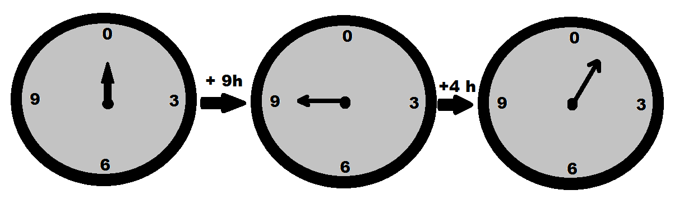

# WTF zk Tutorial Lesson 5: Modular Arithmetic Basics

In this lesson, we will explore Modular Arithmetic, which is frequently used in the field of cryptography.

## 1. Modulo Operation

The modulo operation is an integer operation that obtains the remainder by performing Euclidean division on an integer, limiting the result to a fixed range.

We usually use the symbol $\text{mod}$ to represent the modulo operation. For example, $a \mod n$ represents the modulo operation of integer $a$ divided by $n$, which is the remainder of $a$ divided by $n$. Here, $n$ is called the modulus.

Let's start with some simple examples:

$17 \mod 5 \equiv 2$

$25 \mod 7 \equiv 4$

$69 \mod 23 \equiv 0$

We can implement modulo operation using Python:

```python
def mod(a, b):
    remainder = a % b
    if remainder < 0:
        # Adjust the remainder to ensure non-negative
        remainder += abs(b)
    return remainder

a = 17
b = 5
remainder = mod(a, b)
print(f'{a} mod {b} = {remainder}')
# 17 mod 5 = 2

a = 25
b = 7
remainder = mod(a, b)
print(f'{a} mod {b} = {remainder}')
# 25 mod 7 = 4

a = 69
b = 23
remainder = mod(a, b)
print(f'{a} mod {b} = {remainder}')
# 69 mod 23 = 0
```

The 24-hour clock system we use is also an application of the modulo operation. For example, if it is currently 12 o'clock, is it 32 o'clock after 20 hours? No, it is $32 \mod 24 \equiv 8$ o'clock. Can you calculate what time it will be after 69 hours?



## 2. Congruence

Congruence is a relation that is widely used in cryptography. In the case of a given modulus $n$, if the results of modulo operation for two integers $a$ and $b$ are equal, we say they are congruent modulo $n$. It can be written as:

$$
a \equiv b \pmod{n}
$$

For example, under modulus $3$, both 4 and 7 have a remainder of 1, so they are congruent modulo 3 and can be written as $4 \equiv 7 \pmod{3}$. However, under another modulus, such as $5$, they are not congruent. Therefore, when confirming congruence relations, the modulus must be specified.

### 2.1 Property of Congruence

1. Reflexivity: For any modulus $n$, an integer $a$ is congruent to itself. It can be written as $a \equiv a \pmod{n}$.

2. Symmetry: If $a$ is congruent to $b$ modulo $n$, then $b$ is congruent to $a$ modulo $n$. It can be written as: if $a \equiv b \pmod{n}$, then $b \equiv a \pmod{n}$. For example, $4 \equiv 7 \pmod{3}$ and $7 \equiv 4 \pmod{3}$ because their remainders when divided by 3 are both 1.

3. Transitivity: If $a$ is congruent to $b$ and $b$ is congruent to $c$ modulo $n$, then $a$ is congruent to $c$ modulo $n$. It can be written as: if $a \equiv b \pmod{n}$ and $b \equiv c \pmod{n}$, then $a \equiv c \pmod{n}$. For example, $4 \equiv 7 \pmod{3}$ and $7 \equiv 10 \pmod{3}$, so we have $4 \equiv 10 \pmod{3}$.

These three properties are easy to prove. You can try to write them. Hint: Use Euclidean division to expand $a, b$. If they are congruent, we have:

$$
a=pn+r
$$

$$
b=qn+r
$$

### 2.2 Residue Class

We use the symbol $Z_n$ to represent the residue class modulo $n$, which is the set of all integers from 0 to $n-1$:

$$
Z_n = \{0, 1, 2, \ldots, n-1\}
$$

The result of taking the modulo of any integer $a$ by $n$ will fall within $Z_n$. In other words, for any integer $a$, there exists $b \in Z_n$ such that $a \equiv b \pmod{n}$. Using congruence relations, we can map the modulo operation of infinitely many integers to the operation on $n$ integers in $Z_n$.

Taking the 24-hour clock system as an example, any time will fall within $Z_{24}$, such as $32 \mod 24 = 8$ or $56 \mod 24 = 8$.

We will provide a more systematic introduction to residue classes in our future tutorials. For now, it is important to have a concept of them.

## 3. Basic Modular Arithmetic

1. Translation: For any integer $k$, if $a \equiv b \pmod{n}$, then $a+k \equiv b+k \pmod{n}$. When $k < 0$, the effect is subtraction.

   Example: $4 \equiv 7 \pmod{3}$, if we add 4 to both sides, we get $8 \equiv 11 \pmod{3}$, which is still true.

2. Scaling: For any integer $k$, if $a \equiv b \pmod{n}$, then $a \cdot k \equiv b \cdot k \pmod{n}$.

   Example: $4 \equiv 7 \pmod{3}$, if we multiply both sides by 4, we get $16 \equiv 28 \pmod{3}$, which is still true.

3. Addition: If $a_1 \equiv a_2 \pmod{n}$ and $b_1 \equiv b_2 \pmod{n}$, then $a_1 + b_1 \equiv a_2 + b_2 \pmod{n}$.

   Example: $4 \equiv 7 \pmod{3}$ and $2 \equiv 5 \pmod{3}$, if we add both sides, we get $6 \equiv 12 \pmod{3}$, which is still true.

4. Multiplication: If $a_1 \equiv a_2 \pmod{n}$ and $b_1 \equiv b_2 \pmod{n}$, then $a_1 b_1 \equiv a_2  b_2 \pmod{n}$.

   Example: $4 \equiv 7 \pmod{3}$ and $2 \equiv 5 \pmod{3}$, if we multiply both sides, we get $8 \equiv 35 \pmod{3}$, which is still true.

5. If $d=\gcd(k,n)$ and $k \cdot a \equiv k \cdot b \pmod{n}$, then $a \equiv b \pmod{n/d}$, which means $a$ and $b$ are congruent modulo $n/d$.

   Example: $20 \equiv 2 \pmod{6}$ and $\gcd(2, 6) = 2$, if we divide both sides by 2 and take the modulo operation, we get $10 \equiv 1 \pmod{3}$, which is still true.

6. If integers $k$ and $n$ are coprime, that is, $\gcd(k,n) = 1$, and $k \cdot a \equiv k \cdot b \pmod{n}$, then $a \equiv b \pmod{n}$.

   Example: Given $8 \equiv 14 \pmod{3}$ and $\gcd(2, 3) = 1$, if we divide both sides by 2, we get $4 \equiv 7 \pmod{3}$, which is still true.

## 4. Quadratic Residues

In number theory, if an integer $q$ is congruent to a square of some number modulo $n$, which means there exists $x$ such that $x^2\equiv q\pmod{n}$, then $q$ is called a quadratic residue of $n$. Otherwise, it is called a non-quadratic residue. It simply determines whether $q$ can be the square of a number modulo $n$.

So how do we find all quadratic residues of $n$? The answer is to enumerate from 1 to $q-1$ and calculate whether their squares modulo $n$ are equal to $q$. Please see the example below:

```python
# Check if the numbers in ints are quadratic residues of p, print the smallest square root modulo p
p = 29
ints = [14, 6, 11]
qr = [a for a in range(p) if pow(a, 2, p) in ints]
print(min(qr))
```

- About all quadratic residues modulo $n$

  Note that $x^2\mod n\equiv (n-x)^2\mod n$, so all quadratic residues modulo $n$ cannot exceed $n/2-1$ because of symmetry.

- In the case of $n$ being a prime number, let $n$ be $p$

  If $p=2$, then all integers are quadratic residues of $p$.

  If $p$ is an odd prime number, the number of quadratic residues of $p$ is $(p+1)/2$, and the remaining $(p-1)/2$ are non-quadratic residues.

Properties of Quadratic Residues:

> 1. The product of two quadratic residues is still a quadratic residue.
> 2. The product of a quadratic non-residue and a quadratic non-residue is a quadratic residue.
> 3. The product of a quadratic residue and a quadratic non-residue is a quadratic non-residue.

Legendre Symbol:

$$
(\frac{a}{n})=\begin{cases}
0,& \text{if } a\equiv 0\pmod p\\
1,& \text{if there exists a quadratic residue modulo p}\\
-1,& \text{if there is no quadratic residue modulo p}
\end{cases}
$$

Euler's Criterion: Let $p$ be an odd prime number, $a$ be an integer, and $gcd(a, p)=1$. Then $(\frac{a}{p})\equiv a^{\frac{p-1}{2}}\pmod p$. This can be used to quickly determine if $a$ is a quadratic residue of the odd prime number $p$.

## 5. Summary

In this lesson, we introduced the definition of modular arithmetic, congruence, basic modular operations, and quadratic residues. Modular arithmetic may seem unfamiliar, but in fact, it is everywhere in our daily lives, you just haven't noticed. Can you think of any applications of modular arithmetic in daily life?
