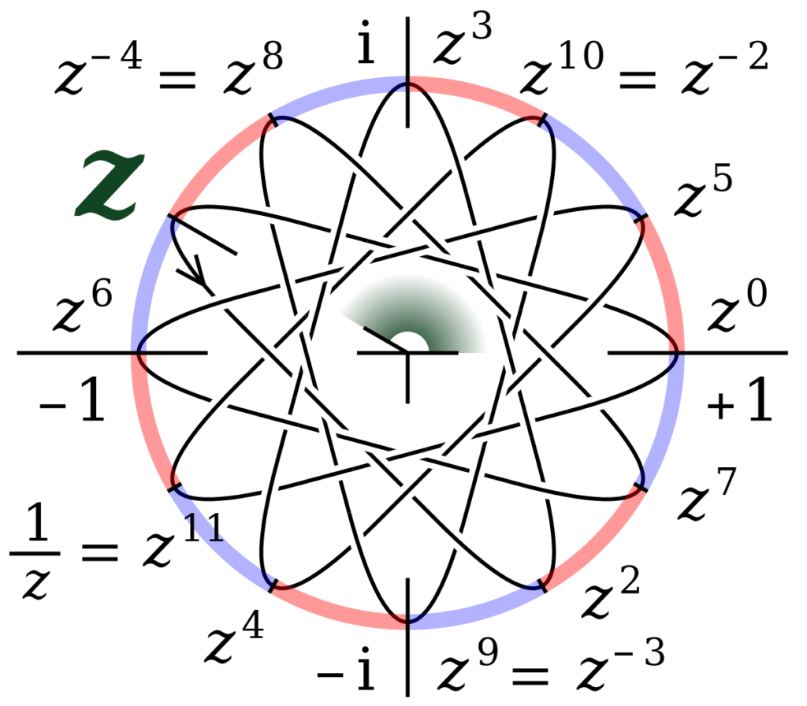

# WTF zk Tutorial Lesson 17: Cyclic Groups

In this lesson, we will introduce cyclic groups, which are group structures generated by a single element. They have simple yet important properties and find wide applications in cryptography and mathematics.

## 1. Cyclic Groups

The simplest trivial group, which contains only the identity element, such as $(\{0\}, +)$, consists of just one element and satisfies the four basic properties of a group. So what is the simplest non-trivial group structure? Suppose a group $(G, 🐔)$ contains an element $a$ in addition to the identity element $e$. To ensure closure, $G$ must also contain the inverse of $a$ and its operation with itself. In other words,

$$
G = \{..., a^{-3}, a^{-2}, a^{-1}, e, a, a^2, a^3, ...\}
$$

This is a group generated by $a$, also known as a cyclic group.

**Definition:** A cyclic group is a group generated by a single element. Let $(G, 🐔)$ be a group. If there exists an element $g \in G$ such that the set of all elements obtained by repeatedly group operation on $g$, i.e., $G = \left \langle \, g \, \right \rangle =  \{g^n \mid n \in \mathbb{Z}\}$, then $(G, 🐔)$ forms a cyclic group. Here, $g$ is called the generator.

The group of integer addition $(\mathbb{Z}, +)$ is a cyclic group with generators $1$ or $-1$. Any integer can be generated by them, for example, $5 = 1^5 = 1 + 1 + 1 + 1  +1$.

For any $m \in \mathbb{Z}$, $(m\mathbb{Z}, +)$ is also a cyclic group because $m\mathbb{Z} = (m^z | z \in \mathbb{Z}) = (mz | z \in \mathbb{Z}) = \left \langle \, m \, \right \rangle$, with $m$ as the generator.

The group of integer modulo $6$ addition $(\mathbb{Z}_6, +)$ is also a cyclic group with the generator $1$. The elements ${0, 1,2,3,4,5}$ can all be obtained by cycling addition with $1$. For instance, $1^6 \equiv 1 + 1 + 1 + 1 + 1 + 1 \equiv 0 \pmod 6$, and $1^7 \equiv 7 \equiv 1 \pmod 6$, thus entering a cycle.

The group of integer modulo $5$ multiplication $(\mathbb{Z}^*_5, \times)$ is also a cyclic group with generators $2$ or $3$. For $2$: $2^1 = 2$, $2^2 = 4$, $2^3 = 3$, $2^4 = 1$, and $2^5 = 2$, creating a cycle. For $3$: $3^1 = 3$, $3^2 = 4$, $3^3 = 2$, $3^4 = 1$, and $3^5 = 3$, also forming a cycle.

### 1.1 Properties of Cyclic Groups

Here are some basic properties of cyclic groups:

**1. Cyclic groups are all Abel groups.**

Click to expand the proof👀

Let $(G, 🐔) = \left \langle \, g \, \right \rangle$ be a cyclic group. For any $a,b \in G$, let $a = g^x$ and $b = g^y$. Then $a 🐔 b = g^xg^y=g^{x+y}=g^{y+x} = g^yg^x = b 🐔 a$. Thus, the group $(G, 🐔) = \left \langle \, g \, \right \rangle$ satisfies commutativity and is an Abel group. Proof complete.

**2. Subgroups of cyclic groups are also cyclic groups.**

Click to expand the proof👀

Let $(G, 🐔) = \left \langle \, g \, \right \rangle$ be a cyclic group, and $H$ be a subgroup of group $G$. Let $d$ be the smallest positive integer such that $g^d \in H$. Then for any other element $g^s \in H$ where $s > d$, by the Euclidean division, we have $s = qd + r$ where $0 \leq r < d$. Due to closure, $g^r \in H$, and since $d$ is the smallest positive integer such that $g^d \in H$, $r = 0$. Thus, $d$ divides $s$, and any element in $H$ can be generated by $g^d$, i.e., $g^s = (g^d)^q$. Therefore, the subgroup $H$ is a cyclic group with $g^d$ as the generator. Proof complete.

**3. Quotient groups of cyclic groups are also cyclic groups.**

Click to expand the proof👀

Let $(G, 🐔) = \left \langle \, g \, \right \rangle$ be a cyclic group, and $H$ be a subgroup of group $G$. According to properties 1 and 2, both $G$ and $H$ are Abel groups, and $H$ is a normal subgroup. We can construct the quotient group $G/H = \{gH \mid g \in G\}$. For the elements $g^k$ in group $G$, the coset $g^kH = g^k H^k = (gH)^k$, thus any element in the quotient group can be represented as $(gH)^k$. Therefore, $G/H$ is a cyclic group with $gH$ as the generator.

Let's consider two examples. First, let's take the integer modulo $6$ addition group $\mathbb{Z}_6$ and its normal subgroup $2\mathbb{Z}_6 = \{0, 2, 4\}$. $\mathbb{Z}_6$ is a cyclic group with generators $1$ and $5$ ($5^1 = 5$, $5^2 = 5 +5 = 4$, $5^3 = 3$, $5^4 = 2$, $5^5 = 1$, $5^6 = 0$). The normal subgroup $2\mathbb{Z}_6$ is also a cyclic group with generators $2$ or $4$, which can be verified. The quotient group $\mathbb{Z}_6/2\mathbb{Z}_6 = \{ \{0, 2, 4\}, \{1,3,5\}\}$ is also a cyclic group, with the generator $1 + 2\mathbb{Z}_6 = 5+ 2\mathbb{Z}_6 = \{1,3,5\}$, since $\{1,3,5\}^2 = 2\{1,3,5\} = \{2,4,6\}$.

Next, let's consider the integer modulo $5$ multiplication group $\mathbb{Z}^*_5$ and its normal subgroup $H=\{1,4\}$. $\mathbb{Z}^*_5$ is a cyclic group with generators $2$ or $3$; the normal subgroup $H=\{1,4\}$ is also a cyclic group with a generator $4$, since $4^1 = 4$ and $4^2 = 1$; the quotient group $\mathbb{Z}^*_5/H = \{ \{1,4\}, \{2,3\}\}$ is also a cyclic group, with the generator $2H = 3H = \{2,3\}$, since $\{2,3\}^2 = \{4, 1\}$.

### 1.2 Classification of Cyclic Groups

Cyclic groups can be classified into finite cyclic groups and infinite cyclic groups based on the number of elements.

Finite cyclic groups have a finite number of elements, such as $\mathbb{Z}_6$ and $\mathbb{Z}^*_5$.

Infinite cyclic groups have an infinite number of elements, such as $\mathbb{Z}$ and $\mathbb{R}$.

## 2. Elements' Order and Group Order

In group theory, "order" is a concept used to describe properties of elements in a group. In cyclic groups, the order of elements and the order of the group have a special relationship.

### 2.1 Definition of Order

The order of an element $g$ is defined as follows: for $g \in G$, the smallest positive integer $n$ satisfying $g^n = e$ is denoted as $\text{ord}(g) = n$. If such $n$ does not exist, the element $g$ is said to have infinite order. The order of an element can be understood as the distance from the element to the identity element, i.e., the minimum number of times the element needs to be operated with itself to reach the identity element.

The order of a group $G$ refers to the number of elements it contains, denoted as $\text{ord}(G) = |G|$.

### 2.2 Properties of Order

**1. $a^m = e$ if and only if the order $n$ of $a$ divides $m$.**

Click to expand the proof👀

**Sufficiency**

According to Euclidean division, let $m = qn + r$, where $0 \leq r < n$, and $a^m = a^{qn + r} = a^{qn}a^r = (a^n)^qa^r = e a^r = a^r$. Since $0 \leq r < n$ and $n$ is the smallest positive integer such that $a^n = e$, when $a^r = e$, then $r = 0$, and $n$ divides $m$. Proof complete.

**Necessity**

If $n$ divides $m$, then $m = qn$, and thus $a^m = a^{qn} = (a^n)^q = e^q = e$. Proof complete.

In the group of integer modulo $5$ multiplication $(\mathbb{Z}^*_5, \times)$, $2^4 \equiv 16 \equiv 1 \pmod{5}$, while $2^8 \equiv 256 \equiv 1 \pmod{5}$.

**2. The order of a cyclic group is equal to the order of its generator:** For a finite cyclic group $G$, the group's order $|G| = n$ if and only if the order $\text{ord}(g)$ of its generator $g$ is $n$.

Click to expand the proof👀

**Sufficiency**

According to the definition, the cyclic group $G$ is generated by $g$. If $G$ has order $n$, the group $G = \left \langle \, g \, \right \rangle = \set{e, g, ..., g^{n-1}}$ contains $n$ different elements, so the order of the element $g$ is $n$.

**Necessity**

According to the definition, the cyclic group $G$ is generated by $g$. If the order of $g$ is $n$, the group $G = \left \langle \, g \, \right \rangle = \set{e, g, ..., g^{n-1}}$ contains $n$ different elements, so the order of the group $G$ is $n$.

In the group of integer modulo $5$ multiplication $(\mathbb{Z}^*_5, \times)$, the order of the generator $2$ or $3$ is $4$, which is also the order of the group.

**3. If a cyclic group of order $|G| = n$ has a positive integer $d|n$, then $G$ has a unique subgroup of order $d$.**

Click to expand the proof👀

First, we prove the existence of a $d$-order subgroup. Since the order of the cyclic group $G$ is $|G| = n$ and the positive integer $d|n$, we can use $g^{n/d}$ as a generator to generate the cyclic group $\left \langle \, g^{n/d} \, \right \rangle = \set{e, g^{n/d}, g^{2n/d},..., g^{n-n/d}}$, which has order $d$. Therefore, there exists a $d$-order subgroup.

Next, we prove the uniqueness of the $d$-order subgroup. By contradiction, assume that group $G$ has another $d$-order cyclic subgroup $\left \langle \, g^{k} \, \right \rangle$, where $k \in \mathbb{Z}$. According to the definition of order, $(g^{k})^d = g^{kd}=  e$. According to the property of order 1, $n|kd$, which means $\frac{n}{d} |k$. Therefore, according to the Abel group property, $\left \langle \, g^{k} \, \right \rangle$ is a subgroup of $\left \langle \, g^{n/d} \, \right \rangle$. Since they both have order $d$, they are the same cyclic group $\left \langle \, g^{n/d} \, \right \rangle$. Therefore, the $d$-order subgroup is unique.

In the group of integer modulo $6$ addition $\mathbb{Z}_6$, which has order $6$, there are $4$ subgroups of orders $1$, $2$, $3$, and $6$, respectively: $\set{0}$, $\set{0,3}$, $\set{0,2,4}$, and $\set{0,1,2,3,4,5}$.

In the group of integer modulo $5$ multiplication $\mathbb{Z}^*_5$, which has order $4$, there are $3$ subgroups of orders $1$, $2$, and $4$, respectively: $\set{1}$, $\set{1, 4}$, and $\set{1,2,3,4}$.

**4. The order of the element $g^k$ in an $n$-order cyclic group $\left \langle \, g \, \right \rangle$ is $\frac{n}{\gcd(n,k)}$.**

Click to expand the proof👀

Assume that the order of the element $g^k$ is $m$. According to the definition of order, $m$ is the smallest positive integer such that $g^{km} = e$. According to the property of order, $n|km$. That is, $km \equiv 0 \pmod{n}$, which can be simplified to $m \equiv 0 \pmod{\frac{n}{\gcd(n,k)}}$. The smallest positive integer satisfying this condition is $m = \frac{n}{\gcd(n,k)}$. Therefore, the order of the element $g^k$ is $\frac{n}{\gcd(n,k)}$. Proof complete.

In the group of integer modulo $6$ addition $\mathbb{Z}_6$, which has order $6$, the elements $2 = 1 + 1 = 1^2$, $3 = 1 + 1 +1 = 1^3$, $4 = 1^4$, and $5 = 1^5$ have orders $3$, $2$, $3$, and $6$, respectively.

In the group of integer modulo $5$ multiplication $\mathbb{Z}^*_5$, which has order $4$, the elements $2 = 2^1$, $3 = 2^3$, $4 = 2^2$, and $1 = 2^4$ have orders $4$, $4$, $2$, and $1$, respectively.

**5. An $n$-order cyclic group has $\phi(n)$ generators.**

Click to expand the proof👀

According to the previous property, an element $g^k$ is a generator only when $\gcd(n, k) =1$. According to Euler's totient function, there are $\phi(n)$ integers less than $n$ and coprime to $n$. In other words, there are $\phi(n)$ values of $k$ for which $g^k$ is a generator. Therefore, an $n$-order cyclic group has $\phi(n)$ generators. Proof complete.

In the group of integer modulo $6$ addition $\mathbb{Z}_6$, which has order $6$, there are $\phi(6) = \phi(2) \cdot \phi(3) = 1 \cdot 2 = 2$ generators, which are $1$ and $5$.

In the group of integer modulo $5$ multiplication $\mathbb{Z}^*_5$, which has order $4$, there are $\phi(4) = \phi(2^2) = 2^2 - 2 = 2$ generators, which are $2$ and $3$.

**6. The order of elements in an $n$-order finite group $G$ divides $n$.**

Click to expand the proof👀

Let $a \in G$, and $\left \langle \, g \, \right \rangle \subseteq G$. According to Lagrange's theorem, the order of a subgroup divides the order of its elements. Therefore, $|\left \langle \, g \, \right \rangle|$ divides $|G|$. Since $|G| = n$ and $|a| = |\left \langle \, g \, \right \rangle|$, the order of the elements divides $n$. Proof complete.

In the group of integer modulo $6$ addition $\mathbb{Z}_6$, which has order $6$, the order of the element $2$ is $3$, which divides $6$.

In the group of integer modulo $5$ multiplication $\mathbb{Z}^*_5$, which has order $4$, the order of the element $4$ is $2$, which divides $4$.

**7. If $p$ is a prime number, then the group of integer modulo $p$ multiplication $Z^*_p$ has $\phi(p-1)$ generators.**

Click to expand the proof👀

First, we need to determine the order of $Z^* _p$, which contains $\phi(p)$ elements. Since $p$ is a prime number, $\phi(p) = p-1$, so the order of $Z^* _p$ is $p-1$. According to property 5, it has $\phi(p-1)$ generators. Proof complete.

Since $5$ is a prime number, $Z^*_5$ has $\phi(4) = \phi(2^2) = 2^2 - 2^1 = 2$ generators, which are $2$ and $3$.

## 3. Isomorphism of Cyclic Groups

In this section, we introduce the isomorphism of cyclic groups. Cyclic groups are the simplest type of groups and can be divided into two classes through isomorphism, one is isomorphic to $\mathbb{Z}$, and the other is isomorphic to $\mathbb{Z}_n$. Therefore, when studying the properties of cyclic groups, we can turn to study the simpler groups $\mathbb{Z}$ or $\mathbb{Z}_n$.

**1. Any infinite cyclic group is isomorphic to the group of integers under addition $\mathbb{Z}$.**

Click to expand the proof👀

Let $G = \left \langle \, g \, \right \rangle$ be an infinite cyclic group. Let the mapping $f: \mathbb{Z} \to G$ have the following form: $f(x) = g^x$.

**Group Homomorphism:** For any $a, b \in \mathbb{Z}$, we have $f(a +b) = g^{a+b} = g^ag^b = f(a)f(b)$. Therefore, $f$ is a group homomorphism.

**Surjective Homomorphism:** The image of $f$, $\set{f(a) | a \in Z} = \set{g^a | a \in Z} = \left \langle \, g \, \right \rangle$, thus the image equals the group $G$. Therefore, $f$ is surjective.

**Injective Homomorphism:** The infinite cyclic group has infinite order, so there is only $g^0 = e_G$. Thus, the kernel of the homomorphism $\text{ker}(f)=0$. According to the necessary and sufficient conditions for injective homomorphisms, $f$ is injective.

Since the group homomorphism $f$ is both surjective and injective, the infinite cyclic group $G$ is isomorphic to the group of integers under addition $\mathbb{Z}$. Proof complete.

**2. Any finite cyclic group of order $n$ is isomorphic to the group of integers modulo $n$ under addition $\mathbb{Z}_n$.**

Click to expand the proof👀

Let $G = \left \langle \, g \, \right \rangle = \set{g^a | a \in Z_n}$ be a finite cyclic group of order $n$. Let the mapping $f: Z_n \to G$ have the following form: $f(x) = g^x$.

**Group Homomorphism:** For any $a, b \in \mathbb{Z}$, we have $f(a +b) = g^{a+b} = g^ag^b = f(a)f(b)$. Therefore, $f$ is a group homomorphism.

**Surjective Homomorphism:** The image of $f$, $\set{f(a) | a \in Z_n} = \set{g^a | a \in Z_n} = \left \langle \, g \, \right \rangle$, thus the image equals the group $G$. Therefore, $f$ is surjective.

**Injective Homomorphism:** The order of the generator $g$ of group $G$ is $n$, so $g^{kn} = e_G$, where $k$ is an integer. Thus, the kernel of the homomorphism $\text{ker}(f)= \set{kn \mod n| k \in Z}=\set{0}$, which is the identity element of $Z_n$. According to the necessary and sufficient conditions for injective homomorphisms, $f$ is injective.

Since the group homomorphism $f$ is both surjective and injective, any finite cyclic group of order $n$ $G$ is isomorphic to the group of integers modulo $n$ under addition $\mathbb{Z}_n$. Proof complete.

Therefore, for any cyclic group $G$, it is isomorphic to either the group $\mathbb{Z}_n$ or the group $\mathbb{Z}$. Isomorphism means that two groups have the same structure, which means that the properties of $\mathbb{Z}_n$ or $\mathbb{Z}$ introduced earlier can be transferred to any cyclic group.

## 4. Revisiting Euler's Theorem

In elementary number theory, we learned about Euler's theorem, which connects Euler's totient function with the cyclic properties of the multiplicative group modulo $n$.

**Euler's Theorem:** If the integers $a$ and the positive integer $n$ are coprime (i.e., $\gcd(a,n)=1$), then $a^{\phi(n)} \equiv 1 \pmod{n}$.

Now, let's prove it using the properties of cyclic groups.

First, consider the multiplicative group modulo $n$, denoted $Z^* _n$. Its order is $\phi(n)$. Let the integer $a$ be coprime with $n$, meaning $\gcd(a,n)= 1$, implying $a \equiv 1 \mod n$, thus $a \in Z^* _n$. We can construct a cyclic group $A$ with $a$ as the generator, making $A$ a subgroup of $Z^* _n$. Let $k$ be the order of group $A$, such that $a^k \equiv 1 \pmod n$. According to Lagrange's theorem, the order of subgroup $A$ divides the order of $Z^* _n$, i.e., $k | \phi(n)$. This implies there exists an integer $q$ such that $\phi(n) = kq$. We obtain:

$$
a^{\phi(n)} = a^{kq} = (a^k)^q = 1^q = 1 \pmod n
$$

Thus, $a^{\phi(n)} \equiv 1 \pmod n$, and the theorem is proven.

## 5. Summary

In this lecture, we introduced cyclic groups, which have a simple structure and can be generated by a single element (the generator). All cyclic groups are Abel groups, and both subgroups and quotient groups of cyclic groups are also cyclic. The order of a cyclic group and the order of its elements have a special relationship, with several properties to grasp. Any infinite cyclic group is isomorphic to $Z$, and any finite cyclic group is isomorphic to $Z_n$.
