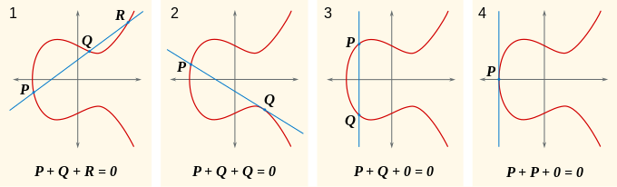

# WTF zk Tutorial Lesson 29: Introduction to Elliptic Curves

Elliptic curves are fundamental to cryptographic algorithms that are used in various applications, such as blockchain and zero-knowledge proofs, due to their enhanced security and efficiency. In this lesson, we will introduce the basic definition of elliptic curves and the operation of addition on them.

## 1. Elliptic Curves

An elliptic curve is not the elliptical shape that we typically associate with in our daily lives. Instead, it is a collection of points that satisfy a specific equation, usually expressed as:

$$
y^2 = x^3 + ax + b
$$

This equation, also known as the standard Weierstrass equation, defines the shape of the elliptic curve with coefficients $a$ and $b$. While these coefficients can belong to any field, let's start by considering them in the real number field and later extend to finite fields. The elliptic curves in the real number field and finite field are denoted as $E(\mathbb{R})$ and $E(\mathbb{F}_p)$, respectively.

To ensure that the curve does not have singular points (i.e., points with cusps or self-intersections), elliptic curves need to satisfy the discriminant condition $\Delta = -16(4a^3 + 27b^2) \neq 0$. This condition ensures the smoothness of the curve and is a prerequisite for performing addition operations.

Despite the name "elliptic," elliptic curves are not directly related to ellipses. Let's consider two examples of elliptic curves:

Elliptic Curve 1: $y^2 = x^3 - x$

Elliptic Curve 2: $y^2 = x^3 - x + 1$

From the above figure, we can observe that the elliptic curve in the real number field is symmetric about the x-axis. For example, both points $(2, \sqrt{6})$ and $(2, -\sqrt{6})$ lie on elliptic curve 1.

## 2. Point at Infinity $O$

To form a group with the points on the elliptic curve, a special point called the point at infinity $O$ (also known as the point at infinity) is introduced. Unlike other points on the elliptic curve, the point at infinity $O$ does not have specific coordinates. It can be understood geometrically as the intersection of two parallel lines at infinity.

The point at infinity $O$ serves as the identity element (zero element) of the additive group formed by the points on the elliptic curve. We will discuss this in more detail in the next section.

## 3. Addition Operation on Elliptic Curves

The group of points on an elliptic curve forms a group under the "addition" operation defined on the curve. However, this addition operation differs from conventional mathematical addition. It is a geometric operation that "adds" two points on the curve to obtain a third point on the curve.

Based on the positions of the two points, the addition operation can be divided into four cases:

Next, we will explain these four cases from a geometric perspective. Given two points $P = (x_1, y_1)$ and $Q = (x_2, y_2)$ on the curve, the addition follows the following rules based on their positions on the curve:

**Case 1: Point Addition:** If $x_1 \neq x_2$, meaning the abscissas of the two points are different, the addition rule is as follows: draw a straight line passing through $P$ and $Q$ (two points determine a straight line), and this line will intersect the elliptic curve at another point $R$. Then, take the symmetric point $R'$ of $R$ with respect to the x-axis as the result of adding $P$ and $Q$.

**Case 2: Doubling of a Point:** If $x_1 = x_2$ and $y_1 = y_2$, but the ordinate is not 0, the points $P$ and $Q$ coincide. In this case, the addition is actually the addition of $P$ with itself, denoted as $P+P$ or $2P$. The addition rule is as follows: draw a tangent line at point $P$, which will intersect the curve at another point $R$. Similarly, take the symmetric point $R'$ of $R$ with respect to the x-axis as the result.

**Case 3: Addition of Inverses:** If $x_1 = x_2$ and $y_1 = -y_2 \neq 0$, we can write it as $P = -Q$, where $P$ and $Q$ are inverses of each other in the elliptic curve point group. In this case, draw a straight line passing through $P$ and $Q$ (two points determine a straight line), which is perpendicular to the x-axis and does not intersect the elliptic curve. However, this is not a problem because the defined point at infinity $O$ comes into play: if there is no intersection, it is defined as intersecting at the point at infinity, which is $P + (-P) = O$.

**Case 4: Both Ordinates are 0:** If $x_1 = x_2$ and $y_1 = y_2 = 0$, meaning the two points coincide and the ordinate is 0, the tangent line at point $P$ is perpendicular to the x-axis and does not intersect the curve at another point. Similarly, if there is no intersection, it can be understood as intersecting at the point at infinity, and the result in this case is also the point at infinity $O$.

These rules ensure that the points on the elliptic curve form a group in abstract algebra. This means that the addition operation on the elliptic curve satisfies closure, associativity, the existence of an identity element (point at infinity), and the existence of an inverse element for each element. We will discuss the properties of the elliptic curve point group in more detail in the next lesson.

## 4. Algebraic Form of the Addition Operation

After introducing the addition operation between points $P$ and $Q$, we will now discuss how to calculate the coordinates of point $R'$, where $R' = P + Q$. Let $R = (x_3, y_3)$ and $R' = (x_3, -y_3)$.

### Case 1: Point Addition

In this case, we first calculate the line passing through $P$ and $Q$, denoted as $l: y = \lambda x + \mu$, where the slope $\lambda = \frac{y_2 - y_1}{x_2 - x_1}$ and the intercept $\mu = y_1 - \lambda x_1$.

Next, we need to find the intersection points of line $l$ and the elliptic curve. Substitute $y = \lambda x + \mu$ into the equation of the elliptic curve:

$$
(\lambda x + \mu)^2 = x^3 + ax + b
$$

By simplifying, we obtain the equation of the intersection points:

$$
x^3 - \lambda^2x^2+ (a-2\lambda\mu)x + (b-\lambda^2) = 0
$$

Alternatively, the elliptic curve can also be expressed in a radical form as $y^2 = (x-x_1)(x-x_2)(x-x_3)$, which expands to $y^2 = x^3 - (x_1 + x_2 + x_3) x^2 + (x_1x_2 + x_1x_3 + x_2x_3)x - x_1 x_2 x_3$. 

The equation of the intersection points and the radical form are equivalent. Therefore, we have:

$$
\lambda^2 = x_1 + x_2 + x_3
$$

This implies that $x_3 = \lambda^2 - x_1 - x_2$. Substituting it into the equation of the line, we get $y_3 = \lambda x_3 + \mu = \lambda(x_3-x_1) + y_1$.

Thus, the coordinates of point $R' = P+Q = (x_3, -y_3)$ are $(\lambda^2 - x_1 - x_2, \lambda(x_1 - x_3) - y_1)$, where $\lambda = \frac{y_2 - y_1}{x_2 - x_1}$.

### Case 2: Doubling of a Point

In this case, let $P = (x_1,y_1)$, $R = (x_3, y_3)$, and $R' = P+P = 2P = (x_3, -y_3)$. We first calculate the tangent line at point $P$, denoted as $l: y = \lambda x + \mu$, where the slope can be obtained by implicitly differentiating the curve equation, $\lambda = \frac{3x_1^2 + a}{2y_1}$, and the intercept is $\mu = y_1 - \lambda x_1$.

Similarly, the equation of the intersection points and the radical form are equivalent. Therefore, we have:

$$
\lambda^2 = 2x_1 + x_3
$$

This implies that $x_3 = \lambda^2 - 2x_1$. Substituting it into the equation of the line, we get $y_3 = \lambda (x_3 - x_1) + y_1$.

Thus, the coordinates of point $R' = 2P = (x_3, -y_3)$ are $(\lambda^2 - 2x_1, \lambda(x_1 - x_3) - y_1)$, where $\lambda = \frac{3x_1^2 + a}{2y_1}$.

In this way, we obtain the algebraic form of the addition operation on points on the elliptic curve. To summarize:

Case 1: The coordinates of point $R' = P+Q = (x_3, -y_3)$ are $(\lambda^2 - x_1 - x_2, \lambda(x_1 - x_3) - y_1)$, where $\lambda = \frac{y_2 - y_1}{x_2 - x_1}$.

Case 2: The coordinates of point $R' = 2P = (x_3, -y_3)$ are $(\lambda^2 - 2x_1, \lambda(x_1 - x_3) - y_1)$, where $\lambda = \frac{3x_1^2 + a}{2y_1}$.

Case 3: Point $R' = P + Q = O$, which is the point at infinity.

Case 4: Point $R' = P + Q = O$, which is the point at infinity.

## 5. Example of Addition Operation

Consider the elliptic curve $y^2 = x^3 - x + 1$ and two points $P(0, 1)$ and $Q(1, 1)$. According to the addition rule, the line $y = 1$ (the line connecting $P$ and $Q$, where $\lambda = 0$) intersects the curve at a third point $R = (-x_1 - x_2, y_1) = (-1, 1)$. Therefore, the point symmetric to it with respect to the x-axis, $R' = P + Q = (-1 , -1)$.

## 6. Group Law

Elliptic Curve Point Group

On an elliptic curve, all points together with the infinity point $O$ form a group known as the elliptic curve point group, denoted as $E$. It satisfies the following properties:

- **Closure:** The addition of any two points in the group using the defined addition operation on the elliptic curve results in another point in the group.
- **Existence of Identity Element:** The point at infinity $O$ serves as the identity element of the elliptic curve group. For any point $P$ in the group, we have $P + O = P$.
- **Existence of Inverse Elements:** For any point $P(x, y)$ on the elliptic curve, there exists a point $P'(x, -y)$ on the curve such that $P + P' = O$, denoted as $P' = -P$.
- **Associativity:** For any three points $P, Q, R$ in the group, we have $(P + Q) + R = P + (Q + R)$.
- **Commutativity:** For any two points $P, Q$ in the group, we have $P + Q = Q + P$.

These properties ensure that the points on the elliptic curve form an Abel group, making the elliptic curve a powerful tool in cryptography.

The elliptic curve point group over the real number field consists of the points on the curve $y^2 = x^3 + ax + b$ and the infinity point $O$, where $a, b \in \mathbb{R}$ and the discriminant $\Delta = 4a^3 + 27b^2 \neq 0$. This group can be written as $E(\mathbb{R}) = \set{(x, y) | y^2 = x^3 + ax + b} \cup O$.

The addition operation on the elliptic curve is defined between two points. We can represent the collinearity of three points $P, Q, R$ on the elliptic curve as $P + Q + R = 0$, so $P + Q = -R$ represents the addition of $P$ and $Q$.

Next, we will prove that $(E(\mathbb{R}), +)$ forms an Abel group.

- **Closure:** According to the definition of the addition operation on the elliptic curve, the calculated result is either a point on the elliptic curve $R' = -R = P+Q$ or the point at infinity $O$, both of which belong to the set of points on the elliptic curve $E(\mathbb{R})$, satisfying closure.

- **Existence of Identity Element:** To satisfy this property, we specifically define the point at infinity $O$ as the additive identity (zero element). For any point $P$ in $E(\mathbb{R})$, we have $P + O = O + P = P$.

- **Existence of Inverse Elements:** The elliptic curve is symmetric with respect to the x-axis, so for any point $P(x, y)$ on the elliptic curve, the point $P' = (x, -y)$ is also on the elliptic curve. From a geometric perspective, for two points $P$ and $P'$ that are symmetric with respect to the x-axis, the straight line determined by them is perpendicular to the x-axis and intersects the elliptic curve at the point at infinity $O$. Therefore, $P, P', O$ are collinear, which can be written as $P + P' + O = O$, i.e., $P + P' = O$. Thus, $P$ and $P'$ are inverse elements of each other, and we can denote $P' = -P$.

- **Commutativity:** For any two points $P$ and $Q$ in $E(\mathbb{R})$, the straight line determined by the two points is not affected by the order of the points, so we have $P + Q = Q + P$.

- **Associativity:** For any three points $P, Q, R$ in the group, we have $(P + Q) + R = P + (Q + R)$. This property requires careful analysis of different cases. One approach is the algebraic approach, where the idea is to prove the equality of expressions on both sides of the equation using formulas. Another approach is the geometric approach, which can be found in this [link](https://warwick.ac.uk/fac/sci/maths/people/staff/helena_verrill/associativity/).

## 7. Summary

In this lesson, we introduced the definition of elliptic curves, the addition operation on elliptic curve points, and the group law. Elliptic curves are not only mathematically elegant but also possess powerful capabilities in cryptography and zero-knowledge proofs. As we continue exploring zero-knowledge proofs, the importance of elliptic curves will become even more evident.