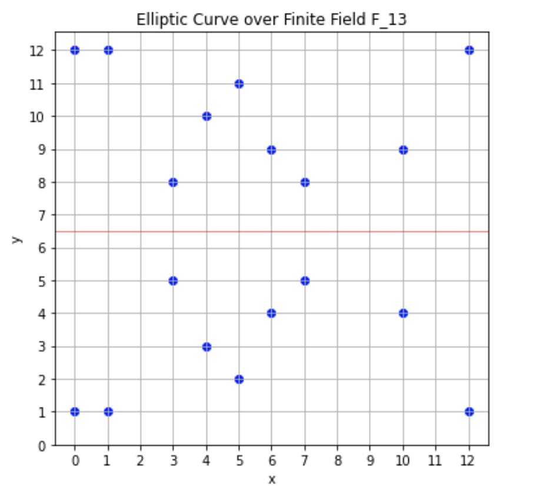
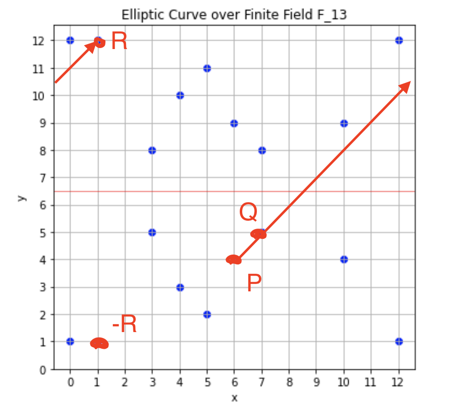
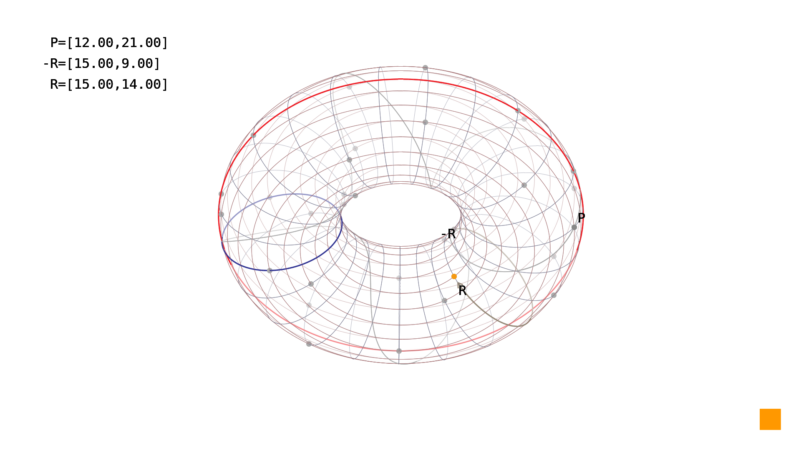
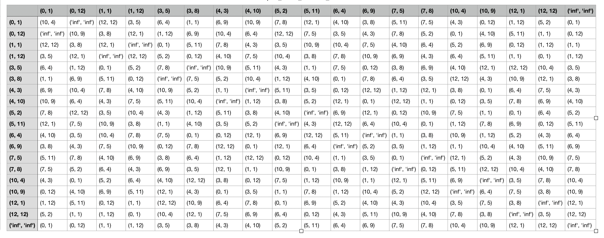

# WTF zk Tutorial Lesson 30: Elliptic Curves over Finite Fields

In the previous chapter, we introduced elliptic curves over the real number field. In this chapter, we will explore elliptic curves over finite fields, which are used directly in zero-knowledge proof algorithms.

## 1. Elliptic Curves over Finite Fields

In cryptography and zero-knowledge proof algorithms, we use elliptic curve point groups over finite fields, such as elliptic curves $E(\mathbb{F}_p)$ over the finite field $F_p$.

In the finite field $\mathbb{F}_p$, an elliptic curve is defined as the set of points that satisfy the following equation:

$$
y^2 \equiv x^3 + ax + b \mod p
$$

where $a, b, x, y \in \mathbb{F}_p$ and $p$ is a prime number. To ensure that the curve does not have singular points, we require the discriminant $4a^3 + 27b^2 \not\equiv 0 \mod p$. Additionally, the point at infinity $O$ must also be included.

The equation of an elliptic curve over a finite field is similar to that over the real number field. However, since the finite field is discrete rather than continuous, the resulting graph consists of a set of discrete points instead of a continuous curve. For example, the elliptic curve $y^2 = x^3 - x + 1 \mod 13$ generates the following set of points:



It consists of 19 points (18 points and the point at infinity $O$), which are:

```python
(0, 1)
(0, 12)
(1, 1)
(1, 12)
(3, 5)
(3, 8)
(4, 3)
(4, 10)
(5, 2)
(5, 11)
(6, 4)
(6, 9)
(7, 5)
(7, 8)
(10, 4)
(10, 9)
(12, 1)
(12, 12)
O
```

We can obtain these points using the following Python code:

```python
import numpy as np

# Define the parameters of the elliptic curve over the finite field F_13
p = 13
a = -1
b = 1

# Define all the points over the finite field F_13
x = np.arange(p)
y = np.arange(p)

# Enumerate the points on the elliptic curve
curve_points = []
for xi in x:
    for yi in y:
        if (yi**2) % p == (xi**3 + a*xi + b) % p:
            print((xi, yi))
            curve_points.append((xi, yi))

# Unpack the coordinates of the points
curve_points_x, curve_points_y = zip(*curve_points)
```

## 2. Symmetry

Just like elliptic curves over the real number field, elliptic curves over finite fields also exhibit symmetry about the x-axis. According to the equation of an elliptic curve:

$$
y^2 \equiv x^3 + ax + b \mod p
$$

if $y \equiv k \mod p$ satisfies the equation, then $y \equiv -k \equiv p-k \mod p$ also satisfies the equation. Therefore, elliptic curves over finite fields are symmetric about the line $y = \frac{p}{2}$, as shown by the red line in the following graph:


## 3. Addition Operation

Although the set of points on an elliptic curve over a finite field is discrete, the addition operation between them is similar to that over the real number field. Given two points $P(x_1, y_1)$ and $Q(x_2, y_2)$ on the elliptic curve $E(\mathbb{F}_p)$, there are four cases depending on the positions of $P$ and $Q$:

**Case 1: Point Addition:** If $x_1 \neq x_2$, i.e., the two points have different x-coordinates, their addition rule is as follows: Draw a line passing through $P$ and $Q$ (two points determine a line). Due to modular arithmetic, this line will continue extending from the opposite boundary after it intersects with the boundary, and eventually intersect with the other point $R(x_3, y_3)$. Therefore, the three points are collinear, and we can express it as $P + Q + R$, so we have $P + Q = -R$, where the coordinates of the point $-R$ are $(x_3, p-y_3)$.

The algebraic representation of point addition is similar to that over the real number field. The coordinates of $-R = P+Q = (x_3, p - y_3)$ are $(\lambda^2 - x_1 - x_2 \mod p, \lambda(x_1 - x_3) - y_1 \mod p)$, where $\lambda = \frac{y_2 - y_1}{x_2 - x_1} \mod p$.



**Case 2: Point Doubling:** If $x_1 = x_2$ and $y_1 = y_2 \neq 0$, in this case, $P$ and $Q$ coincide, and $P + Q = P+P = 2P$. According to the rules of elliptic curves over the real number field, we should draw the tangent line to point $P$. However, for discrete finite fields, finding the tangent line requires knowledge of algebraic geometry, which is beyond the scope of this tutorial (you can get a sense of it from the diagram below). Therefore, we can simply use its algebraic form. In this case, $2P = -R$, where the coordinates of $-R$ are $(\lambda^2 - 2x_1 \mod p, \lambda(x_1 - x_3) - y_1) \mod p$, and $\lambda = \frac{3x_1^2 + a}{2y_1} \mod p$.



**Case 3: Addition of Inverse Elements:** If $x_1 = x_2$ and $y_1 = -y_2 = p- y_2 \neq 0$, we can write it as $P = -Q$, and they are inverse elements of each other in the elliptic curve point group. In this case, draw a line passing through $P$ and $Q$ (two points determine a line), and the line is perpendicular to the x-axis. It intersects with the elliptic curve at the point at infinity, which is $P + (-P) = O$.

**Case 4: y-coordinate is 0:** If $x_1 = x_2$ and $y_1 =-y_2 = 0$, i.e., the two points coincide and their y-coordinate is 0, then $P + Q = O$.

Here is an example: given the elliptic curve $y^2 = x^3 - x + 1 \mod 13$ over a finite field, and two points $P(6,4)$ and $Q(7,5)$, we want to calculate $R'(x_3, y_3) = P+Q$. According to the algebraic form, we first calculate the slope $\lambda = \frac{y_2 - y_1}{x_2 - x_1} = \frac{5-4}{7 - 6} = \frac{1}{1} = 1 \mod 13$. Then $x_3 = \lambda^2 - x_1 - x_2 \mod p = 1 -7-6 = 1 \mod 13$, $y_3 = \lambda(x_1 - x_3) - y_1 = (6-1) - 4 = 1$, so the result is $(1,1)$, which matches the graph (the point $-R$ in the graph).


## 4. Group Law

The points on an elliptic curve $E(\mathbb{F}_p)$ over a finite field can form an Abel group, satisfying five fundamental properties:

- **Closure:** The addition of any two points in the group using the defined addition operation on the elliptic curve yields another point in the group.
- **Identity Element:** The point at infinity $O$ is the identity element of the elliptic curve group. For any point $P$ in the group, we have $P + O = P$.
- **Inverse Element:** For any point $P(x, y)$ on $E(\mathbb{F}_p)$, there exists a point $P'(x, p-y)$ such that $P + P' = O$, i.e., $P'$ is the inverse element of $P$, denoted as $P' = -P$.
- **Associativity:** For any three points $P, Q, R$ in the group, we have $(P + Q) + R = P + (Q + R)$.
- **Commutative Property:** For any two points $P, Q$ in the group, we have $P + Q = Q + P$.

The first three properties are straightforward to derive from the definition, while the associativity and commutative property can be proved using the algebraic form of the addition operation.

Below are the results of the addition operation between all the points on the elliptic curve $y^2 = x^3 - x + 1 \mod 13$. You can verify if they satisfy the five properties mentioned above. The point (inf, inf) represents the point at infinity $O$:



## 5. Finiteness

Since elements in a finite field are finite and cyclic, the number of elements in the elliptic curve point group over a finite field is also finite. This means that cryptographic algorithms operate within a fixed-size set, which is crucial for algorithm implementation.

So how many elements does $E(\mathbb{F}_p)$ contain? We can make a rough estimate: the x-coordinate $x$ can take on $p$ possible values, and for each $x$, there are at most two possible values for the y-coordinate $y$ that satisfy the elliptic curve equation $y^2 = x^3 + ax + b$. Additionally, we have the point at infinity $O$. Therefore, $E(\mathbb{F}_p)$ can contain at most $2p + 1$ elements.

However, this estimate is not precise because $x^3 + ax + b$ may be a quadratic non-residue modulo $p$, so we need to exclude these cases. Roughly speaking, there is a 50% chance of this happening, so $E(\mathbb{F}_p)$ probably contains $0.5 * 2p +1 = p + 1$ elements.

### 5.1 Hasse's Theorem

Hasse's theorem provides an upper and lower bound on the number of points on an elliptic curve over a finite field. It states that the number of points $N$ on the curve satisfies the following inequality with respect to the order $p$ of the finite field:

$$
|N - (p + 1)| \leq 2\sqrt{p}
$$

This means that the number of points on the elliptic curve is approximately equal to $p$, with a possible deviation that does not exceed $2\sqrt{p}$ in absolute value.

Hasse's theorem assures us that the number of elements in the elliptic curve point group over a finite field is sufficiently large, which forms the basis for the hardness of the elliptic curve discrete logarithm problem (ECDLP), which we will discuss in the next chapter.

Additionally, you can use [Schoof's algorithm](https://en.wikipedia.org/wiki/Schoof%27s_algorithm) to compute the number of elements in $E(\mathbb{F}_p)$ accurately, with an algorithmic complexity of $O((\log{p})^6)$.

## 6. Summary

In this chapter, we explored elliptic curves $E(\mathbb{F}_p)$ over finite fields $\mathbb{F}_p$, including symmetry, addition operation, group law, and finiteness. Elliptic curves over finite fields provide a strong mathematical foundation for modern cryptography and blockchain technology, so it is important to thoroughly understand them.