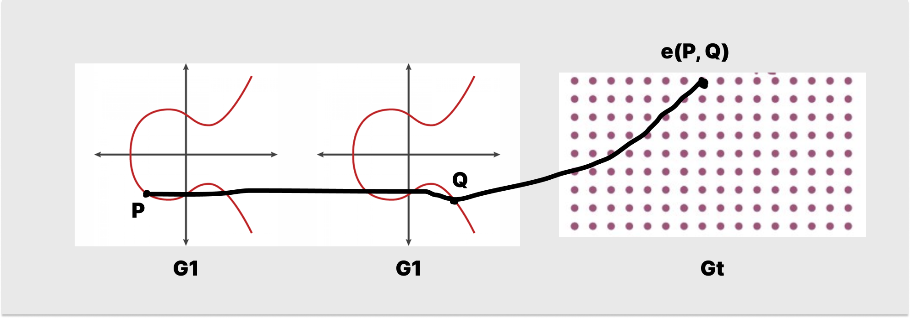
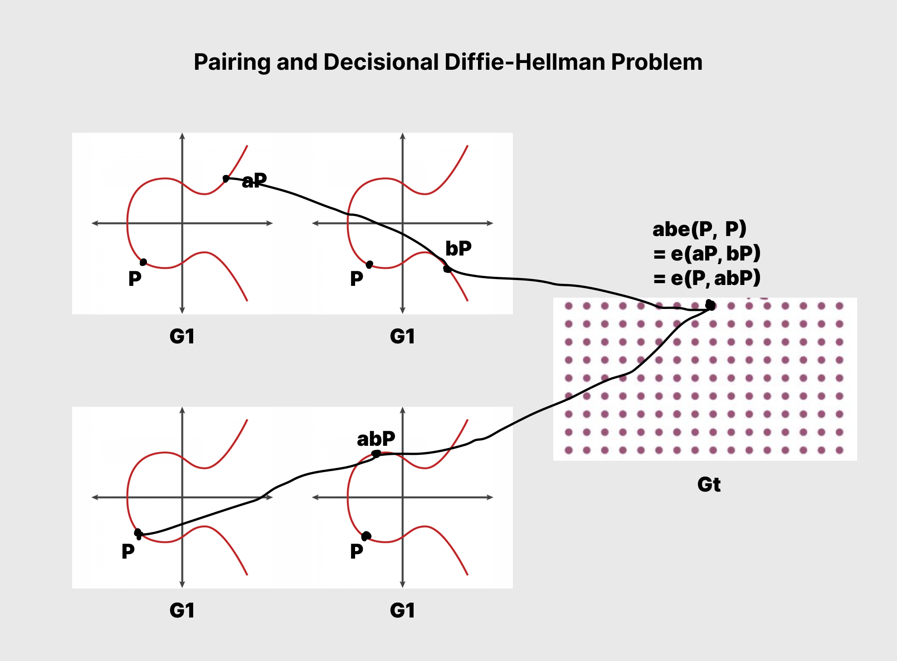

# WTF zk Tutorial Lesson 34: Bilinear Pairing Basics

In this lesson, we will cover the basics of bilinear pairing on elliptic curves. Bilinear pairing is a mathematical operation that establishes a relationship between two groups (usually groups of points on elliptic curves) and maps them to a third group (usually a multiplicative group). It plays a crucial role in cryptography, particularly in identity-based encryption systems and zero-knowledge proofs (zkSnark). We will discuss specific algorithms related to bilinear pairing in the next lesson.

## 1. Bilinear Pairing

Bilinear pairing is a mathematical operation that satisfies the following properties:

1. **Bilinearity**: For all $a, b \in \mathbb{Z}$ and $P \in G_1$, $Q \in G_2$, we have $\text{e}(P^a, Q^b) = \text{e}(P, Q)^{ab}$.

   More rigorously, bilinearity can be expressed as $\text{e}(P + Q, S) = \text{e}(P, S) \cdot \text{e}(Q, S)$ and $\text{e}(P, Q + S) = \text{e}(P, Q) \cdot \text{e}(P, S)$.

2. **Non-degeneracy**: If $P$ and $Q$ are non-zero elements in groups $G_1$ and $G_2$, respectively, then $\text{e}(P, Q) \neq 1$.

3. **Computability**: There exists a polynomial-time algorithm to compute the pairing $\text{e}(P, Q)$ for any $P \in G_1$ and $Q \in G_2$.

Among these properties, bilinearity is the most important, while the other two properties ensure that the pairing is non-trivial and can be efficiently computed.

When the bilinear pairing is defined on the same group, it is called a symmetric bilinear pairing. Otherwise, it is called an asymmetric bilinear pairing.

For example, if we take $G_1 = G_2 = G_T = (\mathbb{Z}, +)$, we can define a mapping $e: \mathbb{Z} \times \mathbb{Z} \to \mathbb{Z}$ as $e(x, y) = x \cdot y$. This mapping satisfies bilinearity: $\text{e}(ax, by) = axby=abxy = ab\text{e}(x, y)$. It also satisfies non-degeneracy and computability, making it a bilinear mapping.

## 2. Bilinear Pairing on Elliptic Curves

Bilinear pairing combined with elliptic curves enables the construction of new encryption algorithms such as identity-based encryption (IBE), short signatures, and zero-knowledge proofs. In this section, we will focus on symmetric bilinear pairing where $G_1 = G_2$. Let $G_1$ be the point group of an elliptic curve, and $G_T$ be a finite group (usually an additive group). We can define a bilinear mapping $e(P, G): G_1 \times G_1 \rightarrow G_T$ that satisfies:

1. **Bilinearity**: For all $a, b \in \mathbb{Z}$ and $P, Q \in G_1$, we have $\text{e}(aP, bQ) = ab \text{e}(P, Q)$.

   More rigorously, bilinearity can be expressed as $e(P, Q + R) = e(P, Q) \cdot e(P, R)$ and $e(P + R, Q) = e(P, Q) \cdot e(R, Q)$.

2. **Non-degeneracy**: If $P$ and $Q$ are not the infinity point $O$ of group $G_1$, then $\text{e}(P, Q) \neq O$.

3. **Computability**: There exists a polynomial-time algorithm to compute the pairing $\text{e}(P, Q)$ for any $P, Q \in G_1$.

The following diagram illustrates bilinear pairing on elliptic curves. It takes two points, $P$ and $Q$, from the elliptic curve $G_1$ and maps them to another group, $G_T$, while satisfying bilinearity.

### 2.1 Decisional Diffie-Hellman Problem

The decisional Diffie-Hellman problem (DDH) refers to the problem of determining whether $g^c = g^{ab}$ in a group $G$, given elements $g, g^a, g^b, g^c$.

While the difficulty of solving the DDH problem depends on the group's characteristics in ordinary group structures, bilinear pairing on elliptic curves provides an effective method for solving the DDH problem.

Given the elliptic curve point group $G_1$ with $P$ as the generator of $G_1$, and given $P, aP, bP, cP$, we can determine whether $g^c = g^{ab}$ by computing $e(aP, bP)$ and $e(P, cP)$. If they are equal, then $g^c = g^{ab}$; otherwise, they are not equal.

This is because, according to bilinearity, we have $e(aP, bP) = e(P, abP) = ab e(P, P)$. Therefore, we can use it to solve the DDH problem.

## 3. Summary

In this lesson, we introduced the basic concepts and properties of bilinear pairing, as well as how it can be used to solve the DDH problem. When combined with elliptic curves, bilinear pairing enables the construction of new cryptographic and zero-knowledge proof algorithms, such as identity-based encryption (IBE), short signatures, and zkSnark. In the next lesson, we will introduce algorithms that can be used to implement bilinear pairing.