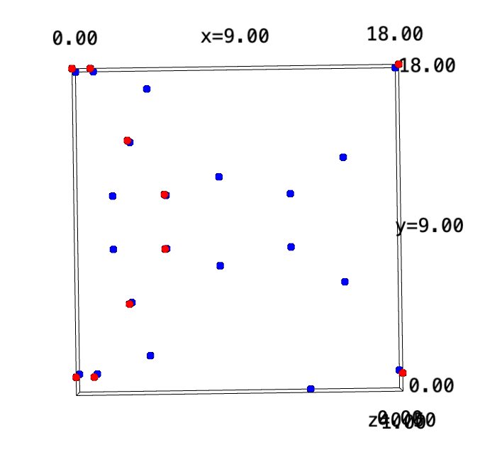
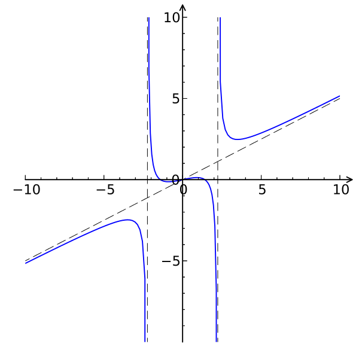
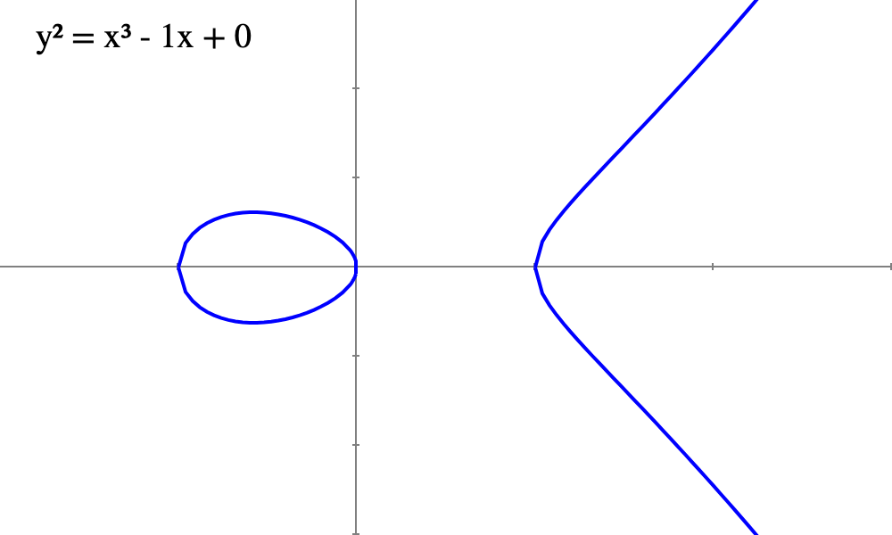

# WTF zk Tutorial Lesson 35: Torsion Groups and Divisors

Before we dive into Weil pairing, we need to introduce two important mathematical tools: torsion groups and divisors. Torsion groups provide a well-defined set of points on an elliptic curve, while divisors allow us to mathematically describe the pairing relationships between points accurately.

## 1. Torsion Groups

Torsion points are points on an elliptic curve that have a finite order. In other words, for any point P on the elliptic curve E, there exists a positive integer m≥1 such that mP=O, where O represents the identity element (the point at infinity) on the curve. The order of the point P is equal to m, and P is called a torsion point.

We can gather all the points whose order is a multiple of m to form the m-torsion group, denoted as:

E[m] = {P ∈ E: mP = O}

The torsion group E[m] is a subgroup of the elliptic curve E under addition, with the identity element being the point at infinity O. If P, Q ∈ E[m], then P+Q and -P also belong to E[m], indicating that the torsion group has closure and inverse properties, thus forming a group structure.

When the elliptic curve is defined over a field K, the m-torsion group is denoted as E(K)[m]. For example, the m-torsion group of E defined over Fp is written as E(Fp)[m].

Let's take the elliptic curve E(F19) with the equation y^2=x^3−x+1 as an example. The curve has a total of 22 elements, and the 11-torsion group has 11 points, which are:

- (0, 18)
- Infinity (point at infinity)
- (18, 18)
- (0, 1)
- (5, 11)
- (3, 14)
- (5, 8)
- (18, 1)
- (3, 5)
- (1, 1)
- (1, 18)

The visualization of the elliptic curve E(F19) (in red and blue) and the points in the 11-torsion group (in red) is shown below:

Torsion groups have an important property:

For the elliptic curve E(Fp), if m and p are coprime, then there exists a positive integer k such that

E(Fpk)[m] ≅ Z/mZ × Z/mZ

That is, the torsion group E(Fpk)[m] on the extension field Fpk is isomorphic to the direct product of two cyclic groups of order m. This suggests that in certain extension fields, the torsion group can be viewed as a 2-dimensional vector space, providing a finite and well-structured group of points for Weil pairing.

## 2. Rational Functions and Divisors

### 2.1 Rational Functions

A rational function is a function of the form A/B, where A and B are polynomial functions and B is not identically zero. A rational function can be defined as:

f(x) = A(x)/B(x)

where A(x) and B(x) are polynomials: A(x)=∑ajxj and B(x)=∑bjxj.

If we factorize A(x) and B(x) into irreducible polynomials and consider complex numbers, the rational function can be written in another form:

f(x) = a(x−α1)e1⋯(x−αr)er/b(x−β1)d1⋯(x−βs)ds

Here are some properties of rational functions:
1. Additivity: Rational functions can be combined through addition and multiplication operations to form new rational functions.
2. Zeros and poles: The zeros of a rational function are the points where the function equals zero, namely, all x0 that make the numerator P(x0)=0, which are {α1,…,αr}; the poles are the points where the function tends to infinity, namely, all x1 that make the denominator Q(x1)=0, which are {β1,…,βs}. The exponents {e1,…,er,d1,…,ds} represent the multiplicities of the zeros and poles.
3. Divisor: The zeros and poles of a rational function can be used to define the divisor of the function.

For example, let's consider the polynomial f(x)=x^3−2x/2(x^2−5), which has zeros at {0,√2,−√2} and a pole at {√5,−√5}.

### 2.2 Divisors

A divisor is a formal sum of points on an elliptic curve and can be seen as a concept of "weighted" points, used to track the zeros and poles of rational functions. If there are e1 zeros at α1, it is denoted as e1[α1]; if there are d1 poles at β1, it is denoted as −d1[β1], and then they are formally added together (not ordinary addition):

div(f) = e1[α1]+…+er[αr]−d1[β1]−…−ds[βs]

For example, for the polynomial f(x)=x^3−2x/2(x^2−5), which has zeros at {0,√2,−√2} and a pole at {√5,−√5}, all with multiplicity 1, the divisor is:

div(f) = [0]+[√2]+[−√2]−[√5]−[−√5]

### 2.3 Rational Functions and Divisors on Elliptic Curves

An elliptic curve is a set of points that satisfy the following equation, together with the point at infinity O:

y^2 = x^3+ax+b

where a, b are coefficients. We can represent the coordinates of all points P(x,y) on the elliptic curve using the equation E(x,y)=y^2−x^3−ax−b=0. In this way, we can define rational functions on the elliptic curve as:

f(x,y) = A(x,y)/B(x,y)

where A(x,y), B(x,y) are polynomials defined on the elliptic curve, satisfying E(x,y)=0, and B(x,y) is not identically zero. The numerator A(x,y) has zeros of f(x,y), and the denominator B(x,y) has poles of f(x,y), all defined on the elliptic curve.

Next, we can define the divisor of a rational function on an elliptic curve as:

D = div(f) = ∑P∈E nP[P]

where nP ∈ Z represents the multiplicities of the zeros or poles at point P. Since there are only finitely many zeros and poles on the elliptic curve, the multiplicities nP for the remaining points are all zero, so the summation in D is finite.

Divisors on an elliptic curve have two important concepts: the degree of a divisor and the sum of a divisor:

1. Degree of a Divisor: Defined as the sum of nP:

   deg(D) = ∑P∈E nP

2. Sum of a Divisor: Defined as the sum of the divisor without the square brackets:

   sum(D) = ∑P∈E nP P

Divisors on an elliptic curve have several important properties (proofs beyond the scope of this tutorial, can be found in dedicated elliptic curve textbooks):

**Property 1: Uniqueness Theorem of Divisors** If two non-zero rational functions f and g defined on the elliptic curve have the same divisor, i.e., div(f) = div(g), then these two functions must be proportional to each other, i.e., there exists a constant c such that f = cg.

> This property implies that the divisor of a rational function can uniquely determine the rational function (up to a non-zero constant factor), which is important for bilinear pairings.

**Property 2: Principal Divisor Theorem** A divisor D = ∑P∈E nP[P] is the divisor of a rational function on an elliptic curve if and only if its degree is zero deg(D) = 0, and the sum of the divisor is the point at infinity on the elliptic curve sum(D) = O. In particular, if a rational function on an elliptic curve has no zeros or poles, it is a constant.

> Firstly, this theorem provides a method to determine whether a given divisor D corresponds to a rational function; secondly, it is important for bilinear pairings.

### 2.4 Examples of Divisors

Let's take the elliptic curve E: y^2 = x^3−x as an example and define the rational function f(x, y) = y on E. We can observe the behavior of f at different points to construct its divisor. Since x^3−x=0 has 3 roots 0,−1,1, f has 3 zeros at P1(0,0), P2(−1,0), P3(1,0), each with multiplicity 1. The function f also has a pole at the point at infinity O (because on the elliptic curve, y tends to infinity at infinity). According to the Principal Divisor Theorem, the multiplicity of the pole at the point at infinity is 3. Therefore, the divisor can be written as:

div(f) = [P1] + [P2] + [P3] − 3[O]

where the degree of the divisor deg(D) = 1 + 1 + 1 − 3 = 0. Since P1, P2, P3 are collinear points, we have P1 + P2 + P3 = O, so the sum of the divisor sum(D) = P1 + P2 + P3 − 3O = O − O = O.

## 3. Examples

Next, let's give an example that combines torsion groups and divisors. We choose an elliptic curve defined over F5: E: y^2 = x^3−x mod 5.

The curve has 3 roots: 0,−1,1, which correspond to the 3 points P1(0,0), P2(−1,0), P3(1,0) on the elliptic curve. Since they satisfy 2P1=2P2=2P3=O, they, together with the point at infinity O, form the 2-torsion group of the elliptic curve: E[2] = {P1, P2, P3, O}. It can be seen that E[2] contains 4 points and is isomorphic to Z/2Z × Z/2Z.

We can define a rational function on E[2]: f(x, y) = (x + 1)/(x−1). This function has a zero at P2 and a pole at P3. Therefore, its divisor can be written as:

D = div(f) = 2[P2] − 2[P3]

> Note that the multiplicity of zeros or poles in the m-torsion group is m.

The degree of this divisor is deg(D) = 2 − 2 = 0, and the sum is sum(D) = 2P2 − 2P3  = O − O = O.

## 4. Summary

In this lesson, we introduced two important mathematical tools used in Weil pairing: torsion groups and divisors. Torsion groups provide a finite and well-structured group of points on an elliptic curve, while divisors allow us to accurately describe the pairing relationships between points mathematically. In the next lesson, we will dive into Weil pairing.