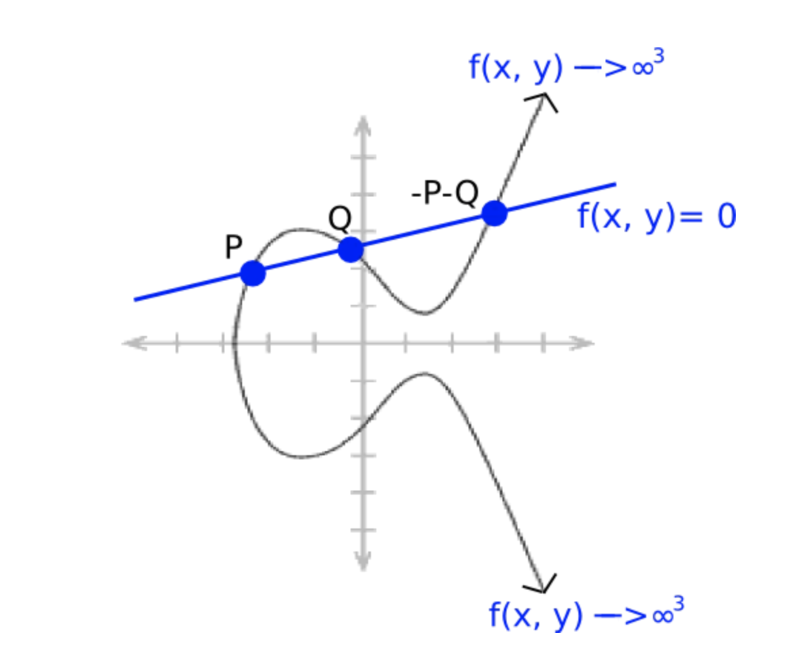

# WTF zk Tutorial 37: Miller Algorithm

In this lesson, we will introduce the Miller Algorithm, which allows for efficient computation of pairings on elliptic curves.

## 1. Miller Algorithm

Let's start by reviewing the Weil pairing, which maps two points $P$ and $Q$ on the $m$-torsion group of an elliptic curve to $m$-th roots of unity:

$$
e_m: E[m] \times E[m] \to \mu_m
$$

The specific form of the Weil pairing is given by:

$$
e_m(P, Q) = \frac{f_P(Q+X)}{f_P(X)} / \frac{f_Q(P-X)}{f_Q(-X)}
$$

where the functions $f_P$ and $f_Q$ are rational functions defined on the elliptic curve, satisfying the following conditions:

$$
\text{div}(f_P) = m[P] - m[O]
$$

$$
\text{div}(f_Q) = m[Q] - m[O]
$$

### 1.1 Algorithm Steps

The Miller Algorithm provides an efficient way to compute the function $f_P$. It can be seen as a Double-And-Add algorithm for pairings, with a computational complexity of $O(\log{m})$. The algorithm consists of the following steps:

1. Initialize $T = P$ and $f = 1$.
2. Loop from $i = t - 1$ to 0:
   - $f = f^2 \cdot h_{T,T}$.
   - $T = 2T$.
   - If $\varepsilon_i = 1$:
      - $f = f \cdot h_{T,P}$.
      - $T = T + P$.
3. End the loop.
4. Return the value of $f$.

The divisor of the resulting function $f$ satisfies the following form:

$$
\text{div}(f_P) = m[P] - [mP] - (m-1)[O]
$$

When $P$ is an $m$-torsion point, we have $mP = O$, so the divisor becomes $\text{div}(f_P) = m[P] - (m)[O]$, which conforms to the form in the Weil pairing.

### 1.2 Proof

Let's define a line $y = \lambda x + \mu$ that intersects the elliptic curve at three points $P$, $Q$, and $-P-Q$.



The rational function $y-\lambda x - \mu$ defined on the elliptic curve has three zeros at $P$, $Q$, and $-P-Q$ (each with multiplicity 1) and one pole at the point at infinity $O$ (with multiplicity 3). Its divisor satisfies:

$$
\text{div}(y-\lambda x - \mu) = [P] + [Q] + [- P - Q] - 3[O]
$$

Similarly, the rational function $x-x_{P+Q}$ has two zeros (with equal abscissas) at $P+Q$ and $-P-Q$ (each with multiplicity 1) and one pole at the point at infinity $O$ (with multiplicity 2). Its divisor satisfies:

$$
\text{div}(x-x_{P+Q}) = [P+Q] + [- P - Q] - 2[O]
$$

By taking the quotient of these two rational functions, we obtain $h_{P, Q} = \frac{y-\lambda x - \mu}{x-x_{P+Q}}$, which is also a rational function. Its divisor satisfies (subtracting the divisors of the two functions above):

$$
\text{div}(h_{P, Q}) = [P] + [Q] - [- P - Q] - [O]
$$

In particular, when the slope of the line $\lambda = \infty$, we have $P + Q = O$, and we set $g_{P,Q} = x - x_P$. Its divisor is:

$$
\text{div}(h_{P, Q}) = [P] + [-P] - 2[O]
$$

Next, we expand $m$ into binary form:

$$
m = \varepsilon_0 + \varepsilon_1 \cdot 2 + \varepsilon_2 \cdot 2^2 + \ldots + \varepsilon_t \cdot 2^t
$$

where $\varepsilon_i \in \{0, 1\}$ and $\varepsilon_t \neq 0$.

Through a simple (not really) induction, we can prove that the output $f$ of the Miller Algorithm satisfies:

$$
\text{div}(f_P) = m[P] - [mP] - (m-1)[O]
$$

## 2. Example

Let's consider a slightly more complex example of the Weil pairing using the Sage software. Sage (also known as SageMath) is an open-source mathematics software system designed to provide a powerful and comprehensive environment for solving various mathematical problems and conducting mathematical research. Its syntax is similar to Python, and you can run Sage programs in your browser using [SageMathCell](https://sagecell.sagemath.org/).

We will work with an elliptic curve defined over $F_{631}$: $E: y^2 = x^3 + 30x + 34 \pmod{631}$. This elliptic curve has a total of 650 points, which can be factorized as $2 \cdot 5^2 \cdot 13$. The $5$-torsion group $E[5]$ of this curve has 25 points, and we will choose two points $P(36, 60)$ and $Q(121, 387)$ from this group, both of which are generators of $E[5]$. We will use Sage to compute their Weil pairing:

$$
e_m(P, Q) = 242
$$

It satisfies $242 \in \mu_5$ because $242^5 = 1 \pmod{631}$.

The code for this example is as follows:

```python
p = 631
a = 30
b = 34
E = EllipticCurve(GF(p), [a, b])
print(E)
print("Number of elements on the elliptic curve: ", E.cardinality())

# Get points in the 5-torsion group
INF = E[0]
L_E_5 = INF.division_points(5)  # [11]P == INF
E_5 = Set(L_E_5)  # $5$-torsion
print("5-torsion points: ", E_5)
print("Number of elements in the 5-torsion group: ", E_5.cardinality())

P = E([36,60])
Q = E([121,387])

weil_P_Q = P.weil_pairing(Q, 5)
print("Weil pairing of points", P, "and", Q, "in the 5-torsion group is", weil_P_Q)

# Output
# Elliptic Curve defined by y^2 = x^3 + 30*x + 34 over Finite Field of size 631
# Number of elements on the elliptic curve:  650
# 5-torsion points:  {(121 : 244 : 1), (121 : 387 : 1), (420 : 48 : 1), (0 : 1 : 0), (531 : 613 : 1), (36 : 60 : 1), (586 : 584 : 1), (428 : 25 : 1), (586 : 47 : 1), (339 : 132 : 1), (289 : 362 : 1), (575 : 7 : 1), (511 : 23 : 1), (511 : 608 : 1), (617 : 626 : 1), (575 : 624 : 1), (595 : 221 : 1), (617 : 5 : 1), (595 : 410 : 1), (36 : 571 : 1), (531 : 18 : 1), (339 : 499 : 1), (289 : 269 : 1), (428 : 606 : 1), (420 : 583 : 1)}
# Number of elements in the 5-torsion group:  25
# Weil pairing of points (36 : 60 : 1) and (121 : 387 : 1) in the 5-torsion group is 242
```

Next, we compute the pairing between $R = 3P = (617, 5)$ and $S = 4Q = (121, 144)$:

$$
e_m(R, S) = 512
$$

Since the Weil pairing satisfies bilinearity, we should have $e_m(R, S) = e_m(3P, 4Q) = e_m(P,Q)^{12}$. Let's verify that $242^{12} = 512 \pmod{631}$, which is indeed the case.

Therefore, using the Weil pairing, we can verify that $3 \cdot 4 = 12$ by $e_m(P, Q)^{12} = e_m(3P,4P)$.

The code for this verification is as follows:

```python
R = 3 * P
S = 4 * Q

weil_R_S = R.weil_pairing(S, 5)
print("Weil pairing of points", R, "and", S, "in the 5-torsion group is", weil_R_S)

print("Since R = 3P and S = 4Q, we have weil_P_Q ^ 12  = ",  weil_P_Q^12 , "which is equal to weil_R_S")

# Weil pairing of points (617 : 5 : 1) and (121 : 244 : 1) in the 5-torsion group is 512
# Since R = 3P and S = 4Q, we have weil_P_Q ^ 12  =  512 which is equal to weil_R_S
```

## 3. Summary

In this lesson, we have introduced the Miller Algorithm, which enables efficient computation of pairings on elliptic curves. We have also provided an example of the Weil pairing using the Sage software.