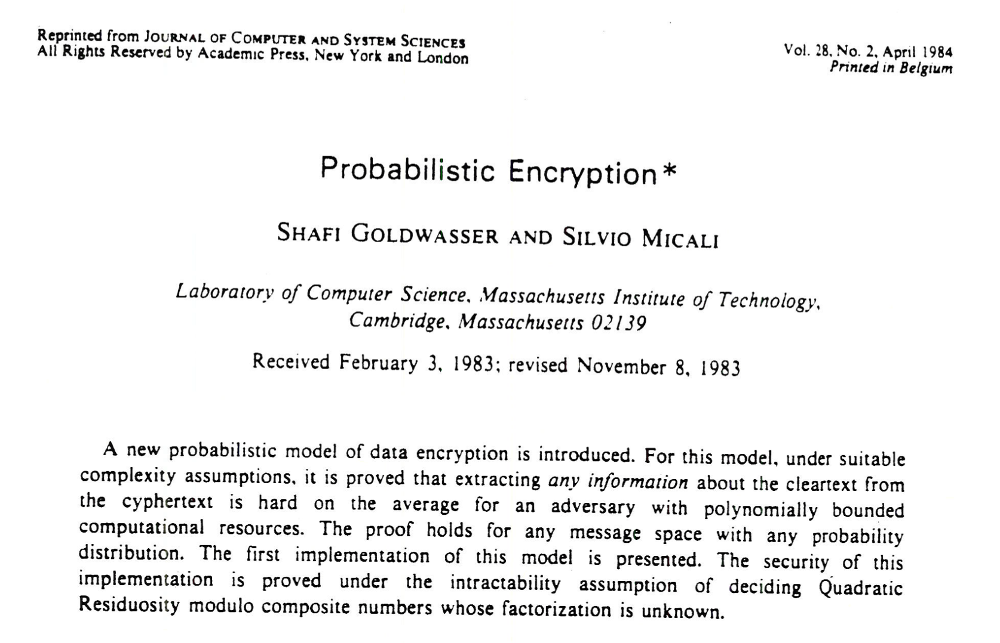

# WTF zk Tutorial Milestone 04: Goldwasser-Micali (GM) Algorithm

The Goldwasser-Micali (GM) algorithm was proposed by Goldwasser and Micali in 1982. It is considered a milestone in cryptography as it was the first encryption algorithm to introduce probabilistic encryption and ciphertext indistinguishability.



## 1. Background

The GM encryption algorithm is an asymmetric encryption algorithm based on the quadratic residue problem. Its security relies on the difficulty of solving the quadratic residue problem.

**Quadratic Residue Problem:** Given $N = pq$, where $p$ and $q$ are large prime numbers, it is computationally difficult to determine whether an integer $x$ exists such that $x^2 \equiv y \mod N$ (i.e., $y$ is a quadratic residue) without knowing $p$ and $q$. However, for the recipient who knows $p$ and $q$, solving the quadratic residue problem is easy, allowing for correct decryption of the ciphertext.

Before the GM encryption algorithm was proposed, encryption algorithms were typically based on traditional deterministic methods, where the same plaintext always produces the same ciphertext. This fixed mapping made them vulnerable to various ciphertext attacks. The GM encryption algorithm introduced probabilistic encryption, where the same plaintext can produce different ciphertexts in different encryption instances. This significantly improved the resistance of the encryption system to ciphertext attacks.

## 2. Algorithm Principles

The GM algorithm consists of three steps: key generation, probabilistic encryption, and deterministic decryption. Let's assume Alice wants to communicate with Bob using the GM algorithm.

### 2.1 Key Generation

Bob generates the key using the GM algorithm, following these steps:

1. Select two large prime numbers, $p$ and $q$.

2. Compute the composite number $N = pq$.

3. Find a quadratic non-residue $x$ modulo $N$ such that the Legendre symbol satisfies $\left(\frac{x}{p}\right) = \left(\frac{x}{q}\right) = -1$, which means the Jacobi symbol satisfies $\left(\frac{x}{N}\right) = \left(\frac{x}{p}\right) \left(\frac{x}{q}\right) = 1$.

The generated public key is $(x, N)$, and the private key is $(p, q)$.

### 2.2 Probabilistic Encryption

Alice encrypts the plaintext message $M$ after receiving the public key $(x, N)$. The GM algorithm encrypts each bit of the plaintext.

1. Encode the plaintext message $M$ into binary format (bits) $M_1, ..., M_n$.

2. For each bit $M_i$:
   - If $M_i = 1$, choose a random number $r$ such that $\gcd(r, N) = 1$, and compute the ciphertext $c_i = r^2x \mod N$.
   - If $M_i = 0$, choose a random number $r$ such that $\gcd(r, N) = 1$, and compute the ciphertext $c_i = r^2 \mod N$.

Alice sends the ciphertext $(c_1, ..., c_n)$ to Bob. Since each bit of the ciphertext is randomly generated, the GM algorithm achieves ciphertext indistinguishability. This means that without knowing the key, an attacker cannot distinguish whether two or more ciphertexts correspond to different plaintexts.

### 2.3 Deterministic Decryption

Bob decrypts the ciphertext after receiving it.

1. Use the private key $(p, q)$ to determine whether each $c_i$ is a quadratic residue.

2. If $c_i$ is a quadratic residue, decrypt $m_i = 0$; otherwise, decrypt $m_i = 1$.

3. Assemble the decrypted message $m = (m_1, ..., m_i)$, which is equal to the plaintext message $M$.

Since Bob possesses the private key $(p, q)$ and knows how to perform prime factorization of $N$, it is easy for him to determine whether a number $a$ is a quadratic residue. The specific method is as follows:

- Compute $a_p = a \mod p$ and $a_q = a \mod q$.

- If $a_p^{(p-1)/2} \equiv 1 \pmod p$ and $a_q^{(q-1)/2} \equiv 1 \pmod q$ hold, then $a$ is a quadratic residue modulo $N$; otherwise, it is a quadratic non-residue.

## 3. Code Implementation

We implement the GM algorithm in Python, using the sympy library.

```python
## Goldwasser-Micali (GM) Encryption Algorithm

from sympy.ntheory import is_quad_residue, primerange
from random import randint

def generate_keys():
    p = next(primerange(1000, 10000))
    q = next(primerange(10000, 11000))
    n = p * q
    x = 2
    while is_quad_residue(x, p) and is_quad_residue(x, q):
        x += 1
    return (n, x), (p, q)

def encrypt(message, public_key):
    n, x = public_key
    encrypted = []
    for bit in message:
        r = randint(1, n-1)
        c = (r * r * x**int(bit)) % n
        encrypted.append(c)
    return encrypted

def decrypt(encrypted, private_key):
    p, q = private_key
    decrypted = ""
    for c in encrypted:
        if is_quad_residue(c, p) and is_quad_residue(c, q):
            decrypted += "0"
        else:
            decrypted += "1"
    return decrypted

# Example
public_key, private_key = generate_keys()
message = "1010"
encrypted_message = encrypt(message, public_key)
decrypted_message = decrypt(encrypted_message, private_key)

print("Public Key (N, x):", public_key)
print("Private Key (p, q):", private_key)
print("Original Plaintext Message:", message)
print("Ciphertext:", encrypted_message)
print("Decrypted Message:", decrypted_message)

## Output Example
# Public Key (N, x): (10097063, 5)
# Private Key (p, q): (1009, 10007)
# Original Plaintext Message: 1010
# Ciphertext: [4261321, 8377247, 969148, 6082662]
# Decrypted Message: 1010
```

#### Notes
- The GM algorithm processes binary messages, encrypting each bit separately.
- Each bit encrypted by the GM algorithm expands by a factor of $\log N$, resulting in low efficiency. It is not as practical as the later Elgamal algorithm, but it is valuable in theory.

## 4. Summary

In this lesson, we introduced the Goldwasser-Micali (GM) encryption algorithm, which holds great theoretical importance. It was the first encryption algorithm to introduce probabilistic encryption and ciphertext indistinguishability. The GM algorithm inspired the development of the Elgamal algorithm and had a significant impact on the advancement of zero-knowledge proofs (Goldwasser, Micali, and Rackoff proposed zero-knowledge proofs in their research three years later).