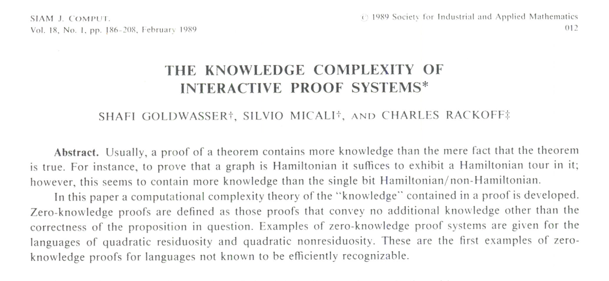
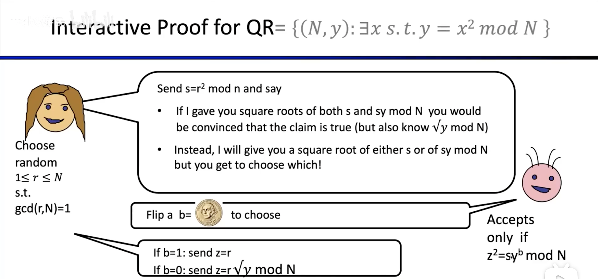

# WTF zk Tutorial Milestone 05: Introduction to Zero-Knowledge Proofs

In this lesson, we will explore the concept of zero-knowledge proofs and introduce a simple example based on the quadratic residue problem. We will delve deeper into this topic in later chapters.

## 1. Background Introduction

Zero-knowledge proofs (zk-proofs) were first proposed by scientists Goldwasser, Micali, and Rackoff in their 1985 paper "The Knowledge Complexity of Interactive Proof Systems". This paper not only introduced the concept of zero-knowledge proofs, but also established the framework of knowledge complexity for interactive proof systems.

Zero-knowledge proofs have three elements that can be used to determine whether an algorithm is a zero-knowledge proof algorithm:

1. **Completeness**: If a statement is true, an honest verifier will be convinced by an honest prover. In other words, "true statements cannot be proven false".
2. **Soundness**: If a statement is false, a dishonest prover cannot convince an honest verifier. In other words, "false statements cannot be proven true".
3. **Zero-Knowledge**: If a statement is true, the verifier does not learn any additional information other than the truth of the statement.

The value of zero-knowledge proofs lies in their strong privacy protection capabilities, which ensure that sensitive information of individuals or organizations is not leaked during the verification process. This feature has a wide range of applications in secure protocol design, identity verification, blockchain technology, and privacy protection, among many other fields.

## 2. Using the Quadratic Residue Problem as an Example

**Quadratic Residue Problem**: Given $N = pq$, where $p$ and $q$ are large primes, it is difficult to determine whether there exists an integer $x$ such that $x^2 \equiv y \mod N$ (i.e., $y$ is a quadratic residue) without knowing $p$ and $q$. However, for the receiver who knows $p$ and $q$, determining the quadratic residue problem is simple and can correctly decode the ciphertext.

Let's consider a scenario where the prover Alice wants to prove to the verifier Bob that an integer $y$ is a quadratic residue modulo $N$.

The most straightforward method is for Alice to send the value of $x$ that satisfies $x^2 \equiv y \mod N$ to Bob, and then Bob verifies whether $x^2 \equiv y \mod N$ holds: if it does, the proposition is true; otherwise, the proposition is false.

This proof method satisfies **completeness** and **soundness**, but it does not satisfy **zero-knowledge**, because Bob, in addition to knowing that the proposition is true, also knows the integer $x$ that satisfies $x^2 \equiv y \mod N$. So how can we complete the proof without revealing the value of $x$? This is where zero-knowledge proofs come into play.

## 3. Zero-Knowledge Proof Example

Let's use an example to understand the cleverness of zero-knowledge proofs. After the proof, Bob will only know that the proposition is true and will receive a bunch of random numbers. This example is taken from the [ZKP MOOC](https://www.youtube.com/watch?v=uchjTIlPzFo).

### 3.1 Scenario Setup

Assume that Alice wants to prove to Bob that she knows an integer $y$ that is a quadratic residue modulo $N$, without revealing the value of $x$ that satisfies $x^2 \equiv y \mod N$.

### 3.2 Interactive Proof Steps

**Step 1:** Bob randomly selects two large prime numbers $p$ and $q$, calculates $N = pq$, and sends $N$ to Alice.

**Step 2:** Alice randomly selects a number $r$ satisfying $1 \leq r \leq N$ and $\text{gcd}(r, N) = 1$ (i.e., $r$ and $N$ are coprime), calculates $s = r^2 \mod N$, and sends $s$ to Bob. Note that $s$ is computed from the random number $r$ and is independent of $x$ or $y$.

**Step 3:** Bob randomly selects a bit (Boolean value) $b$, either 0 or 1, and sends $b$ to Alice.

**Step 4:** If $b = 0$, Alice sends $z = r$ to Bob; if $b = 1$, she sends $z = rx = r \sqrt{y} \mod N$.

**Step 5:** Bob verifies whether $z^2$ is equal to $s \cdot y^b \mod N$. If the equation holds, Bob accepts the proof in this interaction.

Repeat Steps 2-5 until Bob accepts the proposition as true.

### 3.3 Principle Analysis

This example belongs to interactive zero-knowledge proofs, which are a form of probabilistic proofs. If the prover is honest, the verifier will be convinced with high probability after a sufficient number of interactions. Even if the prover tries to deceive the verifier, due to the introduction of randomness, they can only deceive with a very low probability of success.

Now let's analyze whether this example satisfies the three elements of zero-knowledge proofs.

1. **Completeness**: If Alice knows the value of $x$ that satisfies $x^2 \equiv y \mod N$, she can correctly send the value of $z$ that satisfies $z^2 = s y^b \mod N$ in each interaction. If the verifier Bob is honest, he will accept the proposition as true in each round of interaction and eventually be convinced.

2. **Soundness**: If Alice does not know the value of $x$ that satisfies $x^2 \equiv y \mod N$, she cannot correctly compute $z = rx \mod N$ when Bob chooses $b=1$. Therefore, if she tries to deceive Bob, she must guess the value of $b$.
    
    - Guessing Bob will choose $b = 0$: In this case, Alice's strategy is to honestly send $s = r^2$, and then send $z = r$ (the correct response corresponding to $b = 0$). However, if Bob chooses $b = 1$, the verification will fail because $z^2 \neq s \cdot y \mod N$.

    - Guessing Bob will choose $b = 1$: In this case, Alice can manipulate the value of $s$ when sending it for the first time, instead of sending the $s$ generated by the random number $r$, she can choose $s$ such that $sy$ becomes a quadratic residue (e.g., 4) and then send $z$ (e.g., 2) such that $z^2 = sy$ (the correct response corresponding to $b = 1$). However, if Bob chooses $b = 0$, Alice cannot provide a value of $z$ that satisfies $z^2 = s$, which will also result in verification failure.

    Therefore, Alice, without knowing $x$, can only succeed in convincing Bob in each round with a probability of $\frac{1}{2}$. After a sufficient number of interactions, the probability of Alice successfully convincing Bob will be very low, close to $(\frac{1}{2})^k$, where $k$ is the number of interaction rounds. This ensures the soundness of the proof.
    
3. **Zero-Knowledge**: Through this method, Bob can verify that $y$ is a quadratic residue, but he cannot learn the specific value of $x$. Even after multiple interactions, since Alice will randomly choose a new $r$ each time, Bob cannot construct $x$ and will only obtain a series of random numbers.

Therefore, the algorithm in this example satisfies the three elements and is a zero-knowledge proof. You can appreciate the "I know the correct answer, but I won't tell you the correct answer. However, I can prove that I can give you the correct answer when I want to" feeling of zero-knowledge proofs.

## 4. Summary

In this lesson, we provided a brief introduction to the three elements of zero-knowledge proofs and gave a simple example based on the quadratic residue problem. In this example, Alice interactively proved to Bob that $y$ is a quadratic residue modulo $N$ without revealing the value of $x$ that satisfies $x^2 \equiv y \mod N$.

Zero-knowledge proofs are a complex but fascinating subject, and we will explore their charm in more detail in future tutorials.