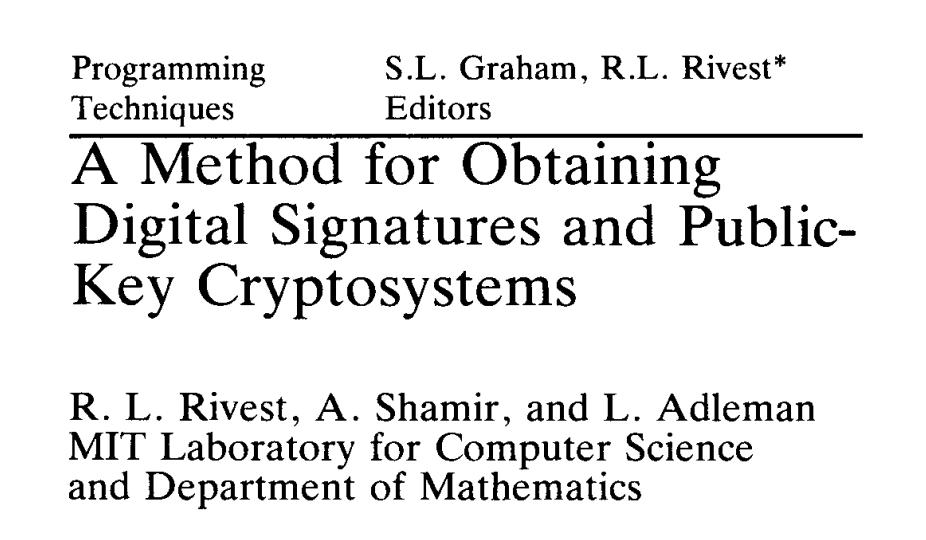
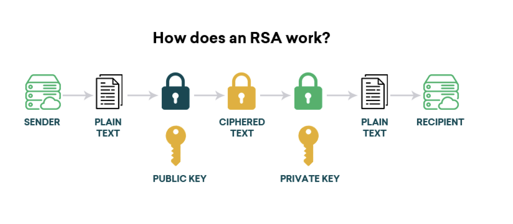

# WTF zk 教程 里程碑 01：RSA 算法

这一讲，我们将介绍经典的 RSA 加密算法，并在 python 和 solidity 中实现它。RSA 算法的安全性基于数论中的数学问题，这正好是 WTF zk 前 10 讲介绍过的内容，你将会对它们有更深的理解。

## 1. 背景介绍

RSA（Rivest–Shamir–Adleman）算法由 Ron Rivest、Adi Shamir 和 Leonard Adleman 在 1977 年发明，也是用他们姓名的首字母命名。（PS:一个在英国情报中心（GCHQ）叫Clifford Cocks的数学家于1973的内部文件中提出了一个同样的系统。然而他的探究因为涉及绝密所以直到1997年才为人所知。）

- **公钥密码学：** 
  - 私钥密码学的缺陷：
    - 秘钥分配：需要通过秘密的安全信道协商加密密钥，而这种安全信道在实际中很难实现。

    - 私钥管理：有$n$个用户的网络中，任何两个用户之间都要共享一个秘密密钥，需要管理的密钥数目是$n(n-1)/2$。

  - 公钥密码学的伟大之处在于利用计算复杂性设计加密算法，而RSA算法是最早的公钥-私钥分离的加密算法之一，可以在不需要分享私钥的情况下加密，更加灵活、安全。

- **安全性：** 
基于两个大素数的乘积难以分解的数学难题。当前很多公钥密码学都是基于数学困难问题构造的，因子分解问题、二次剩余问题和离散对数问题等都是密码学中比较常见的数学困难问题。
  - 因子分解问题：给出一个大整数，将其写成几个素数的乘积。
  - 二次剩余问题：设 $n=pq$ 是两个大素数的乘积，随机选取$a∈QR_n$，求$x$使得$x^2=a\pmod{n}$。
  - 离散对数问题：设$g$为$Z_p^*$的原根，任给元素$y∈Z_p^*$，求唯一的$x$，$1≤x≤p-1$，满足$g^x=y\pmod{p}$，称$x$为模$p$以$g$为底$y$的离散对数。

- **应用广泛：** 距离 RSA 发明已经将近 50 年了，它仍然被广泛应用于加密通信、数字证书、身份验证等方面。



## 2. 算法步骤

RSA 算法分为 3 步：生成一对公钥和私钥，使用公钥加密明文，使用私钥解密并恢复明文。下面我们逐步讲解。



### 第 1 步 密钥生成

密钥生成是 RSA 算法的第一步，会生成一对公钥和私钥。

1. **选择两个大素数 $p$ 和 $q$：** 随机选择两个大素数，计算它们的乘积 $n = p \times q$。
2. **计算欧拉函数 $\phi(n)$：** $\phi(n) = (p-1) \times (q-1)$。
3. **选择加密指数 $e$：** 选择一个与 $\phi(n)$ 互质的整数 $e$，通常选择 $e$ 为素数。
4. **计算解密指数 $d$：** 计算满足 $d \times e \equiv 1 \pmod{\phi(n)}$ 的整数 $d$。

最终，公钥为 $(n, e)$，私钥为 $(n, d)$。

### 第 2 步 加密明文

加密过程使用公钥进行，将明文消息 $M$ 转换为整数（ $M < n$），然后使用公钥 $(n, e)$ 计算：

$$
C \equiv M^e \pmod{n}
$$

密文 $C$ 即为加密后的结果。

### 第 3 步 解密

解密过程使用私钥进行，将密文 $C$ 使用私钥 $(n, d)$ 计算：

$$
M \equiv C^d \pmod{n}
$$

解密后的结果 $M$ 即为原始明文消息。

## 3. 示例

这一节，我们用一个可以手算的例子熟悉一下 RSA 算法。

首先，选两个质数 $(p, q) = (5, 7)$。那么模 $n = pq = 35$，欧拉函数 $\phi(n)= (p-1)(q-1) = 24$。

接下来，选择一个与 $\phi(n)=24$ 互质的公钥 $e = 5$ 用于加密。用扩展欧几里得算法计算满足 $ed \equiv 1 \pmod{24}$ 的私钥 d 用于解密，得到 $d = 5$。

下面我们选择消息 $M = 4$，使用 RSA 算法进行加密，得到密文 $C= M^e = 4^{5} = 9 \pmod{35}$。

最后，我们进行密文的解密，只需要计算 $M = C^d = 9^5 = 4 \pmod{35}$

## 4. 算法逻辑

大家看到 RSA 可能会有两个困惑：

1. 为什么解密过程 $M \equiv C^d \pmod{n}$ 可以将密文恢复成明文？

2. RSA 加密算法为什么是安全的？

这一节，我们探讨下这两个问题。

### 问题 1. 解密逻辑

要理解 RSA 的解密步骤，就是要证明 $M \equiv C^d \pmod{n}$，其中 $C \equiv M^e \pmod{n}$。我们会用到欧拉定理。

首先，我们将原式展开，有：

$$
C^d  \equiv (M^e \pmod{n})^d \equiv M^{ed} \pmod{n}
$$

又因为 $ed \equiv 1 \pmod{\phi(n)}$，因此有 $ed = k\phi(n) + 1$，其中 $k \in \mathbb{Z}$。代入上式，有：

$$
C^d \equiv M^{k\phi(n) + 1} \equiv M^{k\phi(n)} M \pmod{n}
$$

假设 $\gcd(M, n)=1$（当 $M$ 和 $n$ 不互质时，我们要用另一个证明方法，见[维基百科链接](<https://en.wikipedia.org/wiki/RSA_(cryptosystem)#Proofs_of_correctness>) ），根据欧拉定理，有 $M^{\phi(n)} = 1$。因此，原式可以简化为：

$$
C^d \equiv 1^k M \equiv M \pmod{n}
$$

证毕。

也就是说，解密步骤只需要计算密文在模 $n$ 的 $d$ 次幂就可以还原出正确的明文了。

### 问题 2. 安全性

RSA 算法的安全性建立在大素数分解问题的困难性基础上。尽管该算法已经存在近 50 年，但在私钥长度大于 2048 位的情况下仍然被认为是安全的。这一节，我们以黑客的角度，探讨下为什么 RSA 算法很难被破解。

#### 破解办法 1：质数分解 $n$

如果我们能将 $n$ 有效的分解为 $p$ 和 $q$，我们就能轻松的计算 $\phi(n)=(p-1)(q-1)$ 以及私钥 $d$，从而破解 RSA 算法。目前质数分解的算法比较多，实际应用比较多的算法包括二次筛法，椭圆曲线算法和数域筛法，但是这些算法的复杂度都是指数级的。所以在现有的计算能力下，没人能有效地将 $n$ 分解为 $p$ 和 $q$。但是随着量子计算机的出现，量子算法[Shor算法](https://en.wikipedia.org/wiki/Shor%27s_algorithm)将质数分解的复杂度降低到了多项式复杂度，会直接威胁到RSA算法。因此目前很多密码学家在研究抗量子密码算法，目前后量子密码算法的主要技术路线有基于哈希、编码、多变量、格和同源等问题的方案。

#### 破解办法 2：在不分解 $n$ 的情况下计算 $\phi(n)$

这个问题不会比分解 $n$ 简单，因为如果你能计算 $\phi(n)$，那么你也能简单的分解 $n$ 了。这是因为：

$$
\phi(n)=(p-1)(q-1)=pq-p-q+1 = n - (p+q) + 1
$$

如果你计算出了 $\phi(n)$，同时 $n$ 是公开的，你就可以计算出 $p+q$。同时，$p-q$ 也可以通过计算 $(p+q)^2 - 4n$ 的平方根计算出来。这样计算出了 $p$ 和 $q$，也就等于分解了 $n$。但由于分解 $n$
 很难，计算 $\phi(n)$ 同样很难。

#### 破解办法 3: 直接计算私钥 $d$

也就是在未知 $\phi(n)$ 的情况下通过 $d e \equiv 1 \pmod{\phi(n)}$ 计算私钥 $d$。但是这个方法和分解大整数一样难：计算出 $d$ 后，可以通过 $de -1$ 计算出 $\phi(n)$ 的倍数，有方法可以基于$\phi(n)$ 的倍数有效的分解大整数。

## 5. 代码实现

这一节，我们分别用 Python 和 Solidity 实现 RSA 算法。

### 5.1 Python

`generate_keypair`, `encrypt`, `decrypt` 函数分别实现了 RSA 算法的密钥生成，加密，和解密过程。

> 注意，这里的 RSA 算法实现仅用作教学目的，它并不安全。实际使用中需要加入更多的技巧（比如 padding）以及更长的密钥（大于 2048 bit）。

```python
import random

# 素数检测函数，该方法复杂度较高，感兴趣的可以了解下速度比较快的Miller-Rabin算法。
def is_prime(num):
    if num < 2:
        return False
    for i in range(2, int(num**0.5) + 1):
        if num % i == 0:
            return False
    return True

def gcd(a, b):
    while b:
        a, b = b, a % b
    return a

def modinv(a, b):
    m0, x0, x1 = b, 0, 1
    while a > 1:
        q = a // b
        a, b = b, a % b
        x0, x1 = x1 - q * x0, x0
    return x1 + m0 if x1 < 0 else x1

def generate_keypair():
    p, q = random_prime(), random_prime()
    n = p * q
    phi = (p - 1) * (q - 1)
    e = random.randint(2, phi - 1)
    while gcd(e, phi) != 1:
        e = random.randint(2, phi - 1)
    d = modinv(e, phi)
    return ((n, e), (n, d))

def random_prime():
    while True:
        num = random.randint(10**2, 10**3)
        if is_prime(num):
            return num

def encrypt(message, public_key):
    n, e = public_key
    return pow(int(message), e, n)

def decrypt(ciphertext, private_key):
    n, d = private_key
    return pow(ciphertext, d, n)

# 示例
message = 123
public_key, private_key = generate_keypair()
encrypted_message = encrypt(message, public_key)
decrypted_message = decrypt(encrypted_message, private_key)

print("Original Message:", message)
print("Encrypted Message:", encrypted_message)
print("Decrypted Message:", decrypted_message)
print("Public key:", public_key)
print("Private key:", private_key)

## 输出示例
# Original Message: 123
# Encrypted Message: 124872
# Decrypted Message: 123
# Public key: (141727, 52447)
# Private key: (141727, 19423)
```

### 5.2 Solidity

`EVM` 在预编译合约中内置了模幂 `modexp` 操作，地址为 `0x05`，我们可以用它处理 RSA 算法加密和解密的模幂操作。而密钥生成比较复杂，就不放在链上了。

你可以将这个合约部署在链上，验证 python 程序的加密和解密步骤是否正确。

```solidity
// SPDX-License-Identifier: MIT
pragma solidity ^0.8.0;

contract RSA {
    // 模数幂运算的预编译合约地址为 0x05，详情: https://www.evm.codes/precompiled#0x05?fork=shanghai

    // 使用公钥加密
    function encrypt(uint message, uint e, uint n) public returns (uint) {
        // RSA加密: cipher = message^e mod n
        return modExp(message, e, n);
    }

    // 使用私钥解密
    function decrypt(uint cipher, uint d, uint n) public returns (uint) {
        // RSA解密: message = cipher^d mod n
        return modExp(cipher, d, n);
    }

    function modExp(uint256 base, uint256 exponent, uint256 modulus) public returns (uint256 result) {
        assembly {
            // Free memory pointer
            let pointer := mload(0x40)

            // 长度 base, exponent and modulus. 0x20 == 32 bytes
            mstore(pointer, 0x20)
            mstore(add(pointer, 0x20), 0x20)
            mstore(add(pointer, 0x40), 0x20)

            // 定义变量 base, exponent and modulus
            mstore(add(pointer, 0x60), base)
            mstore(add(pointer, 0x80), exponent)
            mstore(add(pointer, 0xa0), modulus)

            // 保存结果
            let value := mload(0xc0)

            // 调用预编译合约 0x05 = bigModExp
            if iszero(call(not(0), 0x05, 0, pointer, 0xc0, value, 0x20)) {
                revert(0, 0)
            }

            // 返回结果
            result := mload(value)
        }
    }
}
```

## 6. 总结

这一讲，我们学习了非常经典的 RSA 算法，理解了它的原理以及安全性，并用 python 和 solidity 复现了它。这是一个里程碑，标志着咱们结束了 WTF zk 数论入门部分的学习。接下来，咱们要短暂的去抽象代数冒险！
