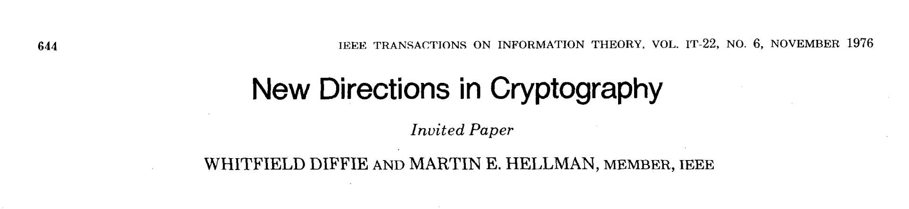
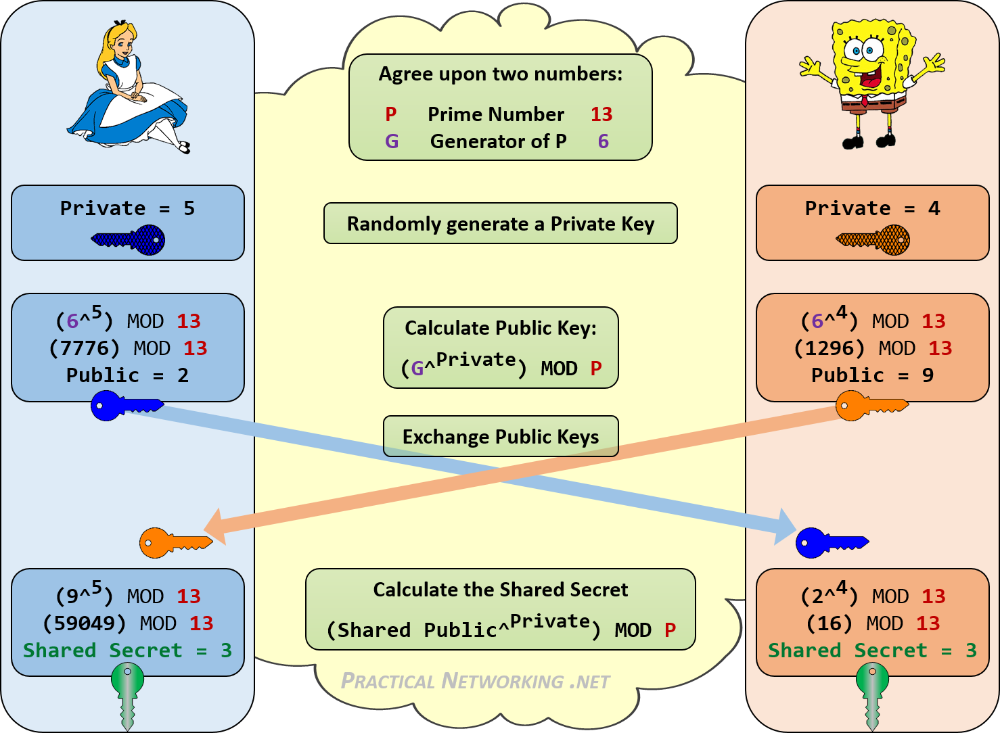

# WTF zk 教程 里程碑 02：Diffie-Hellman 密钥交换算法

这一讲，是WTF zk零知识证明教程的第2个里程碑，你应该已经掌握了数论和群论的基础知识。在里程碑中，我们将学习 Diffie-Hellman 密钥交换算法，这是一种在不安全的通信信道上共享密钥的方法。这个算法是密码学中的重要基石，为安全通信提供了基础。

## 1. 背景介绍

Diffie-Hellman 密钥交换算法是由 Whitfield Diffie 和 Martin Hellman 在 1976 年首次提出的。它是一种公钥密码学算法，允许两个远程用户在不共享密钥的情况下达成一个共同的密钥。

- **公钥密码学：** Diffie-Hellman 算法是最早的公钥密码学算法，它的提出打破了以前需要共享密钥的通信模式，为现代安全通信奠定了基础。

- **安全性：** 基于离散对数问题的难解性，通信双方可以在不公开密钥的情况下安全协商出一个共享密钥。

- **应用广泛：** Diffie-Hellman 算法被广泛应用于安全通信领域，包括 TLS/SSL 协议、SSH 通信等。



## 2. 算法原理



Diffie-Hellman 算法的核心思想是利用离散对数问题，即给定大素数 p、底数 g 和 $A \equiv g^a \mod p$，要计算出 a 的值是一个困难问题。算法步骤如下：

### 2.1 密钥生成

1. **选择参数：** 选择两个大素数 p 和它的原根（乘法生成元） g。p 和 g 都是公开的。
2. **私钥生成：** 每个通信方选择一个私钥。假设 Alice 选择私钥 $a$，Bob 选择私钥 $b$， $a$ 和 $b$ 是隐私的。
3. **计算公钥：** Alice 计算 $A = g^a \mod p$，Bob 计算 $B = g^b \mod p$。
4. **交换公钥：** Alice 将 $A$ 发送给 Bob，Bob 将 $B$ 发送给 Alice，这一步 A 和 B 都是公开的。

这一步，公钥 $p, g, A, B$ 是公开的，而私钥 $a, b$ 是隐私的。

### 2.2 密钥协商

1. **计算会话密钥：** Alice 收到 Bob 的公钥 $B$ 后，计算 $K = B^a \mod p$；同样，Bob 收到 Alice 的公钥 $A$ 后，计算 $K = A^b \mod p$。
2. **生成共享密钥：** Alice 和 Bob 现在都有相同的密钥 $K$，该值可以作为会话密钥用于加密通信。由于窃听者没有 $a$ 和 $b$ 的信息，无法计算出 $K$，因此密钥 $K$ 是隐私的。

## 3. 示例

为了更好地理解 Diffie-Hellman 算法，我们使用一个简单的示例进行演示。

1. **选择参数：** 选择素数 $p = 13$ 和它的原根 $g = 6$。
2. **私钥生成：** Alice 选择私钥 $a = 5$，Bob 选择私钥 $b = 4$。
3. **计算公钥：** Alice 计算 $A = 6^5 = 2 \mod 13$，Bob 计算 $B = 6^{4} = 9 \mod 13$。
4. **交换公钥：** Alice 将 $A = 2$ 发送给 Bob，Bob 将 $B = 9$ 发送给 Alice。
5. **计算会话密钥：** Alice 计算 $K = 9^5 \mod 13 = 3$，Bob 计算 $K = 2^{4} \mod 13 = 3$。
6. **生成共享密钥：** Alice 和 Bob 现在都有相同的共享密钥 $K = 3$，可以用于进一步的加密通信。

## 4. 算法逻辑

Diffie-Hellman 算法的安全性基于离散对数问题的困难性。对于窃听者，它能得到的公开信息是素数 $p$，原根 $g$，Alice的公钥 $A = g^a \mod p$，和Bob的公钥 $B = g^b \mod p$。而窃听者要得到共享密钥 $K =g^{ab} \mod p$，必须要计算出 $a = \log_g{A}$ 或 $b = \log_g{B}$，但这是离散对数问题，没有有效算法，无法计算。因此，Diffie-Hellman 算法是安全的。

另外，由于 $p$ 是大素数，整数模 $p$ 乘法群 $Z^*_p$ 的阶（元素个数）为 $p-1$，很大。由于原根 $g$ 是 $Z^*_p$ 的生成元，它的各次幂可以覆盖 $Z^*_p$ 中所有元素，使得暴力穷举来破解离散对数问题是很难。

## 5. 代码实现

下面是一个简单的 Python 实现，演示了 Diffie-Hellman 密钥交换算法。

```python
import random

def is_prime(num):
    if num < 2:
        return False
    for i in range(2, int(num**0.5) + 1):
        if num % i == 0:
            return False
    return True

def gcd(a, b):
    while b:
        a, b = b, a % b
    return a

def modinv(a, b):
    m0, x0, x1 = b, 0, 1
    while a > 1:
        q = a // b
        a, b = b, a % b
        x0, x1 = x1 - q * x0, x0
    return x1 + m0 if x1 < 0 else x1

def generate_params():
    p = random_prime()
    g = random.randint(2, p - 2)
    return p, g

def generate_private_key():
    return random.randint(2, 2**16)

def generate_public_key(private_key, p, g):
    return pow(g, private_key, p)

def generate_shared_secret(private_key, public_key, p):
    return pow(public_key, private_key, p)

def random_prime():
    while True:
        num = random.randint(10**3, 10**4)
        if is_prime(num):
            return num

# 示例
p, g = generate_params()
alice_private_key = generate_private_key()
bob_private_key = generate_private_key()

alice_public_key = generate_public_key(alice_private_key, p, g)
bob_public_key = generate_public_key(bob_private_key, p, g)

alice_shared_secret = generate_shared_secret(alice_private_key, bob_public_key, p)
bob_shared_secret = generate_shared_secret(bob_private_key, alice_public_key, p)

print("大素数 (p):", p)
print("原根/生成元 (g):", g)
print("Alice's 私钥:", alice_private_key)
print("Bob's 私钥:", bob_private_key)
print("Alice's 公钥:", alice_public_key)
print("Bob's 公钥:", bob_public_key)
print("共享私钥 (Alice):", alice_shared_secret)
print("共享私钥 (Bob):", bob_shared_secret)

## 输出示例
# 大素数 (p): 2707
# 原根/生成元 (g): 1620
# Alice's 私钥: 8706
# Bob's 私钥: 60566
# Alice's 公钥: 1183
# Bob's 公钥: 2369
# 共享私钥 (Alice): 1776
# 共享私钥 (Bob): 1776
```

## 6. 总结

Diffie-Hellman 密钥交换算法是一种重要的密码学算法，它解决了在不安全信道上共享密钥的问题，为现代安全通信提供了基础。通过离散对数问题的困难性，Diffie-Hellman 确保了密钥共享的安全性。在实际应用中，Diffie-Hellman 被广泛用于 TLS/SSL 协议、SSH 通信等场景，为通信双方提供了一种安全可靠的密钥共享机制。