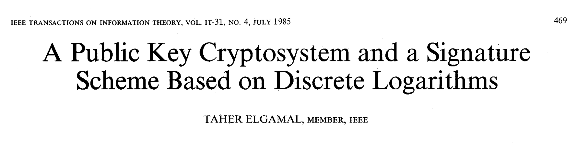

# WTF zk 教程 里程碑 03：ElGamal 算法

在这一讲中，我们将介绍 ElGamal 加密和签名算法。ElGamal 是一种基于离散对数问题的公钥密码学算法，由 ElGamal 在 1985 年提出，将 Diffie-Hellman 密钥交换算法推广到了加密和数字签名领域。



## 1. ElGamal 加密算法

ElGamal 算法是一种公钥密码学的算法，其安全性基于计算离散对数的困难性。ElGamal 算法包括加密和数字签名两个部分，我们来看加密算法的流程。

我们假设 Alice 要通过 ElGamal 算法跟 Bob 通信。

### 1.1 密钥生成

Bob 使用 ElGamal 算法的密钥生成包括以下步骤：

1. **选择大素数 $p$：** 选择一个足够大的素数 $p$ 作为 $Z^*_p$ 的模数。根据原根的存在性， $Z^*_p$ 为循环群，存在原根。
2. **选择生成元 $g$：** 选择一个模 $p$ 的原根 $g$，这时 $g$ 的阶是 $p-1$，此时离散对数问题是困难的。
3. **选择私钥 $x$：** 随机选择一个私钥 $x$，$1 < x < p$。
4. **计算公钥 $y$：** 计算公钥 $y = g^x \mod p$。

最终，公钥为 $(p, g, y)$，是公开的；私钥为 $x$，不公开。

### 1.2 加密

Alice 在获取公钥 $(p, g, y)$ 后使用 ElGamal 加密，过程如下：

1. **选择随机数 $k$：** 随机选择一个 $k$，$1 < k < p$。
2. **计算临时公钥 $a$ 和临时密文 $b$：** 计算 $a \equiv g^k \mod p$ 和 $b \equiv y^k \cdot M \equiv g^{xk} \cdot M \mod p$，其中 $M$ 是要加密的消息明文。
3. **密文：** 密文为 $(a, b)$，是公开的。

随机数 $k$ 在每次加密都会变换，保证了 ElGamal 算法即使加密相同的明文也会输出不同的临时密文。在加密操作中，私钥 $x$ 和随机数 $k$ 是隐私的，而公钥 $(p, g, y)$ 和密文 $(a, b)$，是公开的。

### 1.3 解密

Bob 在收到密文 $(a, b)$ 后，使用 ElGamal 解密过程如下：

1. **计算共享密钥 $s$：** 计算 $s \equiv a^x \mod p$。
2. **计算模逆 $s^{-1}$**。
3. **还原明文 $M$：** 还原明文 $M \equiv b \cdot s^{-1} \mod p$。因为 $b \cdot s^{-1} = b \cdot a^{-x} = g^{xk} \cdot M \cdot g^{-xk} = M$。

ElGamal 算法就巧妙在 $b \cdot s^{-1}$ 能够还原出原文，而计算 $s$ 需要私钥 $x$ 的信息。没有私钥，窃听者想得到明文，就要解离散对数问题（解不出来）。

### 1.4 示例

让我们通过一个简单的例子来说明 ElGamal 加密算法。

假设 $p = 13$，$g = 6$ 是 $p$ 的原根，私钥 $x = 4$，公钥 $y = g^x =  9 $。密钥生成后，Bob 将 $(p, g, y)$ 公开。

现在，Alice 希望加密消息 $M = 5$。Alice 随机选择 $k = 7$（注意要跟 $p$ 互质），并计算：

1. 临时公钥 $a \equiv 6^{7} \equiv 7 \pmod{13}$。
2. 临时密文 $b \equiv 9^{7} \cdot 5 \equiv 6 \pmod{13}$。

因此，密文为 $(7, 6)$。

接下来，Bob 收到密文，并解密：

1. 计算共享密钥 $s \equiv 7^{4} \equiv 9 \pmod{13}$。
2. 计算模逆 $s^{-1} \equiv 9^{-1} \equiv 3 \pmod{13}$。
3. 还原明文 $M \equiv 6 \cdot 3 \equiv 5 \pmod{13}$。

最终，Bob 成功解密，还原出原始消息 $M = 5$。

## 2. ElGamal 签名算法

在介绍算法之前，我们先介绍什么是数字签名。传统行业中，人们会在合同签上纸质签名，具有法律效应。数字签名是一种用于确保数字信息完整性、认证发送方身份以及防止抵赖的技术。数字签名通过使用加密算法生成一个独特的标识符（签名），该标识符附加到消息或文档上。这个数字签名可以被验证，以确认消息是由特定的发送方生成，并且在传输过程中没有被篡改。

数字签名通常涉及两个关键的密钥：私钥和公钥。发送方使用私钥对消息进行签名，而接收方使用公钥验证签名的有效性。这种方法建立在非对称加密的基础上，其中私钥用于签名生成，而公钥用于验证签名。

数字签名具有以下关键属性：

1. **身份认证**：证明签名方是私钥的持有人。
2. **不可否认**：发送方不能否认发送过这个消息。
3. **完整性**：通过验证针对传输消息生成的数字签名，可以验证消息是否在传输过程中被篡改。

与 ElGamal 加密算法相似，ElGamal 签名算法也使用了离散对数问题的困难性来保证签名的安全性。算法主要分为密钥生成、签名生成和签名验证三个步骤，我们用 Alice（签名方）和 Bob（验证方）做演示。

### 2.1 密钥生成

Alice 生成密钥，用于签名：

1. **选择参数：** 选择一个大素数 $p$ 和一个原根 $g$。
2. **生成私钥：** 随机选择一个私钥 $x$，要求 $1 < x < p-1$。
3. **计算公钥：** 计算公钥 $y \equiv g^x \pmod{p}$。

密钥生成步骤和 ElGamal 加密算法相同，最终的公钥为$(p, g, y)$，公开的；私钥为$x$，隐私的。

### 2.2 生成签名

Alice 利用密钥和消息哈希生成签名：

1. **选择随机数：** 随机选择一个整数 $k$，确保 $1 < k < p-1$ 且 $gcd(k, p-1) = 1$。这是因为我们之后会计算 $k^{-1} \pmod{p-1}$，需要 $k$ 在模 $p-1$ 下存在逆元素。
2. **计算中间值 $r$：** 计算 $r \equiv g^k \pmod{p}$。
3. **计算签名：** 计算 $s \equiv k^{-1}(H(M) - xr) \pmod{p-1}$，其中 $H(M)$ 是消息 $M$ 的哈希值。注意，这里用的模数是 $p-1$。

如果 $s=0$，那么需要重新生成一个随机数 $k$ 再次计算。最初论文里用的不是哈希 $H(M)$ 而是消息 $M$ 本身，但这会带来[安全问题](https://en.wikipedia.org/wiki/ElGamal_signature_scheme#Security)。最终的签名为 $(r, s)$，公开的。

### 2.3 验证签名

Bob 可以利用公开的信息 $(g, p, r, s, M)$ 来验证签名是否真实。

1. **验证参数：** 如果满足 $0<r<p$ 且 $0 < s<p-1$，可以进行下一步。
2. **验证签名：** 如果 $g^{H(M)} \equiv y^rr^s \pmod{p}$ 成立，则签名有效。

因为 $y^rr^s = g^{xr}r^{s}=g^{xr}g^{ks} = g^{xr+ks}$，而 $xr+ks = xr +k(k^{-1}(H(M) - xr)) = H(M) \pmod{p-1}$。所以，如果 $g^{H(M)} \equiv y^rr^s \pmod{p}$，也就是 $xr+ks = H(M) \pmod{p-1}$ 成立，那么签名就是有效的。

### 2.4 示例

让我们通过一个简单的例子来说明 ElGamal 签名算法。假设我们已经有一个密钥对 $(p, g, x, y)$，其中 $p = 13$，$g = 6$，$x = 4$，$y = 9$ 与签名消息哈希 $H(M) = 5$。

签名时，我们随机选择 $k = 7$，它与 $p-1 = 12$ 互质，计算：

1. 临时值 $r \equiv 6^7  \equiv 7 \mod 13$。
2. 计算 $s \equiv 7^{-1} \cdot (5 - 4 \cdot 7) \equiv 7 \mod 12$。

因此，签名为 $(7, 7)$。

接下来，我们验证签名是否有效：

$g^{H(M)} \equiv y^rr^s \pmod{p}$ 计算比较复杂，我们可以直接验证 $xr+ks = H(M) \mod 12$ 是否成立。 $xr+ks = 4 \times 7 + 7 \times 7 = 77 = 5 = H(M) \mod 12$，$g^{5} \equiv g^{77} \equiv 2 \pmod{13}$因此签名有效。

## 3. 代码实现

### 3.1 ElGamal 加密算法

```python
## ElGamal 加密算法

from random import randint
from sympy import isprime, mod_inverse

def generate_keys():
    # 生成大素数 p 和原根 g
    while True:
        p = randint(1000, 2000)
        if isprime(p):
            break
    g = randint(2, p-1)

    # 私钥 x
    x = randint(1, p-2)

    # 公钥 y
    y = pow(g, x, p)

    return (p, g, y), x

def encrypt(public_key, message):
    p, g, y = public_key
    k = randint(1, p-2)

    # 加密
    C1 = pow(g, k, p)
    C2 = (message * pow(y, k, p)) % p

    return (C1, C2)

def decrypt(private_key, p, ciphertext):
    C1, C2 = ciphertext
    a = private_key

    # 解密
    s = pow(C1, a, p)
    m = (C2 * mod_inverse(s, p)) % p

    return m

# 示例
public_key, private_key = generate_keys() # 生成密钥
message = 123  # 消息明文
ciphertext = encrypt(public_key, message) #密文
decrypted_message = decrypt(private_key, public_key[0], ciphertext) # 解密

print("公钥 (p, g, y):", public_key)
print("私钥 x:", private_key)
print("消息明文:", message)
print("密文:", ciphertext)
print("解密还原明文:", decrypted_message)

## 输出样例
# 公钥 (p, g, y): (1307, 643, 698)
# 私钥 x: 11
# 消息明文: 123
# 密文: (690, 1225)
# 解密还原明文: 123
```

### 3.2 ElGamal 签名算法

```python
## ElGamal 签名算法

from sympy import gcd

def generate_keys_signature():
    # 和 ElGamal 加密算法一样
    return generate_keys()

def sign(private_key, p, g, message):
    while True:
        k = randint(1, p-1)
        if gcd(k, p-1) == 1:  # k 与 p-1 互质
            break

    r = pow(g, k, p)
    x = private_key
    s = ((message - x * r) * mod_inverse(k, p-1)) % (p-1)

    return (r, s)

def verify(public_key, p, g, message, signature):
    y = public_key[2]
    r, s = signature

    if not (0 < r < p) or not (0 < s < p-1):
        return False

    return pow(g, message, p) == (pow(y, r, p) * pow(r, s, p)) % p

# 示例
public_key, private_key = generate_keys_signature() # 生成密钥
message = 123  # 消息明文
signature = sign(private_key, public_key[0], public_key[1], message) # 生成签名
verification_result = verify(public_key, public_key[0], public_key[1], message, signature) # 验证签名

public_key, private_key, signature, verification_result

print("公钥 (p, g, y):", public_key)
print("私钥 x:", private_key)
print("消息明文:", message)
print("签名:", signature)
print("验证结果:", verification_result)

## 输出样例
# 公钥 (p, g, y): (1409, 853, 1193)
# 私钥 x: 1035
# 消息明文: 123
# 签名: (1126, 1403)
# 验证结果: True
```

## 4. 总结

这一讲，我们介绍了 ElGamal 算法，它将 Diffie-Hellman 算法的思想推广到了加密和数字签名领域。和 Diffie-Hellman 算法一样，ElGamal 算法的安全性也基于离散对数问题的困难性。

> 思考题：为什么在 ElGamal 签名算法中，签名 $s$ 的计算是在模 $p-1$ 下的？