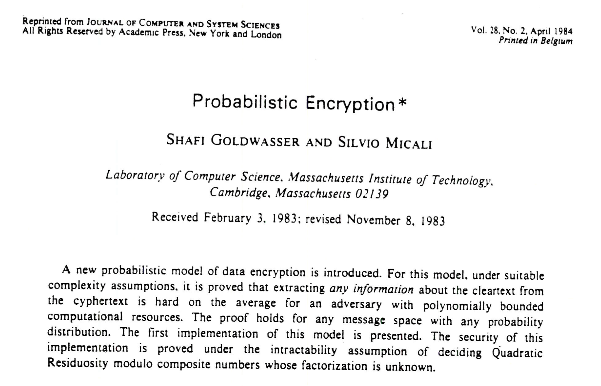

# WTF zk 教程 里程碑 04：Goldwasser-Micali (GM) 算法

Goldwasser 和 Micali 在1982年的论文中提出了Goldwasser-Micali (GM) 算法。它是第一个引入概率性加密和密文不可区分性的加密算法，是密码学的一座里程碑。



## 1. 背景介绍

GM 加密算法是一种基于二次剩余问题的非对称加密算法。其安全性基于二次剩余问题的困难性。

**二次剩余的问题：** 给定 $N  =pq$，其中 $p$ 和 $q$ 为大质数，在未知 $p$ 和 $q$ 的情况下，判断是否存在整数 $x$ 使得 $x^2 \equiv y \mod N$ （即 $y$ 为二次剩余） 是困难的，难度不亚于大数的质数分解。而对于知道 $p$ 和 $q$ 的接收者，判断二次剩余问题是简单的，可以正确解码密文。

在 GM 加密算法提出以前，加密算法都是通常是基于传统的、确定性的方法，其中相同的明文总是产生相同的密文。这种固定的映射方式使得它们容易受到各种密文攻击的影响。而 GM 加密算法引入了概率加密，同样的明文在不同的加密实例中会产生不同的密文。这种方法显著提高了加密系统对密文攻击的抵抗力，

## 2. 算法原理

GM 算法包括3步：密钥生成，加密（概率性），和解密（确定性）。我们假设 Alice 要通过 GM 算法跟 Bob 通信。

### 2.1 密钥生成

Bob 使用 GM 算法生成密钥分为以下步骤：

1. 选择两个大质数 $p$ 和 $q$

2. 计算大合数 $N = pq$。

3. 找到一个模 $n$ 下的二次非剩余 $x$，使得勒让德符号满足 $\left(\frac{x}{p}\right) = \left(\frac{x}{q}\right) = -1$，也就是雅可比符号满足 $\left(\frac{x}{N}\right) = \left(\frac{x}{p}\right) \left(\frac{x}{q}\right) = 1$。

产生的公钥为 $(x, N)$，私钥为 $p, q$。

### 2.2 概率加密

Alice 在收到公钥 $(x, N)$ 后，要加密消息明文 $M$。GM 算法需要对明文的每一个比特加密。

1. 将消息明文 $M$ 编码为二进制格式（比特） $M_1, ..., M_n$

2. 对于每一位比特 $M_i$：
     - 若 $M_i = 1$，选择一个随机数 $r$，满足 $\gcd(r, N) = 1$，计算密文 $c_i = r^2x \mod N$。
     - 若 $M_i = 0$，选择一个随机数 $r$，满足 $\gcd(r, N) = 1$，计算密文 $c_i = r^2 \mod N$。

Alice 将密文 $(c_1, ..., c_n)$ 发送给 Bob。由于密文的每一个比特都是随机生成，因此 GM 算法具有密文不可区分性，即在不知道密钥的情况下，攻击者无法区分两个或多个密文是否对应于不同的明文。

### 2.3 解密

Bob 收到密文后进行解密。

1. 使用私钥 $p$ 和 $q$ 来判断每个 $c_i$ 是否为二次剩余。

2. 如果 $c_i$ 是二次剩余，则解密 $m_i = 0$；否则，$m_i = 1$。

3. 组装解密后的消息 $m = (m_1, ..., m_i)$，它与消息明文 $M$ 相等。

由于 Bob 拥有私钥 $p$ 和 $q$，也就知道如何质数分解 $N$，可以很容易的判断某个数 $a$ 是否为二次剩余。具体方法：

- 计算 $a_p = a \mod{p}$ 和 $a_q = a \mod{q}$。

- 若 $a_p^{(p-1)/2} \equiv 1 \pmod{p}$ 和 $a_q^{(q-1)/2} \equiv 1 \pmod{q}$ 成立，那么 $a$ 是模 $N$ 下的二次剩余；否则就是二次非剩余。


## 3. 代码实现

我们在python中实现GM算法，其中用到了sympy库。

```python
## Goldwasser-Micali (GM)  加密算法

from sympy.ntheory import is_quad_residue, primerange
from random import randint

def generate_keys():
    p = next(primerange(1000, 10000))
    q = next(primerange(10000, 11000))
    n = p * q
    x = 2
    while is_quad_residue(x, p) and is_quad_residue(x, q):
        x += 1
    return (n, x), (p, q)

def encrypt(message, public_key):
    n, x = public_key
    encrypted = []
    for bit in message:
        r = randint(1, n-1)
        c = (r * r * x**int(bit)) % n
        encrypted.append(c)
    return encrypted

def decrypt(encrypted, private_key):
    p, q = private_key
    decrypted = ""
    for c in encrypted:
        if is_quad_residue(c, p) and is_quad_residue(c, q):
            decrypted += "0"
        else:
            decrypted += "1"
    return decrypted

# 示例
public_key, private_key = generate_keys()
message = "1010"
encrypted_message = encrypt(message, public_key)
decrypted_message = decrypt(encrypted_message, private_key)

print("公钥 (N, x):", public_key)
print("私钥 (p, q):", private_key)
print("原始消息明文:", message)
print("密文:", encrypted_message)
print("解密消息:", decrypted_message)

## 输出样例
# 公钥 (N, x): (10097063, 5)
# 私钥 (p, q): (1009, 10007)
# 原始消息明文: 1010
# 密文: [4261321, 8377247, 969148, 6082662]
# 解密消息: 1010
```

#### 注意事项
- GM 算法加密处理的是二进制消息，每一位消息单独加密。
- GM 算法加密时每一位消息都会扩大 $\log{N}$ 倍，因此效率很低，没有之后的 Elgamal 算法实用，但它重在理论价值。

## 4. 总结

这一讲，我们介绍了 Goldwasser-Micali（GM）加密算法，它在理论上非常重要。它是第一个引入概率性加密和密文不可区分性的加密算法，启发了 Elgamal 算法，影响了零知识证明的发展（Goldwasser，Micali和Rackoff在3年后的研究中提出了零知识证明）。