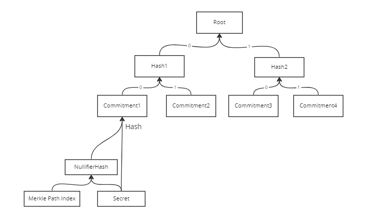

# Mixer

## 什么是Mixer

混币技术通过混淆交易发送方与交易接收方之间的关系，来提高数字货币的不可追踪性。它可以让用户快速高效地与其他用户的资金进行混合，在现有的用户账户和混币后的新账户之间创建随机的映射关系，从而实现完全匿名，是一种保障交易隐私的技术。


功德箱就是一个小的混币器的例子：

- 所有游客向功德箱中放入都是同一年份的一元硬币

自 2010 年以来陆续出现了一系列的混币方案，包括CoinJoin、CoinShuffle等。

## 为什么需要混币器

在区块浏览器上，任何人均可以查看某笔交易，以及与交易相关的：账户的地址、收币人的地址、转账的时间、转账金额等，交易平台或者链上分析机构可以根据地址的交易行为做大数据分析，比如判断某地址交易特征、账户是否优质等。目前公链的匿名其实是伪匿名，如果外界不知道你和公钥的关系，他们就无法把你和你的交易历史关联起来，只要有人能把你跟公钥联系起来，就可以顺藤摸瓜找到你过去的交易历史。

混币服务是解决交易的匿名性，保护用户的隐私。

**隐私权每个人的基本权利。**
1993年，埃里克·修斯在其著名的《朋克宣言》开头提出：
Privacy is necessary for an open society in the electronic age. Privacy is not secrecy. A private matter is something one doesn't want the whole world to know, but a secret matter is something one doesn't want anybody to know. Privacy is the power to selectively reveal oneself to the world.
**隐私在电子时代开放型社会不可或缺。隐私不是秘密。某人不想让全世界知道某事，这是隐私；某人不想让任何人知道某事，这才是秘密。隐私是一种把自己选择性地展现给世界的权力。**
 显然，在Web3时代，隐私保护成为每个人面临的最基本的需求，也是最严峻的挑战。并被认为是Web3.0的重要方向之一。

## 背景知识

### 零知识证明

**零知识证明(zero-knowledge proof)，简写为 ZKP**，最初由 S.Goldwasser、S.Micali 及 C.Rackoff 在 1985 年的论文《交互证明系统的知识复杂性》提出，**指的是证明者能够在不向验证者提供任何有用信息的情况下，使验证者相信某个论断是正确的。**

#### 零知识证明的性质

- 完备性：只要论断是正确的，证明者就可以让验证者相信论断。即：真的假不了。
- 合理性：如果论断是错误的，那么作弊的证明者无法让验证者相信论断。即：假的真不了。
- 零知识性：协议的交互仅仅揭露论断正确与否，而没有泄露任何其他的信息。

#### 零知识证明有何应用？

- 证明关于隐私数据的声明
  - 在不暴露账户余额的情况下证明某人的账户余额多于一个亿
  - 在不暴露DNA数据的情况下匹配DNA
- 匿名认证
  - 在不揭露身份的情况下证明请求者具有访问某些资源的权限
  - 证明某个人隶属于某个身份组而不暴露是哪个
- 匿名支付
  - 纳税而不透露收入
- 外包计算
  - 以太坊扩容技术ZK-Rollup就可以理解为一种外包计算，将计算过程放到链下进行，将结果放到链上去验证


#### Circom

`Circom` 是基于Rust开发的编译器，主要编译`circom` 语言开发的电路，输出约束系统的表示，由`snarkjs` 生成证明。

`Circom`是一种用于编写零知识证明的算术电路的语言，`Circom`简化了创建`zk-snark`电路的复杂度。

下面就是一个电路的实例：

```js
pragma circom 2.0.0;

template Multiplier2() {
    signal private input a; // 隐私输入
    signal private input b; // 隐私输入
    signal output c;
    
    //约束
    c <== a*b;
 }

 component main = Multiplier2();
```

`Circom`有个`template`关键字，`template`类似于`java`面向对象语言中的`class`，与`class`一样定义好的模板可以在不同的电路或其他的项目中重用。

`<==,==>`操作符用于给`signal`赋值，同时会生成一个等于约束。

`<--,-->`操作为赋值符号，用于给`signal`赋值，但不生成任何约束。通常为了强制约束，可以与操作符`===`一起使用。

`===`操作符定义了等于约束，约束必须简化为`a*b+c=0`的形式，其中`a`、`b`和`c`是`signal`的线性组合。

更详细的语法可以看官方文档：https://docs.circom.io/circom-language/signals/

### 默克尔树


[默克尔树](https://en.wikipedia.org/wiki/Merkle_tree)（又叫哈希树）是一种典型的二叉树结构，由一个根节点、一组中间节点和一组叶节点组成。默克尔树最早由 Merkle Ralf 在 1980 年提出，曾广泛用于文件系统和 P2P 系统中。

其主要特点为：

- 最下面的叶节点包含存储数据或其哈希值；
- 非叶子节点（包括中间节点和根节点）都是它的两个孩子节点内容的哈希值。

进一步地，默克尔树可以推广到多叉树的情形，此时非叶子节点的内容为它所有的孩子节点的内容的哈希值。

默克尔树逐层记录哈希值的特点，让它具有了一些独特的性质。例如，底层数据的任何变动，都会传递到其父节点，一层层沿着路径一直到树根。这意味树根的值实际上代表了对底层所有数据的“数字摘要”。

## 如何设计一个混币器

功德箱的两个特点：

- 所有游客向功德箱中放入都是一元硬币
- 证明加密货币所有权的问题同时不暴露相关信息


`Private input`为：

- sk
- Merkle path
- Merkle path index

`public input`为：

- nullifierHash
- root

### 电路设计

混币器的电路就一个目的：“证明你知道`merkle tree`上某个叶子节点的原像”。

首先实现一个模板电路`GetMerkleRoot`,`GetMerkleRoot`有三个输入参数：

- sk
- Merkle path
- Merkle path index

GetMerkleRoot的目的是对输入的参数进行计算，得出merkle path所在的merkle tree的root。

`GetMerkleRoot`里使用的`hash`算法不是`sha256`而是`Poseidon`，原因是`Poseidon`对电路友好。

以下是`GetMerkleRoot`的源码：

```js
pragma circom 2.0.0;
include "../node_modules/circomlib/circuits/poseidon.circom"; 

template GetMerkleRoot(k){
    // k is depth of tree
    signal input leaf;
    signal input paths2_root[k];
    signal input paths2_root_pos[k];

    signal output out;

    // hash of first two entries in tx Merkle proof
    component merkle_root[k];
    merkle_root[0] = Poseidon(2);
    merkle_root[0].inputs[0] <== paths2_root[0] - paths2_root_pos[0] * (paths2_root[0] - leaf);
    merkle_root[0].inputs[1] <== leaf - paths2_root_pos[0] * (leaf - paths2_root[0]);

    // hash of all other entries in tx Merkle proof
    for (var v = 1; v < k; v++){
        merkle_root[v] = Poseidon(2);
        merkle_root[v].inputs[0] <== paths2_root[v] - paths2_root_pos[v] * (paths2_root[v] - merkle_root[v-1].out);
        merkle_root[v].inputs[1]<== merkle_root[v-1].out - paths2_root_pos[v]* (merkle_root[v-1].out - paths2_root[v]);
    } 

    // output computed Merkle root
    out <== merkle_root[k-1].out;

}
```

接下来是`Withdraw`电路，`withdraw`的输入参数分两个部分：

- public input
  - root
  - nullifierHash

- private input
  - sk
  - Merkle path
  - Merkle path index


`withdraw`主要实现以下几个功能：

- 校验`sk`,`merkle path`与`merkle path index`计算出的`root`与`public input`中的`root`是否相等。
- 校验`sk`与`merkle path index`计算出的`nullifierHash`与`public input`中的`nullifierHash`是否相等

下面是`Withdraw`电路的源码：

```js
pragma circom 2.0.0;
include "./get_merkle_root.circom";
include "../node_modules/circomlib/circuits/poseidon.circom";
include "../node_modules/circomlib/circuits/bitify.circom";

template Withdraw(k){
    // public input
    signal input root;
    signal input nullifierHash;

    // private input
    signal input secret;
    signal input paths2_root[k];
    signal input paths2_root_pos[k];

    // construct cmt
    component cmt = Poseidon(2);
    cmt.inputs[0] <== nullifierHash;
    cmt.inputs[1] <== secret;

    // root constrain
    component computed_root = GetMerkleRoot(k);
    computed_root.leaf <== cmt.out;

    for (var w = 0; w < k; w++){
        computed_root.paths2_root[w] <== paths2_root[w];
        computed_root.paths2_root_pos[w] <== paths2_root_pos[w];
    }
    root === computed_root.out;

    // nullifier constrain
    component cmt_index = Bits2Num(k);
    for (var i = 0 ;i < k ; i++){
        cmt_index.in[i] <== 1 - paths2_root_pos[i];
    }

    component nullifier = Poseidon(2);
    nullifier.inputs[0] <== cmt_index.out;
    nullifier.inputs[1] <== secret;

    nullifierHash === nullifier.out;
}
```



### 电路处理

现在所有电路已经全部编写完成了，接下来利用`circom`做以下几件事：

- 编译电路
- 计算witness
- trusted setup
- 生成proof
- 校验proof

首先安装`Circom`与`snarkjs`

```powershell
npm install -g circom
npm install -g snarkjs
```

### 编译电路

执行以下命令编译电路。

```text
circom withdraw.circom --r1cs --wasm --sym
```

- `--r1cs`: 生成 `withdraw.r1cs` ( [r1cs](https://medium.com/@VitalikButerin/quadratic-arithmetic-programs-from-zero-to-hero-f6d558cea649) 电路的二进制格式约束系统)
- `--wasm`: 生成 `withdraw.wasm` ( wasm 代码用来生成见证 witness 稍后再介绍)
- `--sym`: 生成 `withdraw.sym` (以注释方式调试和打印约束系统所需的符号文件）

现在电路已经编译完成了，我们可以使用`snarkjs info`查看电路的统计信息

```text
snarkjs info -r withdraw.r1cs

# Constraints: 3656
# Private Inputs: 17
# Public Inputs: 2
# Outputs: 0
```

### trusted setup

使用编译好的电路执行`trusted setup`。
零知识协议需要使用一些随机性。随机性无法公开,否则可用来生成伪造证据的后门。这意味着需要由可信实体产生随机性。因此称为可信设置。

```text
snarkjs groth16||plonk||fflonk setup withdraw.r1cs powersOfTau28_hez_final_${POWER}.ptau circuit_final.zkey
```


### 计算witness

前面我们生成了 `withdraw.wasm` 文件，它包含的wasm代码用来生成见证。

我们需要它以及一个 `input.json`的文件，它包含给电路的输入信号。

拥有这两个文件后，我们将使用`snarkjs`的`calculatewitness`命令为我们计算见证。

`calculatewitness`命令将来自 `input.json` 的输入发送到 `withdraw.wasm`，后者执行电路，计算（并跟踪）所有中间信号和最终输出。

这组信号（输入，中间信号和输出）就是“见证”（*witness*）。

`input.json`内容

```json
{
    "root": "21150603275199036235447464146889900632582816435445773009431960038115036290869", 
    "nullifierHash": "8112587267332776847096965636706065951984180935722389598817594570457611916925", 
    "secret": "0", 
    "paths2_root": [
        "11730251359286723731141466095709901450170369094578288842486979042586033922425", 
        "9246143820134657901174176070515121907817622693387763521229610032056676659170", 
        "3919701857960328675810908960351443394156342162925591865624975500788003961839", 
        "11868459870544964516983456008242250460119356993157504951373700810334626455267", 
        "17452340833314273101389791943519612073692685328163719737408744891984034913325", 
        "5253775198292439148470029927208469781432760606734473405438165226265735347735", 
        "9586203148669237657308746417333646936338855598595657703565568663564319347700"
    ], 
    "paths2_root_pos": [
        1, 
        1, 
        1, 
        1, 
        1, 
        1, 
        1
    ]
}
```

接下来使用`snarkjs calculatewitness`来生成`witness`，命令执行完成后会将结果输出到`witness.json`文件中。

```text
snarkjs calculatewitness --wasm withdraw.wasm --input input.json
```

### 生成证明

```text
snarkjs groth16 prove circuit_final.zkey witness.wtns proof.json public.json
```

### 校验证明（链下校验）

运行`snarkjs verify`来验证`proof`是否正确，如果验证通过会输出`OK`，否则输出`INVALID`

```text
snarkjs groth16 verify verification_key.json public.json proof.json
```

验证`proof`时会用到`verification_key.json`，`proof.json`以及`public.json`。

### 校验证明（链上校验）

为了能够在链上校验`proof`，需要生成一个链上合约。

```text
snarkjs zkey export solidityverifier circuit_final.zkey verifier.sol
```

`verifier.sol`中包含两个合约：

- Pairing
- Verifier

当部署合约时只需要部署`Verifier`合约即可。`Verifier`合约部署完成后，可以调用`verifyProof`方法校验`proof`，如果校验通过则返回`true`，否则返回`false`。

```js
function verifyProof(
            uint[2] memory a,
            uint[2][2] memory b,
            uint[2] memory c,
            uint[2] memory input
        ) public view returns (bool r) {
        Proof memory proof;
        proof.A = Pairing.G1Point(a[0], a[1]);
        proof.B = Pairing.G2Point([b[0][0], b[0][1]], [b[1][0], b[1][1]]);
        proof.C = Pairing.G1Point(c[0], c[1]);
        uint[] memory inputValues = new uint[](input.length);
        for(uint i = 0; i < input.length; i++){
            inputValues[i] = input[i];
        }
        if (verify(inputValues, proof) == 0) {
            return true;
        } else {
            return false;
        }
    }
```

调用合约方法的参数可以通过`snarkjs zkey export soliditycalldata`生成，`snarkjs zkey export soliditycalldata`会用`proof.json`与`public.json`两个文件生成调用`Verifier`合约所需要的参数。

```text
snarkjs zkey export soliditycalldata public.json proof.json

["0x2e282056742fb4fe24b65531a7e17e66fd2416d293d13a0b4ecc3a4b13be36c5", "0x22b245ca3c770f9ce2e946ccdd4052b9e13f5292009ea1f212a12b260043aa90"],[["0x2e2dbd1677ff7712cbc551c63e205d7e5469d52d07f2e4c700fac535378e6d3c", "0x05f4c0367542bb1281556ff8e773993ed56352dd8cbaa136662d42f959e0ae91"],["0x2088f897fa5e307f41864ce196e3cb94ed6f574fe594af0b7f3633b695cfb38e", "0x21f183a915e59a74744a48883c3d03350115897dc3c621c1ab491706350647e1"]],["0x2166c2e9c9b62f2188a07ea30a9234e6509eaed81a621a93ca7fe000c32fad76", "0x14eee56356071d21438029846397aefc94fc86d4f3fc521dfb2fbae034c9e049"],["0x2ec2d13597576e6e9a28d337af768c614a0b892a38aece30dd4df4b1138edf35","0x11ef8fc9e658c40fa4a8ae1d40e81084befc8a507f560bb0f2c33bb14cca567d"]
```

### 链上合约设计

电路生成好后接下来就到了最后一个环节链上合约设计，链上合约一共有两个：

- Merkle Tree
- Mixer

`merkle tree`合约主要负责：

- 维护`merkle tree`数据结构
- 生成`merkle proof`

`Merkle tree`合约源码：

```js
pragma solidity >0.5.16;
import "hardhat/console.sol";

abstract contract IPoseidon {
    function poseidon(uint256[2] memory) virtual public returns(uint256 out);
}

contract MerkleTree {
    mapping (uint256 => bool) public serials;
    uint public constant tree_depth = 8;
    uint public constant no_leaves = 256;
    struct Mtree {
        uint256 cur;
        uint256[no_leaves][tree_depth + 1] leaves2; // tree depth + 1
    }

    Mtree public MT;

    IPoseidon poseidon;

    event LeafAdded(uint256 index);
    event TestPoseidon(uint256);
    event MerkleProof(uint256[8] , uint256[8] );

    constructor(address _poseidon) public {
        poseidon = IPoseidon(_poseidon);
    }

    // Merkletree.append(com), insert one by one
    function insert(uint256 com) public returns (uint256 ) {
        require (MT.cur != no_leaves );
        MT.leaves2[0][MT.cur] = com;
        updateTree();
        emit LeafAdded(MT.cur);
        ++ MT.cur;

        return MT.cur-1;
    }

    function getMerkleProof(uint256 index) public returns (uint256[8] memory, uint256[8] memory) {
        uint256[8] memory address_bits;
        uint256[8] memory merkleProof;

        for (uint256 i = 0 ; i < tree_depth; i++) {
            if (index % 2 == 0) {
                address_bits[i] = 1;
                merkleProof[i] = getUniqueLeaf(MT.leaves2[i][index + 1],i);
            }
            else {
                address_bits[i] = 0;
                merkleProof[i] = getUniqueLeaf(MT.leaves2[i][index - 1],i);
            }
            index = uint256(index/2);
        }
        emit MerkleProof(merkleProof, address_bits);
        return(merkleProof, address_bits);
    }

    function getPoseidon(uint256 input, uint256 sk) public returns ( uint256) {
        emit TestPoseidon(poseidon.poseidon([input , sk]));
        return poseidon.poseidon([input , sk]); 
    }

    function getUniqueLeaf(uint256 leaf, uint256 depth) public returns (uint256) {
        if (leaf == 0) {
            for (uint256 i=0;i<depth;i++) {
                leaf = poseidon.poseidon([leaf, leaf]);
            }
        }
        return (leaf);
    }

    function updateTree() public returns(uint256 root) {
        uint256 index = MT.cur;
        uint256 leaf1;
        uint256 leaf2;
        for (uint256 i=0 ; i < tree_depth; i++) {
            if (index % 2 == 0) {
                leaf1 =  MT.leaves2[i][index];
                leaf2 = getUniqueLeaf(MT.leaves2[i][index + 1], i);
            } else 
            { 
                leaf1 = getUniqueLeaf(MT.leaves2[i][index - 1], i);
            	leaf2 =  MT.leaves2[i][index];
            }
            index = uint256(index/2);
            MT.leaves2[i+1][index] = poseidon.poseidon([leaf1, leaf2]);
        }
        return MT.leaves2[tree_depth][0];
    }

    function getLeaf(uint256 j,uint256 k) public view returns (uint256 root) {
        root = MT.leaves2[j][k];
    }

    function getRoot() public view returns(uint256 root) {
        root = MT.leaves2[tree_depth][0];
    }
}
```

`Mixer`合约主要负责：

- 记录所有合法`Merkle tree root`，防止链下造假
- 记录已使用的`nullifierHash`，防止双花
- 记录`commitment`，确保同一个`commitment`不会多次被添加到`Merkle tree`上
- `deposit`方法，用户调用`deposit`时，向`Mixer`中存储一定金额的以太币，同时会将承诺添加到`merkle tree`上
- `withdraw`方法，用户调用`withdraw`时，`Mixer`校验`proof`是否合法，如果合法则给用户转一定金额的以太币
- `forward`方法，用户调用`forward`时，`Mixer`校验`proof`是否合法，如果合法则在`merkle tree`中插入一个新的`commitment`

`Mixer`合约源码：

```js
pragma solidity ^0.8.0;

import "./MerkleTree.sol";
import "./verifier.sol";

contract Mixer is MerkelTree ,Verifier {
    mapping(uint256 => bool) public roots; // record all legal Merkle tree root
    mapping(uint256 => bool) public nullifierHashes; // record used nullifier, prevent double-spending
    mapping(uint256 => bool) public commitments; // record commitment,The same commitment is not allowed to be placed twice
    
    uint256 constant public AMOUNT = 0.01 ether;

    event Deposit(uint256 indexed commitment, uint256 leafIndex, uint256 timestamp);
    event Withdraw(address to, uint256 nullifierHash);
    event Forward(uint256 indexed commitment, uint256 leafIndex, uint256 timestamp);

    // Constructor
    constructor  (address _mimc) MerkelTree(_mimc) public {
        
    }
    
    // Deposit takes a commitment as a parameter
    // The commitment in inserted in the Merkle Tree of commitment
    function deposit (uint256 _commitment) payable public{
        require(!commitments[_commitment], "The commitment has been submitted");
    
        require(msg.value == AMOUNT);
        uint256 insertedIndex = insert(_commitment);
        commitments[_commitment] = true;
        roots[getRoot()] = true;
        emit Deposit(_commitment,insertedIndex,block.timestamp);
    }

    // The withdraw function enables a user to redeem AMOUNT ether by providing a valid proof of knowledge of the secret
    function withdraw(uint[2] memory a,
            uint[2][2] memory b,
            uint[2] memory c,
            uint[2] memory input) public payable {
                
        uint256 _nullifierHash = uint256(input[1]);
        uint256 _root = uint256(input[0]);

        require(!nullifierHashes[_nullifierHash], "The note has been already spent");
        require(isKnownRoot(_root), "Cannot find your merkle root"); 
        require(verifyProof(a,b,c,input), "Invalid withdraw proof");

        nullifierHashes[_nullifierHash] = true;
        msg.sender.transfer(AMOUNT); 
        emit Withdraw(msg.sender, _nullifierHash);
    }


    // The forward function enables a user who has been the recipient
    // of a "private payment" in the past
    // (thus possessing the secret associated with a non-spent nullifier, and a commitment in the tree)
    // to use it to pay someone else
    // (ie: "spend" his nullifier and creating a new commitment in the tree to pay someone else)
    function forward (
            uint[2] memory a,
            uint[2][2] memory b,
            uint[2] memory c,
            uint[2] memory input,
            uint256 _commitment
    ) public returns (address) {

        uint256 _nullifierHash = uint256(input[1]);
        uint256 _root = uint256(input[0]);
        
        require(!commitments[_commitment], "The commitment has been submitted");
        require(!nullifierHashes[_nullifierHash], "The note has been already spent");
        require(isKnownRoot(_root), "Cannot find your merkle root"); // Make sure to use a recent one
        require(verifyProof(a,b,c,input), "Invalid withdraw proof");

      
        uint insertedIndex = insert(_commitment);
        roots[getRoot()] = true;
       
        nullifierHashes[_nullifierHash] = true;
        emit Forward(_commitment,insertedIndex,block.timestamp);
    }

    function isKnownRoot(uint256 _root) public returns(bool){
        return roots[_root];
    }

}
```

## Tornado Cash源码

Tornado Cash是基于零知识证明在以太坊上实现的隐私交易应用，也是目前以太坊上最受欢迎的隐私应用。它使用zk-SNARK技术，能够以不可追溯的方式将ETH以及ERC20代币（目前支持DAI，cDAI，USDC，USDT，WBTC）发送到任何地址。在实际使用中，用户需要先将加密货币存入隐私池中并获得一笔存款凭证，未来用户可以通过存款凭证可以向任何地址中提取先前存入的加密货币。

https://github.com/tornadocash/tornado-core

## 法律风险

2022年8月，美国财政部外国资产控制办公室 (OFAC) 宣布制裁混币器Tornado Cash，将Tornado Cash 相关的USDC和ETH地址添加到特别指定国民 (Specially Designated Nationals, SDN) 名单中。在发布的公告中，OFAC禁止美国居民使用Tornado Cash。Tornado Cash一直以来是一些去中心化金融黑客攻击和利用的核心。自2019年以来，个人和团体使用该混和器清洗了价值超过70亿美元的加密货币。

“尽管公众另有保证，但Tornado Cash 一再未能实施有效控制措施，以阻止其定期为恶意网络行为者洗钱，并且没有采取基本措施来解决其风险，财政部将继续积极采取行动，打击为犯罪分子和协助犯罪分子洗钱的混币者。”负责恐怖主义和金融情报的美国财政部副部长Brian Nelson表示。

此消息一出，USDC稳定币发行方Circle也冻结了价值超过75,000 USDC 的资金，这些资金与OFAC批准的列入SDN名单中的44个Tornado Cash地址有关。

随着加密市场监管制度的逐渐完善，隐私交易越来越受到重视。此前几年里，Tornado已经成为区块链用户（合法和非法用户）的默认平台，用以保护交易中的隐私。区块链交易对隐私的需求尤其迫切，因为所有交易都是公众可见的。没有Tornado来混合资金，区块链要实现隐私将变得更加复杂。

## Reference

1. https://learnblockchain.cn/article/1078

2. https://zhuanlan.zhihu.com/p/94979076

3. https://github.com/0xEigenLabs/ZKMixer

   