# KZG

KZG 承诺又叫做 KZG10 承诺,是由 Kate, Zaverucha, and Goldberg 三位作者共同提出.

## **1.多项式表示**

多项式 P(x)可以用系数表述,如$p(x)=6x^5+0x^4+0x^3+0x^2+0x^1-55$简单可表示为

$p(x)=6x^5-55$,所以对于一个多项式 P(x)可以表示为$\sum_{0}^{n}c_ix^i$,其中$c_i$表示对应位置的系数.

## **2.Commitment Scheme**

### **2.1 Commit Schemes 过程：**

可以把承诺 C(m)理解为一个装着信件 m 的信封

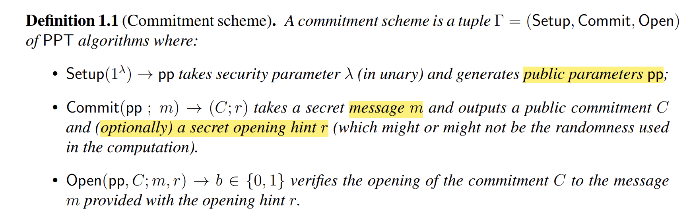

- Setup 阶段产生一些公共参数
- Commit 阶段:对消息 **m** 进行承诺得到 **C(m)**
- Open 阶段:打开 **C(m)**得到** m‘,**验证** m**是否等于 **m’. commit 阶段的 m，在 open 阶段是会暴露的.**

### **2.2 commit Schemes 性质：**

- **Hiding:意味着敌手获得承诺 c(m)后无法获得 m 的值**

  - computational hiding:对于任意的 PPT 敌手 A.有
    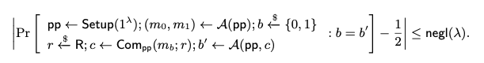
  - Perfect hiding:将 A 的计算能力修改为无穷算力,“≤ negl(λ)”替换为 0
- **Binding:是指一个承诺 c(m) 在 Open 阶段打开只会得到 m 而不会得到 m‘.**

  - computational  Binding
    
  - perfect binding::将 A 的计算能力修改为无穷算力,“≤ negl(λ)”替换为 0

### **2.3 Polynomial Commitment Schemes：PCS**

多项式承诺 PCS:承诺对象是单变量多项式,$f(X)∈F_p^{(≤d)}[X]$:表示所有 degree 最多为 d 的单变量多项式的集合。过程可总结如下图

- Prover 运行 Commit 算法,将函数 f 与随机数 r 作为输入,$com_f$为输出.将$com_f$发送给 Verifier
- Verifier 发送一个挑战点:即一个函数域 X 中的元素 x
- Prover 将 x 对应的 f(x)=y,以及 proof $\pi$发送给 Verifier.  $\pi$表明 1.f(x)=y 2.f 属于 F,即 f 的 degree<=d.

其中 Prover 需要计算如下内容

1. 多项式的承诺 C=[P(x)]
2. 多项式在 z 点的值,P(z)=y,这很简单
3. the proof $\pi$

PCS 有多种,比如 [FRI](https://drops.dagstuhl.de/opus/volltexte/2018/9018/pdf/LIPIcs-ICALP-2018-14.pdf) or Dark'20 or Dory'20 .但是 KZG 仍然是目前实践中**使用最为广泛的 PCS 方案**.其特点如下

1. 基于 Pairing 实现
2. Proof size 是常量 (一个椭圆曲线群元素)
3. 验证时间是常量 (两次 pairing 操作)

其中特性 2 与 3 导致可以将其构造成一个 SNARK 方案.SNARK 的全称是 Succinct Non-interactive  Argument of Knowledge:简洁非交互式知识论证.

SNARK 要求 1.size of proof=O(log(d)) 2.time of Verification =O(log(d)),d 为 degree of Polynomial.

进而可以将 KZG 应用在零知识证明系统如 ZK-SNARK 中.

## **3.计算多项式的承诺 C**

在计算之前,首先介绍两个概念

### **3.1 椭圆曲线(****EC****)**

这里只简单提一下椭圆曲线,更多细节可参考阅读 [basic  elliptic curve cryptography series](https://andrea.corbellini.name/2015/05/17/elliptic-curve-cryptography-a-gentle-introduction/).

假设$\mathbb{G}$是由椭圆曲线点构成的群,g 是$\mathbb{G}$的生成元.

用符号[x]表示$g^x$.由于**椭圆曲线的****离散对数****难题**,给定 g 与[x],**但无法逆推出 x.**

### **3.2 Trusted Setup**

对多项式进行承诺,需要一个与多项式系数数量一样长的 structured reference string（SRS）。该字符串必须按照指定的方式生成，并提供给任何希望承诺多项式的参与方。生成过程会产生一个秘密值 s,也称为 trapdoor 或者 toxic waste），必须将 s 其丢弃。换句话说，生成参考字符串的任何一方都知道一个信息片段，该信息可以破坏多项式承诺方案的 binding 性质，从而破坏使用该承诺方案的任何证明系统的正确性。生成这样的 SRS 过程被称为**可信设置（trusted setup).**

设 D 是希望支持承诺的多项式 P(x)的最高次数上界, SRS =$(g, g^s , g^{s^2} , . . . , g^{s^D})$.

目前主流是通过 **Ceremony** 生成 SRS,关于 **Ceremony** 的详细细节可参考 [https://mirror.xyz/privacy-scaling-explorations.eth/naTdx-u7kyirczTLSAnWwH6ZdedfTQu1yCWQj1m_n-E](https://mirror.xyz/privacy-scaling-explorations.eth/naTdx-u7kyirczTLSAnWwH6ZdedfTQu1yCWQj1m_n-E)

Ceremony 的思想与 MPC 类似，让 N 名参与者生成自己的秘密，并按顺序将其添加到主秘密中。只要有一个参与者不泄露秘密，那么主秘密就是安全的。主秘密的生成过程被称为 Ceremony.

可进入 [https://ceremy.ethereum.org](https://ceremy.ethereum.org) 参与以太坊社区组织的 KZG Ceremony 的生成过程,成为其中一名贡献者!

### **3.3 combine Trusted Setup and EC**

- Trusted Setup 阶段生成 SRS=($[s^0],[s^1],[s^2]...[s^n]$),n 为 P(x)的 degree.然后将 s 丢弃。任何人都可以访问 SRS，但是**无法获得 s 本身**.
- 通过 SRS 重新构造多项式 P(x)为[P(s)],而不会暴露 s 与多项式本身

  ​                      $\left[ P(s)\right] = \left[ \sum_{i=0}^n c_i s^i \right] = \sum_{i=0}^n c_i \left[ s^i \right]$

上式中，用秘密 s 替换自变量 X,得到 P(s):因为自变量 x 可以表示为任何值,.这不影响多项式本身.进而得到承诺 C=[P(s)]

## **4.计算 proof**

我们需要 proof $\pi$证明 P(z)=v.构造$\pi$前先引入一些 polynomial math.

> **P(x)的零点为 m，即 P(m)=0.那么 P(x)一定能整除（x-m),即存在一个商多项式 q(x).使得**
>
> $$
> P(X)=(X-m)*q(x)
> $$

想要证明的是 **p(z)=v**,结合上述 polynomial math.可做如下变换.

p(X)-v=0 when X=z,则 p(X)-y 能整除(X-z) ,即$q(X)=\frac{P(X)-v}{X-z}$,即$\pi=q(s)=\frac{P(s)-v}{S-z}$.

也把 q(X)称为**"Witness Polynomial"**

对于$p(s)-v= q(s)(s - z)$,不能直接利用这个等式,因为等式中的**s **两方都不知道

**直觉上**,我们希望直接证明等式 [p(s)-v] = [q(s)*(s-z)]成立,从而完成验证.

**等式左边:**

承诺仅满足**加法同态**_:_$[p(s)]+[q(s)]=[p(s)+q(s)]$,所以[p(s)-v]=[p(s)] -[v]

**等式右边:**

在验证过程中,验证方会收到证明方发来的[p(s)] ,同时验证方自己可以计算[s-z]=[s]-[z]的值

但是由于椭圆曲线上不满足乘法,即**乘法****同态**:[p(s)]*[q(s)] =[p(s)*q(s)]

所以等式**[q(s) * (s-z)]= [q(s)]*[s-z]** 并不成立,需要引入**配对 pairing**。

`因为椭圆曲线上的运算是一个加法群，而不是一个乘法群，乘法没有被定义。`

> 这里需要强调的是，单个运算结构其实并不区分加法乘法，a o b 这个 o 把它称作成什么都行
> 只是在有限域上的椭圆曲线点集构成一个加法群，把它称为加法是更符合习惯。
> 我们区别加法与乘法，比如两种运算的代数结构比如环，域。
> 因为有两种运算，需要做区分，因为涉及到分配律，谁对谁分配的问题，所以会很明确的区分加法与乘法。

## 5.Pairing

Pairing is **a bilinear mapping.**深入学习Pairing可参考**《Pairing for beginners》**这本书,在这里只做简单介绍.

- **bilinear**
  - Linearity:对于某些一元函数,如果该函数服从$𝑓(𝑎𝑟_1+𝑏𝑟_2)=𝑎𝑓(𝑟_1)+𝑏𝑓(𝑟_2)$
  - Bilinearity:对于二元函数,Linearity 存在于所有维度中,即

$$
𝑓(𝑎𝑟_1+𝑏𝑟_2,𝑠)=𝑎𝑓(𝑟_1,𝑠)+𝑏𝑓(𝑟_2,𝑠),𝑓(𝑟,𝑎𝑠_1+𝑏𝑠_2)=𝑎𝑓(𝑟,𝑠_1)+𝑏𝑓(𝑟,𝑠_2)
$$

- **bilinear mapping**
  [双线性映射](https://zh.wikipedia.org/wiki/%E5%8F%8C%E7%BA%BF%E6%80%A7%E6%98%A0%E5%B0%84)是一个函数,它从两个向量空间的元素产生第三个向量空间的元素,每个参数都是线性的.

### 5.1 about pairing

配对是⼀种抽象操作。其定义可能会有所不同。 有 Tate 配对、Weil 配对、Ate 配对等等…… 虽然每⼀个都通过不同的操作来定义配对,**但是Input与output的格式,pairing 的属性都是固定的**.

#### **Input**:

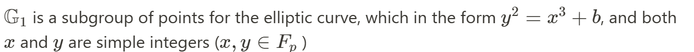

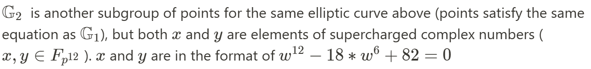

#### **output**：

n 阶乘法群$G_T$中的整数（或复数)

$e(G_1,G_1)，e(G_1,G_2)$分别是对称与非对称的 Pairing 形式。**在实际中，非对称 Pairing 效率最高。**

#### properties：

- e(P, Q + R) = e(P,Q) * e(P, R)
- e(P + S, Q) = e(P,Q) * e(S, Q)
- $e(aP, bR) = e(P,R)^{ab} = e(P, bR)^a = e(aP, R)^b = e(bP, aR)$(bilinear)
- e(P, Q) ≠ 1 (non-degeneracy property)

### 5.2 Pairing examples

#### 1.e(x, y) = 2ˣʸ

例: 请举例在实数域中 e(x, y) = 2ˣʸ 是双线性函数.

- e(3, 4 + 5) = 2³˙⁹ = 2²⁷
- e(3, 4) * e(3, 5) = 2³˙⁴ * 2³˙⁵ = 2¹² * 2¹⁵ = 2²⁷.
- 通过 pairing 证明知道 x² - x - 42 = 0 的解, 然而并不透露这个解的具体数值.

如果 $e(G, G)^k = 1$ 成立, 那么 k 必须为 0 或者目标群的倍数.

如果存在 $e(G, G)^{(x² - x - 42)}$, 可以确定原始二次方程式成立. 使用双线性性重写方程 $e(G, G)^{(x²)} ⋅ e(G, G)^{(-x)}⋅ e(G, G)^{(-42)}= 1$.进一步,e(xG, xG) ⋅ e(xG, -G) ⋅ e(G, -42G) = 1.

因此只需要提供 xG 的值. 同时由于椭圆曲线的离散对数问题, 从 xG 反推回 x 是困难的.

#### 2.**解决 Diffie-Hellman 难题**

#### 3.**BLS**签名

## 6.**KZG**

回到KZG部分

$\mathbb{G}_1,\mathbb{G}_2$分别是同一椭圆曲线的两个子群.g 是子群$\mathbb{G}_1$的生成元,h 是子群$\mathbb{G}_2$的生成元

生成元的选择通常在 trusted Setup 阶段选择$[x]_1=g^x,[x]_2=h^x.$

define pairing e: $\mathbb{G}_1 \times \mathbb{G}_2 \rightarrow \mathbb{G}_T$,对于秘密 s 也相应有两个分布$[s^i]_1,[s^i]_2$.即SRS

原来要验证的等式：$q(s)·(s-z)=p(s)-v$   **=>**   $π_1·[s-z]_2=C_1-[v]_1$

分布集1: $[s_i]_1=g^{s_i}$，对应生成元为g。计算π、C、$[v]_1$

分布集2: $[s_i]_2=h^{s_i}$，对应生成元为h。计算$[s-z]_2$               

验证者验证等式：$e(π，[s-z]_2)\stackrel{?}{=} e(C-[v]_1,h)$

简单理解这个等式：$e(π，[s-z]_2）=e(g^{q(s)}，h^{s-z}) =e(g,h)^{q(s)·(s-z)}$

$e（C-[v]_1,h)     =e  (g^{C-v},h)        =e(g,h)^{C-v}$

> [x]g 与 g^x 表述形式不同，本质上没有什么区别。
> a o b =c
> 如果群运算定义为加法，就使用[x]g 这种形式
> 如果群运算定义为乘法，就使用 g^x 这种形式

用黑盒来理解这个等式的话，就等价于在$G_T$群中去验证下面乘法的成立

$$
[q(s).(s-z)]_T=[p(s)-y]_T
$$

Verifier 如何进行验算：

- _prover 发送_$\pi=[q(s)]$,C,v
- Verifier 自己选择的 z,根据加法同态,Verifier 可以计算_[s -z]₂=[s]₂ - [z]₂_
- _g,h_ is public,**pairing function is public.**

### KZG **完整过程：**

1. 通过 Trusted setup, 产生 SRS:**[sⁱ]₁**,  **[sⁱ]₂**.
2. Prover 使用_[sⁱ]₁_,对多项式 P(x)进行 commit,得到 **C** = _[p(s)]₁_,  发送给 Verifier.
3. Verifier 选择挑战点_z _∈ {0,...,_p_−1}
4. Prover 发送 **π 、y** 给 Verifier:
5. Verifier 检查等式: _e(π, [s -z]₂) = e(C -[v]₁, H)
   __—_ if the equation holds, the verifier accepts the proof
   _—_ if the equation does not hold, the verifier rejects the proof

### KZG 分析

对 KZG 的 Corretness Binding hiding 分别分析

- Corretness

$$
e(π，[s-z]_2)\stackrel{?}{=} e(C-[y]_1,h)
$$

等式左边:$e(π，[s-z]_2)=e（g^{q(s)}，h^{s-z}） =e(g,h)^{q(s)·(s-z)}$

等式右边: $e(C-[y]_1,h)    =e  (g^{C-y},h)        =e(g,h)^{C-y}$

- hiding

因为椭圆曲线的离散对数难题,敌手拿到[x]无法得到 x.

- Binding

分析 Binding 前，需要介绍 SDH 假设。

**Strong Diffie-Hellman(SDH)** 问题定义如下：

给定(q+1)长的元组 $(g^1,g^s,g^{s^2}...g^{s^q})$ 作为输入，输出 $(g^{\frac{1}{s+x}},x),x∈Z_p^*$

**SDH**假设**就是不存在多项式时间算法可以**以**不可忽略概率**解决 SDH 问题。下面用对称形式的 Pairing 进行分析

后续 pairing 的验证都是“g 的指数上”在进行验证,为了方便起见.省略底数 g,后续的等式都是在指数位置上进行.

反证法,即KZG不满足 binding,那么 open 承诺 C 可以得到值 v 和 v'，承诺方必须确定两个不同的值 y 和 y'，使得下列等式成立:

$$
q(s)−v = w(s)·(s −z),q(s)−v'= w'(s)·(s −z)
$$

即$v' −v = (q(s)−w'(s))(s −z)$

_因为_$v−v'\neq0$,假设 $s\neq z$, 等式两边同时除以$(v−v')·(s−z)$可得:

$\frac{1}{(s−z)} = \frac{q(s)−q′(s)}{(v−v′)}$,即$g^{\frac{1}{(s−z)}} = g^{\frac{q(s)−q′(s)}{(v−v′)}}$,这说明有人可高效计算出$g^{\frac{1}{s-z}}$,这**违背了SDH假设**.

### 总结:

像之前说的那样,KZG 方案的 Proof size 是常量 (一个椭圆曲线群元素),验证时间也是常量 (两次 pairing 操作),这是其优点.但是其最大缺点是需要一个 Trusted Setup 阶段.

## 7.**Batch-KZG proof：multi proof**

上述过程验证了⼀个在**单点上**求值的多项式。但如果想证明⼀个多项式上在**多点**上的值，就必须⼀次⼜⼀次地重复同样的协议 **(back and forth)**。这显然是没有效率的。为了解决这个问题，需要 "批量 "验证多项式上的点。

假设想证明 k 个点上的值：

通过使用拉格朗日多项式插值法，构造一个经过上述 k 个点对的 k-1 次多项式

n+1 个坐标对的形式 可以唯一的恢复出一个多项式

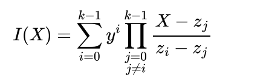

**原多项式 P(x)**与**构造的 I(x)**都经过 k 个点对，所以多项式 P(x)-I(x)=0 在如下点上满足

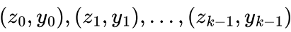

即多项式能够整除

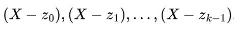

定义一个 zero polynomial:

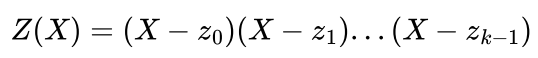

则下式成立

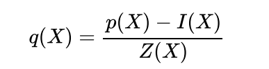

定义 kate multiproof for the evaluation of these points：

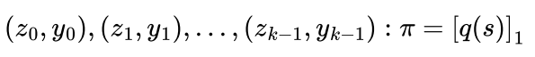

验证过程如下：

- Verifier 通过 k 个 points(z,y)计算 Z(x)和 I(x)
- Verifier 计算$[Z(s)]_2,［I(s)]_1$
- Verifier 验证等式$e(\pi,[Z(s)]_2) ＝e(C-[I(s)]_1,H)$是否成

## 8.KZG in ZK-Rollup

在 zk-rollups 的情况下,想证明发生在 L2 上的一些计算是有效的。简单来讲，发生在 L2 上的计算可通过称为“ witness 生成”的过程表示为二维矩阵。然后可以用多项式列表来表示矩阵 - 每列都可以编码为其自己的一维向量。然后，计算的有效性可以表示为这些多项式之间必须保持的一组数学关系。例如，如果前三列分别由多项式 a(x)、b(x) 以及 c(x) 表示，可能需要关系 a(x)⋅b(x)−c(x)=0 保持。多项式（代表计算）是否满足这些“正确性约束”可通过在一些随机点评估多项式来确定。如果“正确性约束”在这些随机点上得到了具体的满足，则一名验证者可以非常高的概率断言计算是正确的。

很自然地看到像 KZG 这样的多项式承诺方案，是如何直接插入到这个范式中的：rollup 将 commit to 一组多项式，它们一起代表计算。 然后，验证者可要求对一些随机点进行评估，以检查正确性约束是否成立，从而验证多项式表示的计算是否有效。

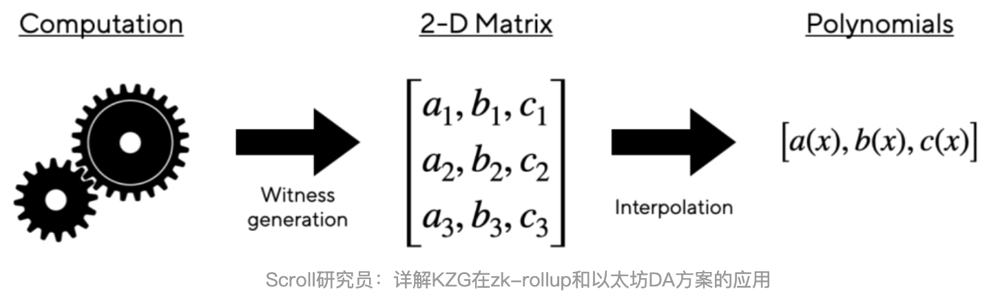

最后感谢@Kurt-Pan的指导与建议

## 参考文章

[Understanding KZG10 Polynomial Commitments (taoa.io)](https://taoa.io/posts/Understanding-KZG10-Polynomial-Commitments)

[Kate Commitments: A Primer - HackMD](https://hackmd.io/@tompocock/Hk2A7BD6U)

[Dankrad Feist's kzg commitment post](https://dankradfeist.de/ethereum/2020/06/16/kate-polynomial-commitments.html)

[https://blog.subspace.network/kzg-polynomial-commitments-cd64af8ec868](https://blog.subspace.network/kzg-polynomial-commitments-cd64af8ec868)

[Understanding KZG10 Polynomial Commitments](https://taoa.io/posts/Understanding-KZG10-Polynomial-Commitments)

[Committing to lunch (taoa.io)](https://taoa.io/posts/Committing-to-lunch)

book:Proof,argument and zero knowledge

KZG原始论文
