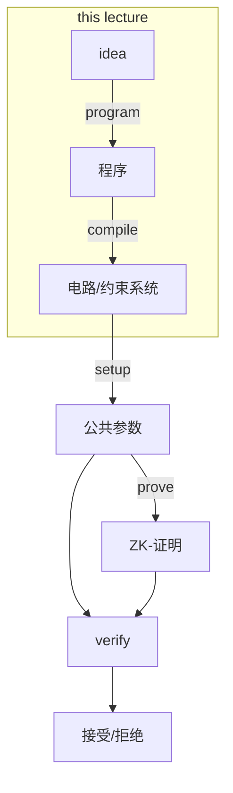

# 零知识证明（ZKP）的编程

假设你有一个应用程序的想法，并想在其中使用零知识证明（ZKP）。你会怎么做？



在本讲中，我们将进行以下活动：

1. 对ZKP的可编程性有一个总体了解
2. **Example**: 使用HDL（硬件描述语言），如Circom
3. **Example**: 使用库，如Arkworks
4. **Example**: 使用编程语言和编译器，如ZoKrates
5. 概述优秀的ZKP工具链

# 回顾: ZKP for a predicate $\phi$

让我们回忆一下ZKP做了什么。假设你有一个谓词 $\phi$，有一些公共输入 $x$ 和私有输入（见证）$w$。例如，$\phi =$ 我知道一个 $w$，使得 $x = \text{SHA256}(w)$。

- 证明者可以访问$\phi, x, w$.
- 验证者可以访问 $\phi, x$.
- 证明 $\pi$ 将证明 $\phi(x, w)$ 成立，而不透露 $w$

然而，关键问题是：$\phi$ 可以是什么？还有其他例子吗？理论上，$\phi$ 可以是任何NP问题语句。

- $w$ 是整数 $x$ 的因式分解
- $w$ 是与某个公钥 $x$ 对应的私钥
- $w$ 是账户 $x$ 的凭证
- $w$ 是有效交易

然而，将这些语句转换成编程方面的东西有些不同。

# 算术电路

实际上，$\phi$ 可能是一个 "算术电路"，基于输入 $x$ 和 $w$.

想象你在本科期间可能上过的关于布尔电路的电子课或电路设计课。那里我们有AND门、OR门、NAND门等，操作是在1和0上进行的。

在算术电路中，操作发生在有限域 $\mathbb{Z}_p$ 的元素上。通常，$p$ 是一个大质数（例如约255位）。从本质上讲，算术电路可以由多项式表示，例如我们可以有:

- $w_0 \times w_0 \times w_0 = x$
- $w_1 \times w_1 = x$

然而，有一个更好的思考电路的方法：将其视为 DAG（有向无环图）！在这个DAG中:

- **Nodes** (or **Vertices**) 是输入、门和常数.
- **Edges** 是线/连接.

以下是上述两个多项式的电路，可视化为DAG:

```mermaid
flowchart LR
	w0((w_0)) --> x1[x]
	w0 --> x1[x]
	x1 --> x2[x]
	w0 --> x2[x]
	w1((w_1)) --> x3[x]
	w1 --> x3[x]
	x --> =2
	x2 --> =1[=]
	x((x)) --> =1
	x3 --> =2[=]
```

## Rank-1 Constraint System (R1CS)

R1CS 是 ZKP 算术电路（AC）的一种格式。它是一种非常常用的格式。以下是其定义方式:

- $x$ 是一组域元素 $x_1, x_2, \ldots, x_l$.
- $w$ 是一组域元素 $w_1, w_2, \ldots, w_{m-l-1}$
- $\phi$ 由形式为 $\alpha \times \beta = \gamma$ 的 $n$ 个方程组成，其中 $\alpha, \beta, \gamma$ 是上述要点中提到的变量的仿射组合.

让我们看几个 $\alpha \times \beta = \gamma$ 的例子.

- $w_2 \times (w_3 - w_2 - 1) = x_1$ 是 可以的.
- $w_2 \times w_2 = w_2$ 是 可以的.
- $w_2 \times w_2 \times w_2 = x_1$ 是不行的！你不能在这里有两次乘法！那么，我们该怎么办呢？我们可以借助一个额外的变量来捕捉这个操作，比如说 $w_4$:
  - $w_2 \times w_2 = w_4$ 是可以的.
  - $w_2 \times w_4 = x_1$ 是可以的, 这两者一起捕捉了上述等式.

## R1CS的矩阵定义

还有另一种看待R1CS的方式，使用矩阵。这次，我们定义如下:

- $x \in \mathbb{Z}_p^l$ 是 $l$ 个域元素的向量.
- $w \in \mathbb{Z}_p^{m-l-1}$ 是 $m-l-1$ 个域元素的向量.
- $\phi$ 由三个矩阵组成：$A, B, C \in \mathbb{Z}_p^{n\times m}$

现在，我们定义向量 $z = (1 || x || w) \in \mathbb{Z}_p^m$，它有 $m$ 个元素。此系统的规则是以下方程必须成立:

$$
Az \circ Bz = Cz
$$

这里，$\circ$ 表示这些的逐元素乘积.

```json
┌───────┐┌┐   ┌───────┐┌┐   ┌───────┐┌┐
|.......||| o |.......||| = |.......||| //--> 每行都对应一个
|   A   |└┘   |   B   |└┘   |   C   |└┘ // Rank-1约束！
|       |     |       |     |       |
└───────┘     └───────┘     └───────┘
```

## 示例：写一个AC的R1CS

考虑以下AC：

```mermaid
flowchart LR
	w0((w_0)) --> m1[x]
	w1((w_1)) --> m1
	w1 --> m2
	x0((x_0)) --> a1
	m1 --w_2--> a1[+]
	x0 --> m2[x]
	a1 --w_3--> =
	m2 --w_4--> =
```

这里，我们有一个公共输入 $x_0$ 和两个秘密输入（见证）$w_0, w_1$。我们首先要做的是通过分配给它们秘密输入变量来捕获中间输出；在这种情况下，这些将是 $w_2, w_3, w_4$。然后，我们只需按照之前讨论的形式 $\alpha \times \beta = \gamma$ 写方程，每个门一个方程!

- $w_0 \times w_1 = w_2$
- $w_3 = w_2 + x_0$ (注意左侧实际上是 $w_3 \times 1$)
- $w_1 \times x_0 = w_4$
- $w_3 = w_4$

就这么简单.

# 教程：Circom - 使用HDL进行R1Cs

首先要注意的是，Circom 不是编程语言（PL），它是硬件描述语言（HDL）.

|         | 编程语言                       | 硬件描述语言        |
| ------- | ------------------------------------------ | ------------------------------------ |
| 对象 | 变量、操作、程序和函数 | 线、门、电路和子电路 |
| 行为 | 修改变量, 调用函数           | 连接线、创建子电路   |

有一些已知的数字电路HDL:

- Verilog
- SystemVerilog
- VHDL
- Chisel

Circom不是数字电路的HDL，它是R1CS的HDL。线构成了R1CS变量，门构成了R1CS约束。本质上，Circom做了两件事:

1. 设置变量值
2. 创建R1CS约束

## 示例: $z = x \times y$

让我们来看一个基本的示例:

```ts
template Multiply(){
  signal input x; // 私有，除非明确声明为公共
  signal input y; // 私有，除非明确声明为公共
  signal output z; // 输出始终是公共的

  z <-- x * y;
	z === x * y;
  // z <== x * y; 也可以
}

// 为了开始执行，需要一个主组件
// 不能存在多个主组件！
component main {public [x]} = Multiply();
//                      明确声明 x 为公共!
```

让我们分析一下这里发生了什么:

- `template` 只是一个电路（或者如果被其他电路导入，则是子电路）
- `signal` 是一条线，可以是 `input`, `output` or 或者一些中间变量.
- `<--` 操作设置信号值.
- `===` 创建一个约束，必须是Rank-1。因此，一侧是线性的，另一侧是二次的。你不能做像`x * x * x`因为$x^3$ 不是二次的.
- 作为速记, `<==` 在一行中同时执行两个操作，而不是两行.
- 你还可以有  `-->` and `==>` 它们的工作方式类似.

## 示例: $y = f^n(x)$ where $f(x) = x^2$

现在稍微复杂一些的例子.

```ts
template RepeatedSquaring(n){
  signal input x;  // 私有，除非明确声明为公共
  signal output y; // 输出始终是公共的

  // 中间信号
  signal xs[n+1];

	xs[0] <== x;
	for (var i = 0; i < n; i++) {
	  xs[i+1] <== xs[i] * xs[i];
	}
	y <== xs[n];
}

// 提供模板值 n = 1000
component main {public [x]} = RepeatedSquaring(1000);
//                      ^ 明确声明 x 为公共!
```

Circom 有非常好的功能，如上所示!

- 你可以有模板参数，比如这里的 `n` here, 你在实例化组件时硬编码
- 你可以有信号数组.
- 你可以有变量（用 `var` 定义）。这些与信号不同，它们是可变的并在编译时求值
- 你可以有循环, 如`for`.
- 你也可以有`if` - `else`.
- 你可以用 `arr[i]` 访问数组的索引 `i`.

## 示例：非零与零

```ts
template NonZero(n){
	signal input in;
	signal inverse;

	inverse <-- 1 / n; // 与R1CS不兼容
	1 === in * inverse; // 与R1CS兼容
}

template IsZero() {
	signal input a;
	signal input b;

	component nz = NonZero();

	// 检查 a 是否非零
	nz.in <== a;

	// b 必须为 0，这个才能成立
	0 == a * b;

	// 你本可以简单地这样做：
	// 0 === b;
	// 但嘿，这是个教育示例！
}

component main {public [a, b]} = IsZero();
```

`NonZero` 是`IsZero`用的子电路. 在`NonZero`使, 我们检查一些输入是否不为0。然而，约束只检查等式，我们没有类似`a !=== b`的东西。要检查某物是否非零，我们可以检查它是否有逆！

为此，我们执行 `inverse <-- 1 / n` 但这不是R1！ 
`<--` i只是一个赋值操作符，不是一个约束！所以，在这里我们可以这样做；事实上，没有约束的信号赋值比受约束的赋值能做的更多。约束本身在下一行: `1 === in * signal`,这才是R1.

另请注意 `IsZero`在其中使用了 `NonZero` 并通过实例化子电路作为`nz`. 来做到这一点。你可以使用 `.`操作符访问电路中的信号，如 `nz.in`.

## 示例：数独解决方案

这是一个相当大的例子，代码也很多。我将只记录电路，有关代码，请访问 [https://github.com/rdi-berkeley/zkp-course-lecture3-code/tree/main/circom](https://github.com/rdi-berkeley/zkp-course-lecture3-code/tree/main/circom).

我们想证明我们知道数独谜题的解答。

- 公共输入 $x$ 将是数独棋盘的初始设置，空格为0，非空格为某个整数 $1 \leq i \leq 9$。.
- 私有输入 $w$（见证）将是我们的解决方案，同样为一系列数字.
- 我们的谓词 $\phi$ 是我们知道公共输入中给出的数独设置的解答.

输入将以 $n \times n$ 大小的二维数组给出。我们真的应该写一个通用的模板电路，将棋盘大小 $n$ 作为模板参数。

现在，让我们以 $n=9$ 为例。但我们的约束是什么呢？让我们一一列举.

- 解决方案输入应由范围在 $[1, 9]$ 的数字组成。
- 解决方案输入应具有每个数字仅出现一次的行。
- 解决方案输入应具有每个数字仅出现一次的列。
- 解决方案输入应具有 $3\times3$ 细胞组（如数独中），每组中每个数字仅出现一次。.

以下是电路及其子电路.

```ts
// 断言两个元素不相等。
// 通过检查 in0 - in1 是否非零来完成.
template NonEqual() {
	signal input in0;
  signal input in1;

// 采用逆向技巧检查零
  signal inverse;
	inverse <-- 1 / (in0 - in1);
	1 === (in0 - in1) * inverse;
}

// 断言给定的所有值都是唯一的
template Distinct(n) {
  signal input in[n];

  // 为每对创建一个不等组件
  component neq[n][n];
  for (var i = 0; i < n; i++) {
		for (var j = 0; j < i; j++) {
			neq[i][j] = NonEqual();
			neq[i][j].in0 <== in[i];
			neq[i][j].in1 <== in[j];
		}
	}
}

// 断言给定数字可以用n位表示
// 意味着它在范围 [0, 2^n) 内。
template Bits(n) {
	signal input in;

	signal bits[n];
	var bitsum = 0;
  for (var i = 0; i < n; i++) {
		bits[i] <-- (in >> i) & 1;
    bits[i] * (bits[i] - 1) === 0; // 确保位是二进制的
    bitsum += bitsum + 2 ** i * bits[i];
	}
  bitsum == in;
}

// 检查给定信号是否在范围 [1, 9] 内
template OneToNine() {
  signal input in;
  component lowerbound = Bits(4);
  component upperbound = Bits(4);
  lowerbound.in <== i - 1; // 只有当 i >= 1 时才工作
  upperbound.in <== i + 6; // 只有当 i <= 9 时才工作
}

// 主电路
template Sudoku(n) {
  signal input solution[n][n];
  signal input puzzle[n][n];

	// 确保一切都在范围 [1, 9] 内
	component inRange[n][n];
  for (var i = 0; i < n; i++) {
		for (var j = 0; j < n; j++) {
			inRange[i][j] = OneToNine();
			inRange[i][j].in <== solution[i][j];
		}
	}

   // 然后，让我们确保解决方案与谜题一致
	// 意味着谜题的非空格应等于
  // 相应的解决方案值
  // 谜题的其他值必须是0（空格）
  for (var i = 0; i < n; i++) {
		for (var j = 0; j < n; j++) {
      // 这有效，如果 puzzle[i][j] == 0，或者
			// puzzle[i][j] == solution[i][j]
			puzzle[i][j] * (puzzle[i][j] - solution[i][j]) === 0;
		}
	}

  // 确保一行中的所有值都是唯一的
  component distinctRow[n];
	for (var row = 0; row < n; row++) {
		distinctRow[row] = Distinct(9);
		for (var col = 0; col < n; col++) {
			distinctRow[row].in[col] <== solution[row][col];
		}
	}

	// 确保一列中的所有值都是唯一的
  component distinctColumn[n];
	for (var col = 0; col < n; col++) {
		distinctColumn[col] = Distinct(9);
		for (var row = 0; row < n; row++) {
			distinctColumn[col].in[row] <== solution[row][col];
		}
	}

 
}

component main{public[puzzle]} = Sudoku(9);

```
Circom 很棒，并且对约束有直接控制。然而，使用自定义语言也有其自身的缺点。一种替代方案是使用已知的高级语言（例如Rust、Go）并有一个库帮助你在其中编写电路.

